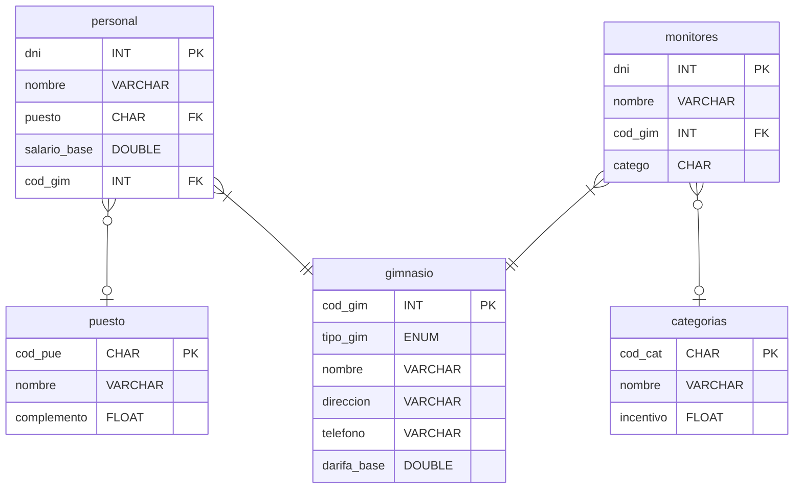

# Tarea UD5: Edición de los datos

## Estructura de la base de datos



## Apartado 1

Realizar las siguientes operaciones sin utilizar sentencias SQL:

### Operación 1.1

Inserta tres nuevos gimnasios con los siguientes datos:

| Datos gimnasio 1 | Datos gimnasio 2 | Datos gimnasio 3 |
|:-----------------|:------------------|:-----------------|
| cod_gim: 600 | cod_gim: 700 | cod_gim: 800 |
| timpo_gim: SUP | tipo_gim: MED | tipo_gim: INF |
| nombre: SuperGym | nombre: EgoGym | nombre: VivaGym |
| dirección: Calle Sherezade 10 | dirección: Calle Arenal | dirección: |
| telefono: 666554411 | teléfono: 666442288 | teléfono: 666998833 |
| tarifa_base: 30 | tarifa_base: 25 | tarifa_base: |

### Operación 1.2

Inserta los siguientes monitores:

| Monitor 1 | Monitor 2 | Monitor 3 | Monitor 4 |
|:--|:--|:--| :--|
| dni: 66665555 | dni: 77772222 | dni: 33338888 | dni: 44441111 |
| nombre: Pardo, Luís | nombre: Salas, Eva | nombre: Cruz, Marta | nombre: Gil, Jorge |
| cod_gim: 55 | cod_gim: 20 | cod_gim: 77 | cod_gim: |
| catego: 'CARI' | catego: 'COM1' | catego: 'YOG1' | catego: 'YOG2' |

### Operación 1.3

Modifica el código del gimnasio 10, por el código 15. ¿Se ha podido realizar esa modificación? Indica si ha tenido alguna repercusión en el personal y monitores de ese gimnasio, y a que puede ser debido. Captura pantallas en las que se pueda apreciar lo ocurrido.

### Operación 1.4

Elimina el gimnasio de código 40 y el de código 77. ¿En algún caso de error? Explica cada caso.

## Apartado 2

Escribe las sentencias SQL necesarias para realizar las siguientes operaciones:

### Operación 2.1

Inserta los siguientes monitores:

1. nombre: 'Frías Reche, María', gimnasio: 20, DNI: '10101010'
2. nombre: 'Verde Botella, Esperanza', gimnasio: 40, DNI: '20202020' y categoría 'CAR2'

#### Solución 2.1

1.

  ```sql
  INSERT INTO monitores (dni, nombre, cod_gim) VALUES ('10101010', 'Frías Reche, María', 20);
  ```

2.
  
  ```sql
  INSERT INTO monitores (dni, nombre, cod_gim) VALUES ('20202020', 'Verde Botella, Esperanza', 40)
  ```

### Operación 2.2

Inserta un monitor de nombre 'Amarillo Rojo, Luís', DNI: '80808080', gimnasio: 30 y categoría 'YOGA'.

```sql
INSERT INTO monitores (dni, nombre, cod_gim, catego) SELECT '80808080', 'Amarillo Rojo, Luís', 30, cod_cat FROM categorias WHERE nombre = "YOGA";
```
