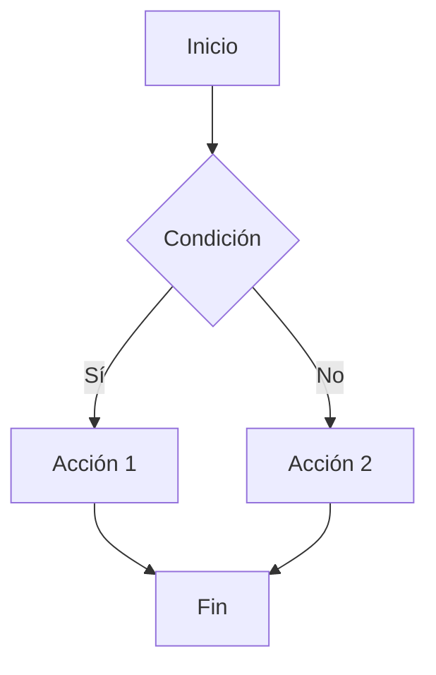

# Estructuras condicionales

Las estructuras condicionales son instrucciones que permiten ejecutar un bloque de código u otro dependiendo de si se cumple o no una condición.



Si se cumple la condición se iría por la _bifurcación_ o _rama_ de la izquierda (rama del sí), y si no se cumple se iría por la _bifurcación_ o _rama_ de la derecha (rama del no).

En MySQL hay dos estructuras condicionales: `IF` y `CASE`.

## Sentencia `IF`

Como dijimos antes la sentencia `IF` nos permite seleccionar qué sentencias hemos de ejecutar en función de una condición.

**Función `IF()`:** Además de la sentencia `IF`, existe una función llamada `IF()` que se utiliza para evaluar una condición y devolver un valor si la condición es verdadera y otro valor si es falsa. La función `IF()` se utiliza principalmente en consultas SQL para realizar cálculos condicionales.

```sql
SELECT IF(@mi_valor = True, 'Es cierto', 'Es falso') AS 'Resultado';
```

### Sintaxis del `IF`

La sintaxis de la sentencia `IF` es la siguiente:

```text
IF search_condition THEN 
    statement_list
[ELSE
    statement_list]
END IF
```

Donde:

* _statement_list_: es una o más sentencias SQL que se ejecutan si la condición es verdadera o falsa.
* _search_condition_: es la condición que se evalúa. Puede ser cualquier expresión que devuelva un valor booleano (verdadero o falso, 0 ó 1).

Un ejemplo sería el siguiente:

```sql
IF longitud > 10 THEN
    SELECT 'La longitud es mayor que 10';
ELSE
    SELECT 'La longitud es menor o igual que 10';
END IF;
```

### `ELSEIF`

Si queremos _encadenar_ o _anidar_ varias condiciones, podemos utilizar la sentencia `ELSEIF` para evaluar múltiples condiciones en una sola estructura `IF`. La sintaxis es la siguiente:

```text
IF search_condition THEN statement_list
[ELSEIF search_condition THEN statement_list] ...
[ELSE statement_list]
END IF
```

Un ejemplo de uso de esta sentencia sería el siguiente:

```sql
IF longitud < 10 THEN
    SELECT 'La longitud es menor que 10';
ELSEIF longitud = 10 THEN
    SELECT 'La longitud es igual a 10';
ELSE 
    SELECT 'La longitud es mayor que 10';
END IF;
```

### Ejemplo de la estructura `IF`

## Sentencia `CASE`

La sentencia `CASE` es una estructura condicional que permite evaluar una expresión y devolver un valor basado en el resultado de esa evaluación. Es útil cuando se tienen múltiples condiciones que se deben evaluar y se desea evitar el uso de múltiples sentencias `IF` anidadas. Su utilizad principal es **facilitar la lectura del código** ya que lo mismo que se hacemos usando `CASE` podemos hacerlo con `IF` pero el código sería más largo y menos legible.

### Sintaxis del `CASE`

Case, par hacernos la vida aún más fácil, tiene dos sintaxis:

```text
CASE case_value
    WHEN when_value THEN statement_list
    [WHEN when_value THEN statement_list] ...
    [ELSE statement_list]
END CASE
```

O bien:

```text
CASE
    WHEN search_condition THEN statement_list
    [WHEN search_condition THEN statement_list] ...
    [ELSE statement_list]
END CASE
```

En la primera sentencia vemos que a continuación de la palabra especial `CASE` se encuentra un valor, normalmente una expresión o una variable. En las siguientes líneas se compara su valor con los valores que se encuentran en las cláusulas `WHEN`. Si el valor de la expresión coincide con el valor de una cláusula `WHEN`, se ejecuta la sentencia que se encuentra en esa cláusula. Si no coincide con ninguno de los valores, se ejecuta la sentencia que se encuentra en la cláusula `ELSE` (si existe).

En la segunda sintaxis, la palabra especial `CASE` no tiene un valor a continuación. En este caso, cada cláusula `WHEN` contiene una condición que se evalúa. Si la condición de una cláusula `WHEN` es verdadera, se ejecuta la sentencia que se encuentra en esa cláusula. Si ninguna de las condiciones es verdadera y existe una cláusula `ELSE`, se ejecuta la sentencia que se encuentra en la cláusula `ELSE`. Si no existe una cláusula `ELSE`, no se ejecuta ninguna sentencia.

Veamos dos ejemplos de código con cada una de las sintaxis:

```sql
-- Sintaxis 1
CASE longitud
    WHEN 1 THEN SELECT 'La longitud es 1';
    WHEN 2 THEN SELECT 'La longitud es 2';
    WHEN 3 THEN SELECT 'La longitud es 3';
    ELSE SELECT 'La longitud no es 1, 2 o 3';
END CASE;

-- Usando IF sería:

IF longitud = 1 THEN
    SELECT 'La longitud es 1';
ELSEIF longitud = 2 THEN
    SELECT 'La longitud es 2';
ELSEIF longitud = 3 THEN
    SELECT 'La longitud es 3'; ELSE
    SELECT 'La longitud no es 1, 2 o 3';
END IF;

-- Sintaxis 2
CASE
    WHEN longitud < 10 THEN SELECT 'La longitud es menor que 10';
    WHEN longitud = 10 THEN SELECT 'La longitud es igual a 10';
    ELSE SELECT 'La longitud es mayor que 10';
END CASE;
```

### Ejemplo de la estructura `CASE`
