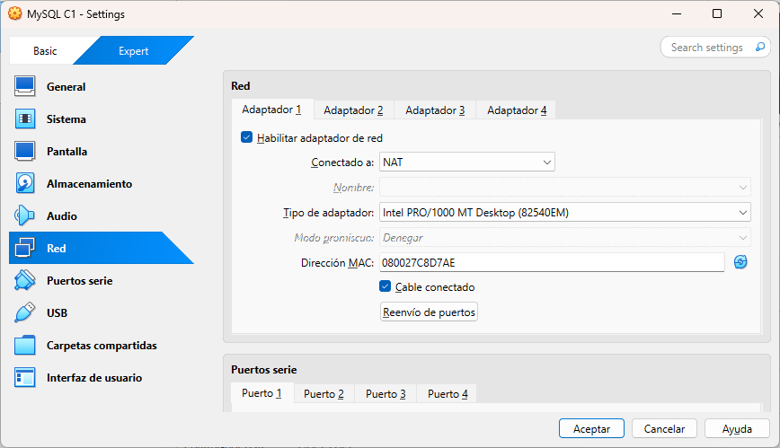
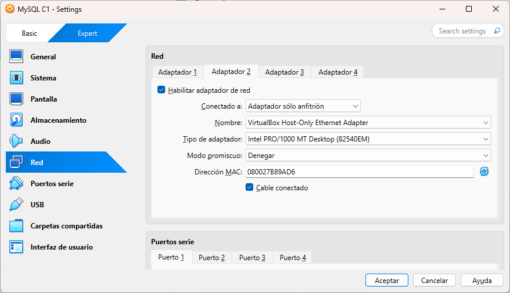
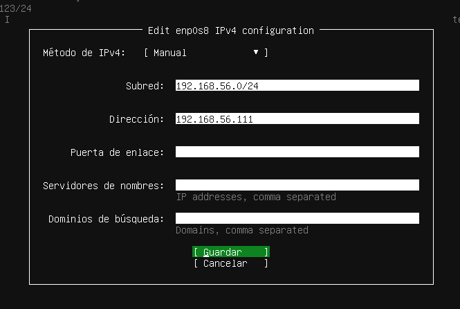
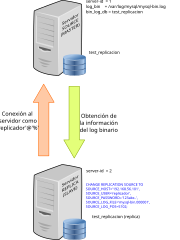

# Bases de datos distribuidas

<!-- toc -->

- [Configuración de la red](#configuracion-de-la-red)
    * [Configuración de las máquinas virtuales](#configuracion-de-las-maquinas-virtuales)
    * [Configuración de red (VirtualBox)](#configuracion-de-red-virtualbox)
    * [Configuración del sistema operativo](#configuracion-del-sistema-operativo)
        + [Configuración de la red (Ubuntu Server)](#configuracion-de-la-red-ubuntu-server)
        + [Configuración de SSH](#configuracion-de-ssh)
- [Configuración de MySQL](#configuracion-de-mysql)
    * [Conexión a la máquina virtual](#conexion-a-la-maquina-virtual)
    * [Instalación de MySQL](#instalacion-de-mysql)
    * [Configuración del Servidor MySQL](#configuracion-del-servidor-mysql)
        + [Permitir conexiones remotas](#permitir-conexiones-remotas)
    * [Creación de usuario administrador de MySQL](#creacion-de-usuario-administrador-de-mysql)
    * [Comprobar la configuración](#comprobar-la-configuracion)
        + [Comprobar visibilidad entre máquinas virtuales](#comprobar-visibilidad-entre-maquinas-virtuales)
            - [Comprobar conexión SSH](#comprobar-conexion-ssh)
            - [Visibilidad entre los equipos](#visibilidad-entre-los-equipos)
- [Caso 1: Replicación de bases de datos _maestro-esclavo_ (_source-replica_)](#caso-1-replicacion-de-bases-de-datos-_maestro-esclavo_-_source-replica_)
    * [Objetivo](#objetivo)
    * [Configuración del maestro](#configuracion-del-maestro)
        + [Obtención de la información del maestro](#obtencion-de-la-informacion-del-maestro)
        + [Creación de usuario para la réplica](#creacion-de-usuario-para-la-replica)
    * [Configuración del esclavo](#configuracion-del-esclavo)
        + [¿Qué ha salido mal?](#%C2%BFque-ha-salido-mal)
        + [Otra forma de solucionar el problema (menos segura)](#otra-forma-de-solucionar-el-problema-menos-segura)
        + [_Batallita_](#_batallita_)

<!-- tocstop -->

En este documento veremos como crear bases de datos distribuidas entre varios servidores MySQL. Se seguirán los ejemplos creados por el profesor Emiliano Gómez Vázquez en su curso de ASGBD.

La única variación consistirá en que, en lugar de utilizar máquinas virtuales MS. Windows 10, utilizaremos máquinas virtuales Linux (Ubuntu Server 24.04) en VirtualBox.

Otro cambio será que, en lugar de utilizar una _red NAT_ para interconectar las máquinas virtuales, utilizaremos dos interfaces de red (o adaptadores) para cada máquina virtual. El primero será el que viene configurado por defecto en VirtualBox, _NAT_ que nos permitirá tener conexión a Internet desde las máquinas virtuales. El segundo adaptador será de tipo _host-only_ (_solo-anfitrión_) y permitirá que las máquinas virtuales **se vean entre sí y vean al anfitrión**. De este modo tendremos acceso a Internet y podremos conectarnos a las máquinas virtuales desde el anfitrión y entre ellas.

## Configuración de la red

### Configuración de las máquinas virtuales

Una vez creada cada máquina virtual (y antes de iniciar el proceso de instalación del sistema operativo), se han de configurar los interfaces de red de cada máquina virtual.

Usaremos la misma configuración para todas la máquinas virtuales de los ejemplos.

### Configuración de red (VirtualBox)

En VirtualBox, seleccionamos la máquina virtual y vamos a `Configuración` (`Control-S`)-> `Red`. Ahí podremos ver varias pestañas, una por cada adaptador o interfaz de red. En la primera pestaña (adaptador 1) dejaremos la configuración tal y como está (`NAT`) para que la máquina tenga acceso a Internet. En la segunda interfaz de red (adaptador 2) habilitaremos el adaptador y seleccionaremos `Adaptador de solo-anfitrión` (`Host-only`) para que la máquina sea visibles tanto desde el anfitrión como desde las demás máquinas que incluyamos en dicha red.

Configuración del adaptador 1 (se deja como está):



Configuración del segundo adaptador (Sólo anfitrión):



### Configuración del sistema operativo

El siguiente paso de configuración se realizará durante la instalación del sistema operativo.

#### Configuración de la red (Ubuntu Server)

Durante la instalación de [Ubuntu Server 24.04](https://ubuntu.com/download/server), cuando lleguemos a la pantalla `Network configuration`, veremos dos interfaces de red llamados `enp0s3` y `enp0s8`. La primera será la interfaz NAT y no hemos de modificarla. La segunda será la interfaz conectada a la red _host-only_ y tendrá un valor asignado por el servidor DHCP de VirtualBox. Si decidimos utilizar dicha dirección IP sería conveniente que la anotásemos pues la hemos de usar a establecer conexiones (SSH, MySQL Shell, Workbench, etc.).

Si por el contrario queremos decidir nosotros la dirección hemos de seleccionar el interfaz `enp0s8`, modificar el desplegable `IPv4` y, dentro del mismo establecer una dirección dentro del rango válido `192.168.56.0/24`, `192.168.56.101` para el servidor, `192.168.56.102` para el primer servidor réplica, etc. Queda a vuestra elección.

En el apartado de `Network configuration`:


Seleccionamos el interfaz ethernet `enp0s8` y editamos el protocolo IPv4:


Seleccionamos la opción `manual`:


Establecemos la dirección IP (fija) que deseemos (dentro de la red `192.168.56.0/24`):



#### Configuración de SSH

Configurando el servicio SSH podremos conectarnos a la máquina virtual desde un terminal de la máquina anfitrión, lo que nos facilitará la realización de los siguientes pasos de configuración.

Cuando lleguemos a la pantalla de instalación con el título `SSH configuration` simplemente hemos de marcar la casilla que inidca `Instalar servidor OpenSSH`.


**Estos pasos serán idénticos para todas las máquina virtual que creemos. Obviamente, si establecemos las direcciones IP a mano, hemos de usar direcciones distintas para cada máquina.**

## Configuración de MySQL

Una vez instalado el sistema operativo y reiniciada la máquina tendremos que instalar también el servidor MySQL. Esto podremos hacerlo entrando mediante login en la ventana de la máquina virtual o desde un terminal de la máquina anfitrión mediante una conexión SSH. En este ejemplo utilizaremos SSH siempre que sea posible.

### Conexión a la máquina virtual

Una vez finalizada la instalación de Ubuntu Server y reiniciada la máquina virtual, para conectamos a ella por SSH desde el anfitrión utilizaremos el siguiente comando:

```powershell
ssh usuario@192.168.56.101
```


**Substituyendo `usuario` por el nombre de usuario que hayamos puesto durante la instalación y la dirección IP por la que hayamos asignado a la máquina virtual.**

### Instalación de MySQL

Una vez conectados a la máquina virtual (vía SSH o desde la propia máquina) hemos de instalar el servidor MySQL. Para ello, primero actualizaremos los paquetes del sistema con los comandos:

```bash
sudo apt update
sudo apt upgrade
```

Una vez finalizada el proceso de actualización instalaremos el servidor MySQL con el siguiente comando:

```bash
sudo apt install mysql-server
```

### Configuración del Servidor MySQL

En este punto ya tenemos instalado y en funcionamiento una servidor MySQL. Podemos comprobarlo utilizando el comando:

```bash
$ systemctl status mysql.service
● mysql.service - MySQL Community Server
     Loaded: loaded (/usr/lib/systemd/system/mysql.service; enabled; preset: enabled)
     Active: active (running) since Thu 2025-05-01 17:05:35 UTC; 1h 19min ago
    Process: 661 ExecStartPre=/usr/share/mysql/mysql-systemd-start pre (code=exited, status=0/SUCCESS)
   Main PID: 780 (mysqld)
     Status: "Server is operational"
      Tasks: 43 (limit: 2272)
     Memory: 517.5M (peak: 517.8M)
        CPU: 53.093s
     CGroup: /system.slice/mysql.service
             └─780 /usr/sbin/mysqld

may 01 17:05:25 mysql-d2 systemd[1]: Starting mysql.service - MySQL Community Server...
may 01 17:05:35 mysql-d2 systemd[1]: Started mysql.service - MySQL Community Server.
```

Por defecto este servidor **sólo acepta conexiones locales**. Esto significa que no podremos conectarnos a él desde el anfitrión o desde otras máquinas virtuales (no podremos establecer una conexión mediante MySQL Workbench, MySQL Shell, etc.).

Para hacer que el servidor acepte conexiones remotas de editar el archivo de configuración de MySQL. Éste se encuentra en la ruta `/etc/mysql/mysql.conf.d/mysqld.cnf`.

Para editar el archivo podemos utilizar los editores de texto de consola `nano` o `vim`.

#### Permitir conexiones remotas

Una vez conectados a la máquina virtual mediante SSH editaremos el archivo `/etc/mysql/mysql.conf.d/mysqld.cnf`  modificando las siguientes líneas cambiando:

```text
bind-address        = 127.0.0.1
mysqlx-bind-address = 127.0.0.1
```

A:

```text
bind-address        = 127.0.0.1,192.168.56.101
mysqlx-bind-address = 127.0.0.1,192.168.56.101
```

En lugar de la dirección `192.168.56.101` hemos de poner la dirección IP de la máquina virtual que hemos asignado a la interfaz de red `enp0s8` (la segunda interfaz).

**Nota: Si hemos olvidado la dirección IP de la máquina virtual, podemos consultarla con el comando `hostname -I` que nos mostrará todas las direcciones IP asignadas a la máquina virtual.**

```bash
$ hostname -I
10.0.2.15 192.168.56.110 fd17:625c:f037:2:a00:27ff:fef7:f8f3
```

_La dirección que nos interesa es la segunda: `192.168.56.101`. La primera es la de la red NAT y la tercera es la dirección IPv6._

**Cada vez que realicemos un cambio en la configuración del servidor MySQL hemos de reiniciar el servicio para que los cambios surtan efecto.** Para ello, utilizamos el siguiente comando:

```bash
sudo systemctl restart mysql.service
```

**¿Qué hemos hecho?**

Los cambios que hemos realizado en la configuración del servidor tendrán las siguientes consecuencias:

- **La primera línea:** `bind-address=127.0.0.1,192.168.56.101` indica al servidor MySQL que acepte conexiones locales (`127.0.0.1` o interfaz de _loopback_) y además _escuche_ también en la interfaz de red con dirección IP `192.168.56.101` (`enp0s8`) para que podemos conectarnos a ella desde el anfitrión o desde otras máquinas virtuales.
- **La segunda línea:** `mysqlx-bind-address=127.0.0.1,192.168.56.101` indica al servidor MySQL lo mismo que en el caso anterior pero para conexiones de la aplicación [MySQL Shell](https://dev.mysql.com/doc/mysql-shell/8.0/en/) que podemos descargar en [este enlace](<https://dev.mysql.com/downloads/shell/>) o instalar mediante `winget` con el comando de Powershell:

```powershell
winget install Oracle.MySQLShell
```

[MySQL Shell]() es una aplicación de línea de comandos que nos permitirá ejecutar scripts, escribir sentencias SQL, etc. en cualquier servidor NySQL. No es imprescindible para la práctica pero nos hará la vida más fácil a la hora de realizar consultas y operaciones en el servidor MySQL.


### Creación de usuario administrador de MySQL

Aunque ya hemos configurado el servidor MySQL para que acepte conexiones remotas, **aún no podremos conectarnos al mismo de manera remota**. Esto se debe a que no disponemos de ningún usuario que se pueda conectar en remoto.

Para solventar esto hemos de conectarnos de nuevo a la máquina virtual Linux y crear un usuario con los privilegios necesarios siguiendo los siguientes pasos:

1. Nos conectamos a la máquina virtual con el siguiente comando: `ssh usuario@192.168.56.101`.
2. Accedemos a la consola de MySQL con el siguiente comando: `sudo mysql`.

Una vez dentro de la consola de MySQL como administradores procedemos a escribir la sentencia SQL para crear el usuario:

```SQL
CREATE USER 'admin'@'%' IDENTIFIED BY '123abc..';
```

Y la sentencia para asignarle privilegios:

```SQL
GRANT ALL PRIVILEGES ON *.* TO 'admin'@' WITH GRANT OPTION;
```

Ahora el usuario `admin` podrá conectarse al servidor de manera remota (`%`) y además tendrá todos los privilegios sobre todas las bases de datos (`*.*`) y podrá asignar privilegios a otros usuarios (`WITH GRANT OPTION`).

**Estos cambios han de realizarse en todos los servidores que utilicemos en estas prácticas cambiando únicamente las direcciones IP para adecuarlas a las de cada servidor.**

### Comprobar la configuración

Para asegurarnos de que, una vez instaladas las máquinas virtuales (siguiendo las instrucciones previas), todo funciona correctamente hemos de realizar las siguientes pruebas:

#### Comprobar visibilidad entre máquinas virtuales

Antes de continuar sería conveniente comprobar que las máquinas virtuales se ven entre sí y que el anfitrión puede verlas. También sería interesante asegurarnos de que podemos establecer conexiones SSH.

##### Comprobar conexión SSH

Después comprobaremos que podemos acceder mediante SSH a las máquinas virtuales. Para ello, desde un terminal del anfitrión como [Windows Terminal](https://apps.microsoft.com/detail/9n0dx20hk701?hl=es-ES&gl=ES), utilizando preferiblemente Powershell, hemos de escribir el siguiente comando:

```powershell
ssh usuario@192.168.56.101
```

De nuevo substituyendo `usuario` por el nombre de usuario que hayamos puesto durante la instalación y `192.168.56.101` por la IP de la máquina virtual que hayamos asignado a la interfaz de red `enp0s8`.

Nos pedirá la contraseña del usuario que hayamos puesto durante la instalación de Ubuntu Server. Si todo ha ido bien, deberíamos ver algo como esto:

```text
> ssh manuel@192.168.56.102
manuel@192.168.56.102's password:
Welcome to Ubuntu 24.04.2 LTS (GNU/Linux 6.8.0-58-generic x86_64)

* Documentation:  https://help.ubuntu.com
* Management:     https://landscape.canonical.com
* Support:        https://ubuntu.com/pro

System information as of mié 30 abr 2025 17:52:05 UTC

System load:  0.0                Processes:               135
Usage of /:   44.2% of 11.21GB   Users logged in:         1
Memory usage: 31%                IPv4 address for enp0s3: 10.0.2.15
Swap usage:   0%

(...)
```

##### Visibilidad entre los equipos

Primero comprobaremos la conexión desde el anfitrión a las máquinas virtuales. Para ello, desde el anfitrión, hemos de hacer un `ping` a cada una de las máquinas virtuales. Por ejemplo:

```powershell
> ping 192.168.56.101

Haciendo ping a 192.168.56.101 con 32 bytes de datos:
Respuesta desde 192.168.56.101: bytes=32 tiempo<1m TTL=64
Respuesta desde 192.168.56.101: bytes=32 tiempo<1m TTL=64

Estadísticas de ping para 192.168.56.101:
    Paquetes: enviados = 2, recibidos = 2, perdidos = 0
    (0% perdidos),
Tiempos aproximados de ida y vuelta en milisegundos:
    Mínimo = 0ms, Máximo = 0ms, Media = 0ms
Control-C
```

No haremos la comprobación desde la máquina virtual al anfitrión porque, dependiendo de la configuración del firewall de Windows, este podría rechazar el paquete de _ping_. Esto no sería un error de la máquina virtual y todo funcionaría correctamente.

Hemos de comprobar también que las máquinas virtuales se ven entre sí. Para ello, desde la sesión de SSH de la máquina de IP `192.168.56.101` haremos ping a la máquina `192.168.56.102` y, si todo va bien, deberíamos ver algo como esto:

```powershell
ssh usuario@192.168.56.101
```

Una vez dentro de la máquina virtual, haremos un `ping` a la otra máquina virtual:

```bash
ping 192.168.56.102
PING 192.168.56.102 (192.168.56.102) 56(84) bytes of data.
64 bytes from 192.168.56.102: icmp_seq=1 ttl=64 time=0.207 ms
64 bytes from 192.168.56.102: icmp_seq=2 ttl=64 time=0.816 ms
64 bytes from 192.168.56.102: icmp_seq=3 ttl=64 time=0.333 ms
64 bytes from 192.168.56.102: icmp_seq=4 ttl=64 time=0.388 ms
^C
--- 192.168.56.102 ping statistics ---
4 packets transmitted, 4 received, 0% packet loss, time 3124ms
rtt min/avg/max/mdev = 0.207/0.436/0.816/0.228 ms
```

Como podemos ver, la máquina `192.168.56.102` responde a los paquetes de _ping_ enviados desde la máquina `192.168.56.101` y todo estaría funcionando correctamente.

Una vez comprobado el correcto funcionamiento de las máquinas virtuales, hemos de proceder a la configuración del servidor MySQL para que realice réplicas.

## Caso 1: Replicación de bases de datos _maestro-esclavo_ (_source-replica_)

Para realizar esta práctica hemos de utilizar dos máquinas virtuales con MySQL. En este caso, una de las máquinas será el _maestro_ y la otra será el _esclavo_. En MySQL y por motivos culturales se están cambiando los nombres de _master_ y _slave_ (maestro, esclavo) por `source` y `replica` (fuente y réplica). Si a lo largo del documento utilizamos fuente y réplica se entiende que se corresponden con maestro y esclavo respectivamente.

De ahora en adelante diremos que la IP del maestro será la `192.168.56.101` y la del esclavo será la `192.168.56.102`. En el caso de cada alumno estos valores pueden variar como se indicó en la sección anterior. Por lo tanto, en cada caso hemos de sustituir las direcciones IP por las que correspondan a cada máquina virtual.

### Objetivo

Si realizamos este ejemplo de manera correcta, lo que lograremos será que los cambios que realicemos en una base de datos específica del servidor _maestro_ (en nuestro ejemplo`test_replicacion`) se replicarán automáticamente en el servidor _esclavo_. Para lograr esto, como de costumbre, tendremos que realizar una serie de pasos tanto en el servidor maestro como en el esclavo.



El proceso se puede resumir en los siguientes pasos:

1. El servidor maestro (_source_) guardará los cambios realizados para la base de datos en un log binario.
2. El servidor esclavo (_replica_) se conectará al maestro y le pedirá los cambios realizados en la base de datos.
3. El servidor replica aplica los cambios obteniendo una copia de la base de datos del maestro.

**Nota:** Si realizamos cambios en la base de datos del maestro estos se verán reflejados en la base de datos del esclavo. Pero **si realizamos cambios en la base de datos del esclavo, estos no se verán reflejados en el maestro**. Esto es así porque el maestro no tiene conocimiento de los cambios realizados en el esclavo.

### Configuración del maestro

Como hemos dicho hemos elegido como _maestro_ al servidor de IP `192.168.56.101` y, de nuevo, hemos de modificar la configuración de MySQL editando el fichero `/etc/mysql/mysql.conf.d/mysqld.cnf`. Para editar este fichero desde la línea de comandos podremos utilizar los editores `nano` o `vim` como administradores (como hicimos antes):

```bash
sudo nano /etc/mysql/mysql.conf.d/mysqld.cnf
```

O bien:

```bash
sudo vim /etc/mysql/mysql.conf.d/mysqld.cnf
```

Las líneas que hemos de modificar se encuentran a partir de la 70 del fichero _(con vim saltaremos a dicha línea escribiendo `:70` y con nano lo haremos con la combinación de teclas `Ctrl + /` y escribiendo el número de línea al que queremos ir.)_. En cualquier caso nos encontraremos con un bloque de texto similar al siguiente:

```text
# The following can be used as easy to replay backup logs or for replication.
# note: if you are setting up a replication slave, see README.Debian about
#       other settings you may need to change.
# server-id             = 1
# log_bin                       = /var/log/mysql/mysql-bin.log
# binlog_expire_logs_seconds    = 2592000
max_binlog_size   = 100M
# binlog_do_db          = include_database_name
# binlog_ignore_db      = include_database_name
```

Las líneas que comienzan con `#` son comentarios y no se ejecutan. Para activar estas líneas hemos de eliminar el símbolo `#` del principio de cada línea. En nuestro caso, las líneas que hemos de des-comentar son:

```text
# Activar el log binario para la replicación
server-id = 1
# La ruta del log binario
log_bin = /var/log/mysql/mysql-bin.log
# La base de datos que se replicará
binlog_do_db = test_replicacion
```

**¿Qué hemos hecho?**

Los valores que hemos modificado indicarán al servidor MySQL lo siguiente:

- `server-id = 1`: Este parámetro le asigna un **identificador único** al servidor maestro o _source_. Este valor ha de ser único en el conjunto de servidores. En este caso le hemos asignado el valor `1`. Al servidor (o servidores) esclavo le asignaremos el valor `2` (`3`, `4`, etc.). _Los valores concretos son irrelevantes, lo importante es que no se repitan._
- `log_bin = /var/log/mysql/mysql-bin.log`: Este parámetro le indica al servidor maestro que **guarde un log binario** en la ruta indicada. Este [log binario](https://dev.mysql.com/doc/refman/8.4/en/binary-log.html) contendrá todas las operaciones se que realizan en el servidor maestro y permitirá replicarlas en el esclavo. En este caso lo guardará en la ruta `/var/log/mysql/` con el nombre `mysql-bin.log`.
- `binlog_do_db = test_replicacion`: Este parámetro le indica al servidor maestro **que bases de datos se han de replicar**. En nuestro caso sólo se r en el log binario las operaciones sobre la base de datos indicada. En este caso hemos de poner el nombre de la base de datos que queramos replicar que será `test_replicacion` en el ejemplo.

**Si no indicamos una (o varias) base de datos con la opción `binlog_do_db`, se replicarán todas las bases de datos del servidor maestro. Es conveniente indicar únicamente las bases de datos que nos interesen tener replicadas en el esclavo.**

Una vez realizados estos cambios hemos de reiniciar los servidores MySQL con el comando:

```bash
manuel@mysqlc1:~$ sudo systemctl restart mysql.service
```

#### Obtención de la información del maestro

Necesitamos obtener un par de datos sobre el fichero de log binario que utilizaremos en la configuración del esclavo. Para ello, desde la consola de MySQL ejecutamos el siguiente comando:

```SQL
SHOW MASTER STATUS;
+------------------+----------+------------------+------------------+-------------------+
| File             | Position | Binlog_Do_DB     | Binlog_Ignore_DB | Executed_Gtid_Set |
+------------------+----------+------------------+------------------+-------------------+
| mysql-bin.000001 |     5102 | test_replicacion |                  |                   |
+------------------+----------+------------------+------------------+-------------------+
1 row in set (0.0013 sec)
```

Los valores que nos interesan son:

- _File_: `mysql-bin.000001` (el nombre del fichero de log binario).
- _Position_: `5102` (la posición del log binario).

_El número de posición será distinto en cada caso y no ha de coincidir con el de este ejemplo._

#### Creación de usuario para la réplica

Finalmente hemos de crear un usuario en el maestro que utilizará el esclavo para conectarse a él y obtener la información necesaria para la replicación. Para ello, desde la consola de MySQL Shell (o MySQL Workbench) ejecutamos el siguiente comando:

```mysql
CREATE USER 'replicador'@'%' IDENTIFIED BY '123abc..';
```

A continuación hemos de asignarle lo siguientes privilegios:

```mysql
GRANT REPLICATION SLAVE ON *.* TO 'replicador'@'%';
```

El permiso `REPLICATION SLAVE` es el único que se necesita para que el esclavo pueda conectarse al maestro y realizar la réplica.

### Configuración del esclavo

Para configurar el servidor esclavo hemos, en primer lugar, de modificar también el fichero de configuración `/etc/mysql/mysql.conf.d/mysqld.cnf`. En este caso la única línea que hemos de modificar será:

```text
server-id = 2
```

Estableciendo un número distinto al del maestro. En este caso le asignamos el valor `2`.

A continuación hemos de reiniciar el servidor MySQL de la máquina esclava para que los cambios surtan efecto:

```bash
sudo systemctl restart mysql.service
```

A continuación hemos de conectarnos a la consola de MySQL del servidor esclavo. Puesto que ya habríamos configurado el servidor para que acepte conexiones remotas y creado el usuario `'admin'@'%'` podremos conectarnos al servidor utilizando MySQL Workbench o desde la línea de comandos mediante MySQL Shell.

En nuestro ejemplo utilizaremos MySQL Shell. Para ello, desde la máquina anfitrión, abrimos una terminal y escribimos el siguiente comando:

```powershell
mysqlsh admin@192.168.56.102
```

Se nos pedirá la clave que hayamos introducido al crear el usuario `admin` y una vez dentro deberíamos de ver algo como esto:

```text
 MySQL  192.168.56.102:33060+ ssl  SQL >
```

Para activar este servidor como réplica (_slave_), en la consola de MySQL Shell, hemos de ejecutar el siguiente comando:

```mysql
CHANGE MASTER TO
MASTER_HOST='192.168.2.101',
MASTER_USER='replicador',
MASTER_PASSWORD='123abc..',
MASTER_LOG_FILE='mysql-bin.000001',
MASTER_LOG_POS=5102;
```

O utilizando la terminología actualizada:

```mysql
CHANGE REPLICATION SOURCE TO
SOURCE_HOST='192.168.56.101',
SOURCE_USER='replicador',
SOURCE_PASSWORD='123abc..',
SOURCE_LOG_FILE='mysql-bin.000001',
SOURCE_LOG_POS=5102;
```

Cuando ejecutamos esta sentencia el servidor nos responde con este mensaje:

```text
Note (code 1759): Sending passwords in plain text without SSL/TLS is extremely insecure.
Note (code 1760): Storing MySQL user name or password information in the connection metadata repository is not secure and is therefore not recommended. Please consider using the USER and PASSWORD connection options for START REPLICA; see the 'START REPLICA Syntax' in the MySQL Manual for more information.
```

Que **SEGURO** que no tendrá ningún impacto en nuestra futuro a corto plazo... :wink: :wink:

Ahora hemos de iniciar la réplica con el siguiente comando:

```SQL
START REPLICA;
```

¡Y ya todo funciona perfectamente! Y ¡¡ :fireworks: A LA PRIMERA :rocket: !! :tada:

_(Ni en nuestros más alocados sueños.)_

Para comprobarlo sólo tendremos que crear la base de datos `test_replicacion` en el maestro, meter algunos datos y ver si, ¡Qué digo ver! ¡Comprobar! Comprobar que se ha replicado en el esclavo. Para ello crearemos un pequeño _script_ que nos ayude a crear la base de datos e insertar datos:

```SQL
DROP DATABASE IF EXISTS test_replicacion;

CREATE DATABASE test_replicacion;

CREATE TABLE test_replicacion.usuario (
    id INT NOT NULL AUTO_INCREMENT,
    nombre VARCHAR(50) NOT NULL,
    email VARCHAR(50) NOT NULL,
    PRIMARY KEY (id)
);

INSERT INTO test_replicacion.usuario (nombre, email) VALUES
('Juan', 'juan@sinmiendo.ltd'),
('Manuel', 'mourazos@iessanclemente.net'),
('MySQL', 'server@replica.com');
```

Y si nos conectamos al la réplica y miramos las base de datos que tenemos:

```SQL
SHOW DATABASES;
+--------------------+
| Database           |
+--------------------+
| information_schema |
| mysql              |
| performance_schema |
| sys                |
+--------------------+
```

...:disappointed:

Esto no es lo que que debería salir. Nos falta la base de datos `test_replicacion` :sob:

#### ¿Qué ha salido mal?

Para obtener información sobre el estado de la réplica podemos escribir:

```SQL
SHOW REPLICA STATUS\G
```

_(Nota: El `\G` a final en lugar del `;` indica que en lugar de formato "vertical" use el formato "horizontal", más legible en estos casos)._

Un par de líneas deberían de llamar nuestra atención:

```text
(...)
Last_IO_Errno: 2061
Last_IO_Error: Error connecting to source 'replicador@192.168.56.123:3306'. This was attempt 1/86400, with a delay of 60 seconds between attempts. Message: Authentication plugin 'caching_sha2_password' reported error: Authentication requires secure connection.
(...)
```

**¿Qué significa esto?**

Lo que ha sucedido es que cuando creamos el usuario `'replicador'@'%'` el _plugin_ de autenticación que se ha utilizado es `caching_sha2_password`, que es el plugin por defecto. Y en la documentación de MySQL se nos indica los siguiente (la traducción es mía):

> Para conectar a la fuente (_master_) utilizando una cuenta de usuario de replicación que se autentica con el plugin `caching_sha2_password`; deberemos de, o bien establecer una conexión segura (...) o bien habilitar la conexión no cifrada para admitir el intercambio de contraseñas mediante un par de claves RSA. El plugin de autenticación `caching_sha2_password` es el valor predeterminado para los nuevos usuarios creados a partir de MySQL 8.0. Si la cuenta de usuario que ha creado o usa para replicación utiliza este plugin de autenticación (`caching_sha2_password`) y no está utilizando una conexión segura, debe habilitar el intercambio de contraseñas basado en pares de claves RSA para una conexión exitosa. Puede hacerlo utilizando la opción `MASTER_PUBLIC_KEY_PATH` o la opción `GET_MASTER_PUBLIC_KEY=1` para esta sentencia (la sentencia `CHANGE REPLICA SOURCE TO`).

(Se puede comprobar en este enlace: [MySQL 8.0 Reference Manual: CHANGE MASTER TO statement](https://dev.mysql.com/doc/refman/8.0/en/change-master-to.htm)).

Si en la misma página buscamos el parámetro `GET_MASTER_PUBLIC_KEY` veremos que nos dice que (la traducción es de nuevo mía):

> Habilita el intercambio de contraseñas basado en pares de claves RSA al solicitar la clave pública al maestro. Esta opción está deshabilitada de forma predeterminada.

En resumen: **no podemos conectarnos al servidor _fuente_ desde el esclavo si el mecanismo de autenticación del usuario es `caching_sha2_password`** si no utilizamos alguna de estas dos opciones:

- `GET_MASTER_PUBLIC_KEY = 1`: Esto hará que el intercambio de contraseñas sea cifrado mediante el sistema de clave pública/clave privada.
- `MASTER_PUBLIC_KEY_PATH = ruta_a_la_clave_publica_del_servidor`: Esto implicaría generar un par de claves en el servidor _fuente_ y copiar la clave pública en una ruta dentro de la máquina _réplica_.

De modo que, para solucionar el problema, hemos de volver a la consola de MySQL Shell del esclavo y ejecutar los siguientes comandos:

```SQL
STOP REPLICA;

CHANGE REPLICATION SOURCE TO
GET_MASTER_PUBLIC_KEY=1;

START REPLICA;
```

O la forma nueva:

```mysql
STOP REPLICA;

CHANGE REPLICATION SOURCE TO
GET_SOURCE_PUBLIC_KEY=1;

START REPLICA;
```

Si volvemos a consultar el estado de la réplica obtendremos lo siguiente:

```mysql
show REPLICA STATUS\G
*************************** 1. row ***************************
             Replica_IO_State: Waiting for source to send event
                  Source_Host: 192.168.56.123
                  Source_User: replicador
                  Source_Port: 3306
                Connect_Retry: 60
              Source_Log_File: mysql-bin.000001
          Read_Source_Log_Pos: 3039
               Relay_Log_File: mysql-c2-relay-bin.000002
                Relay_Log_Pos: 326
        Relay_Source_Log_File: mysql-bin.000001
           Replica_IO_Running: Yes
          Replica_SQL_Running: Yes
              Replicate_Do_DB:
          Replicate_Ignore_DB:
           Replicate_Do_Table:
       Replicate_Ignore_Table:
      Replicate_Wild_Do_Table:
  Replicate_Wild_Ignore_Table:
                   Last_Errno: 0
                   Last_Error:
                 Skip_Counter: 0
          Exec_Source_Log_Pos: 3039
              Relay_Log_Space: 539
              Until_Condition: None
               Until_Log_File:
                Until_Log_Pos: 0
           Source_SSL_Allowed: No
           Source_SSL_CA_File:
           Source_SSL_CA_Path:
              Source_SSL_Cert:
            Source_SSL_Cipher:
               Source_SSL_Key:
        Seconds_Behind_Source: 0
Source_SSL_Verify_Server_Cert: No
                Last_IO_Errno: 0
                Last_IO_Error:
               Last_SQL_Errno: 0
               Last_SQL_Error:
  Replicate_Ignore_Server_Ids:
             Source_Server_Id: 1
                  Source_UUID: c65b056a-2733-11f0-9f2f-080027c8d7ae
             Source_Info_File: mysql.slave_master_info
                    SQL_Delay: 0
          SQL_Remaining_Delay: NULL
    Replica_SQL_Running_State: Replica has read all relay log; waiting for more updates
           Source_Retry_Count: 86400
                  Source_Bind:
      Last_IO_Error_Timestamp:
     Last_SQL_Error_Timestamp:
               Source_SSL_Crl:
           Source_SSL_Crlpath:
           Retrieved_Gtid_Set:
            Executed_Gtid_Set:
                Auto_Position: 0
         Replicate_Rewrite_DB:
                 Channel_Name:
           Source_TLS_Version:
       Source_public_key_path:
        Get_Source_public_key: 1
            Network_Namespace:
1 row in set (0.0022 sec)
```

Como podemos ver ya no se observa ningún error.

Ahora sí que todo debería de funcionar correctamente. Podremos comprobarlo volviendo a ejecutar el _script_ de creación de la base de datos en el maestro y ver que ahora sí se ha replicado la base de datos correctamente.

**En la fuente:**

```powershell
msyqlsh admin@192.168.56.101 -f test_replicacion.sql
```

**En la réplica:**

```mysql
SHOW DATABASES;
+--------------------+
| Database           |
+--------------------+
| information_schema |
| mysql              |
| performance_schema |
| sys                |
| test_replicacion   |
+--------------------+
```

:relieved:

#### Otra forma de solucionar el problema (menos segura)

Si lo que causa el problema es usar el _plugin_ de autenticación `caching_sha2_password` , lo que podemos hacer es cambiar el _plugin_ de autenticación del usuario `replicador` a `mysql_native_password` que es el que se utilizaba en versiones anteriores de MySQL. Para ello, desde la consola de MySQL del maestro ejecutaríamos el siguiente comando:

```SQL
ALTER USER 'replicador'@'%' IDENTIFIED WITH mysql_native_password BY '123abc..';
```

_(No he probado esta solución pero debería de funcionar)_

#### _Batallita_

La primera vez que realicé los pasos detallados en este documento para configurar la replicación se produjo el error anterior (como era esperado) y se solucionó estableciendo el parámetro `GET_MASTER_PUBLIC_KEY=1` en la sentencia `CHANGE REPLICATION SOURCE TO`.

Documenté todo el proceso: mensajes de error, corrección y pruebas. Y luego lo borré todo por error antes de hacer _commit_. Cuatro horas de trabajo a la basura.

En cualquier caso al volver a realizar el proceso desde cero, documentándolo todo de nuevo. Esta vez no me dio ningún error **cuando debería darlo**. Cree una nueva máquina virtual **replica** con la configuración indicada (sin incluir `GET_MASTER_PUBLIC_KEY = 1`) y, cuando probé la replicación, funcionó sin error. He de confesar que no sé cuál es el motivo. _Se me ocurre que cuando configuré la primera máquina réplica algo cambió en el servidor maestro que permitió que la segunda réplica funcionara sin errores. Pero no tengo ni idea de qué pudo ser._

_Atentamente_

_Manuel_.
