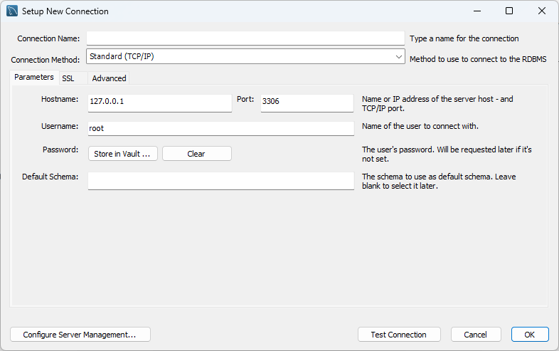
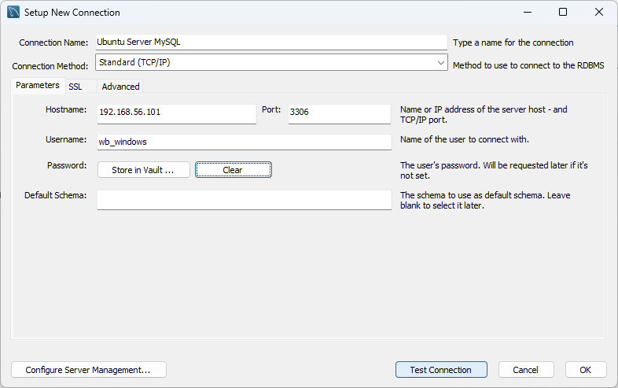
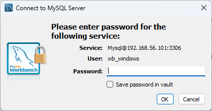
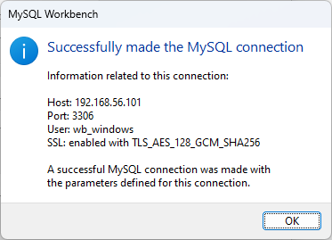

# Instalación y configuración de un Sistema Gestor de Base de Datos

En esta actividad vamos a instalar y configurar un Sistema Gestor de Base de Datos. Para ello vamos a utilizar el Sistema Gestor de Base de Datos MySQL.

## Instalación de MySQL Server

### Instalación en Windows

### Instalación en Linux

## Instalación de MySQL Workbench

### Instalación en Windows

### Instalación en Linux

## Conexión de MySQL Workbench con MySQL Server

El caso que vamos a ver es el de conectar un MySQL Workbench instalado en Windows con un MySQL Server instalado en Linux.

### Configuración de MySQL Server

El archivo de configuración de MySQL Server es `mysqld.cnf` y se encuentra en la siguiente ruta: `/etc/mysql/mysql.conf.d/mysqld.cnf`.

Dentro del ese archivo buscaremos la línea que empieza por `bind-address`. Esta instrucción indica a MySQL Server en qué dirección IP (interfaz) debe escuchar las peticiones de conexión. Por defecto, esta línea está está: `bind-address = 127.0.0.1`, lo que significa que sólo escuchará las peticiones de conexión que vengan del equipo local. Si queremos que atienda a las peticiones que vengan de otra red como `192.168.56.0` a la que está conectado la interfaz de IP `192.168.56.101` la añadiríamos de la siguiente forma: `bind-address = 127.0.0.1,192.168.56.101`.

### Creación de un usuario para acceso remoto

Para crear un usuario en MySQL Server que pueda acceder desde otro equipo hemos de seguir los siguientes pasos:

#### Conexión a MySQL Server como `root`

Ahora hemos de crear un usuario que pueda acceder a MySQL Server desde otro equipo. Para ello, nos conectamos a MySQL Server con el usuario `root` de la siguiente forma:

```bash
~$ sudo mysql
[sudo] password for manuel:
Welcome to the MySQL monitor.  Commands end with ; or \g.
Your MySQL connection id is 12
Server version: 8.0.39-0ubuntu0.24.04.2 (Ubuntu)

Copyright (c) 2000, 2024, Oracle and/or its affiliates.

Oracle is a registered trademark of Oracle Corporation and/or its
affiliates. Other names may be trademarks of their respective
owners.

Type 'help;' or '\h' for help. Type '\c' to clear the current input statement.

mysql>
```

#### Creación de un usuario

En este momento estaríamos dentro de MySQL server como administradores (usuario `root`). Ahora vamos a crear un usuario que pueda acceder a MySQL Server desde otro equipo. Para ello ejecutamos la siguiente instrucción:

```sql
CREATE USER 'usuario'@'ip_desde_donde_conecta' IDENTIFIED BY 'password';
```

Donde:

* `usuario`: es el nombre del usuario que vamos a crear.
* `ip_desde_donde_conecta`: es la dirección IP desde la que se va a conectar el usuario.
* `password`: es la contraseña que va a tener el usuario.

#### Dar permisos al usuario

Ahora hemos de darle permisos al usuario para que pueda acceder a la base de datos. Para ello ejecutamos la siguiente instrucción:

```sql
GRANT CREATE, ALTER, DROP, INSERT, UPDATE, DELETE, SELECT, REFERENCES, RELOAD on *.* TO 'sammy'@'remote_server_ip' WITH GRANT OPTION;
```

De esta forma el usuario podra...:

* `CREATE`: crear bases de datos y tablas.
* `ALTER`: modificar la estructura de las tablas.
* `DROP`: eliminar bases de datos y tablas.
* `INSERT`: insertar registros en las tablas.
* `UPDATE`: modificar registros de las tablas.
* `DELETE`: eliminar registros de las tablas.
* `SELECT`: consultar registros de las tablas.
* `REFERENCES`: crear claves foráneas.
* `RELOAD`: recargar los privilegios.

Estos permisos los tendrá sobre todas las bases de datos (`*.*`) y desde la dirección IP que hayamos indicado en `ip_desde_donde_conecta`.

Finalmente hemos de recargar los privilegios para que los cambios surtan efecto:

```sql
FLUSH PRIVILEGES;
```

Ahora ya podemos salir de MySQL Server (`exit;`) y probar la conexión desde MySQL Workbench. En las siguientes imágenes veremos como se hace.

*Nota: en el siguiente ejemplo usé como nombre de usuario `wb_windows` (WorkBench Windows). La dirección IP del servidor MySQL es `192.168.56.101` (la ip que dar Virtual Box a la máquina virtual Ubuntu Server conectada mediante una interfaz *host only*) y la IP de Windows (desde dónde se ejecuta Workbench) es `192.168.56.1`, por lo que al configurar MySQL Server habrá que usar esa IP en lugar de `ip_desde_donde_conecta`.*

### Creación de una conexión en MySQL Workbench

Una vez abierto el WorkBench pulsaremos en `+` para añadir una nueva conexión.


En la ventana que se abre rellenamos los campos de la siguiente forma:



Cubrimos los campos con los valores correctos y probamos la conexión pulsando en el botón `Test Connection`.



Si todo está correcto nos aparecerá un mensaje como el siguiente pidiéndonos la contraseña del usuario que hemos creado en MySQL Server:



Si todo ha ido bien nos aparecerá un mensaje como el siguiente:



Y creo que con esto ya hemos terminado.

*P.D.:
Si tenéis alguna duda, como siempre, no dudéis en consultarme.*
