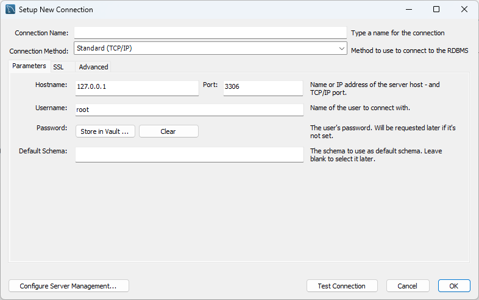
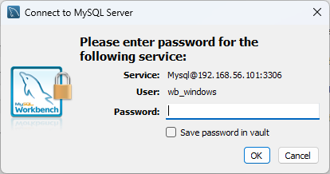
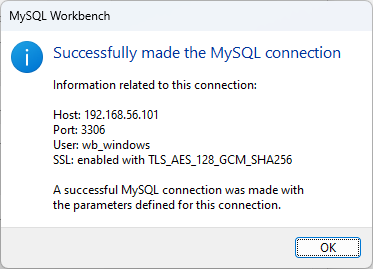

# Instalación y configuración de un Sistema Gestor de Base de Datos

[TOC]

En esta actividad vamos a instalar y configurar un Sistema Gestor de Base de Datos. Para ello vamos a utilizar el Sistema Gestor de Base de Datos MySQL.

## Instalación de MySQL Server

En primer lugar veremos cómo instalar MySQL Server en Windows y en una distribución de Linux (en concreto Ubuntu Server).

Hoy en día, a la hora de realizar la instalación de cualquier software casi siempre nos encontramos con dos opciones: descargar el instalador desde la página web del fabricante o instalarlo mediante un gestor de paquetes. En el caso de MySQL Server, vamos a ver cómo instalarlo mediante un gestor de paquetes en Ubuntu Server y mediante un instalador y un gestor de paquetes en Windows.

### Instalación en Windows

#### Descargando el instalador

Para descargar el instalador de MySQL server hemos de ir a la página web de MySQL y buscar la versión que queremos instalar. En nuestro caso vamos a instalar la versión 8.4.2 LTS (Long Time Support) en su versión *Community*. Para ello iremos a la siguiente URL (4/10/2024): [https://dev.mysql.com/downloads/mysql/](https://dev.mysql.com/downloads/mysql/) y seleccionamos la versión y el S.O. correspondiente. Se nos presentarán tres opciones de descarga: *MSI Intaller* y dos *ZIP Archive* (el segundo con características de desarrollo). Nosotros vamos a descargar el *MSI Installer*.


Una vez descargado el instalador seguiremos el conocido proceso de doble clic, siguiente, siguiente, ..., finalizar.

#### Usando `winget`

Desde hace un tiempo el sistema operativo Windows dispone de una herramienta de gestión de paquetes llamada `winget`. Con esta herramienta podemos instalar, actualizar y desinstalar software de una forma sencilla.

Si no recordamos el nombre exacto del paquete que queremos instalar podemos buscarlo con el comando `search`. Por ejemplo, si queremos buscar el paquete de MySQL Server ejecutaríamos el siguiente comando:

```powershell
winget search mysql
Name                            Id                                 Version      Match      Source
--------------------------------------------------------------------------------------------------
MySQL Client Go                 9PMCW63W4G3B                       Unknown                 msstore
SQLPro for MySQL                9PFHQWV7FCHK                       Unknown                 msstore
Navicat 17 for MySQL            XP9KGG7DX4NM3R                     Unknown                 msstore
计算机二级 MySQL 数据库程序设计 9NRBZTD0W1PF                       Unknown                 msstore
MySQL                           Oracle.MySQL                       8.0.39                  winget
XAMPP 8.1                       ApacheFriends.Xampp.8.1            8.1.12-0     Tag: mysql winget
...
# Se han reducido los resultados para simplificar la lectura.
...
TriCo                           ngudbhav.TriCo                     3.1.0        Tag: mysql winget
MySQL Shell                     Oracle.MySQLShell                  8.4.0                   winget
MySQL Workbench 8.0 CE          Oracle.MySQLWorkbench              8.0.38                  winget
```
El que nos interesa es el paquete `Oracle.MySQL` que es el servidor de MySQL de Oracle. Para instalarlo ejecutaríamos el siguiente comando:

```powershell
winget install Oracle.MySQL
```
`winget` se encargará de descargar el instalador correcto y de instalarlo en nuestro sistema (pidiéndonos permisos de administrador si fuera necesario). Una vez terminado el proceso de instalación `winget` borrará el instalador descargado y ya podremos usar MySQL Server.

### Instalación en Linux

Para instalar MySQL Server en Linux vamos a seguir los siguientes pasos:

```bash
$ sudo apt update # Actualizamos la lista de paquetes.
$ sudo upgrade # Actualizamos los paquetes a sus últimas versiones.
$ sudo apt install mysql-server
```

Si no supiéramos el nombre exacto del paquete que queremos instalar podemos buscarlo con el comando `apt search`. Por ejemplo, si queremos buscar el paquete de MySQL Server ejecutaríamos el siguiente comando:

```bash
apt search mysql
```

## Instalación de MySQL Workbench

### Instalación en Windows

Esta vez veremos únicamente la instalación mediante `winget`. Para ello ejecutaremos el siguiente comando:

```powershell
wignet install Oracle.MySQLWorkbench
```

### Instalación en Linux

De nuevo usando apt (la herramienta de gestión de paquetes de Ubuntu) instalaremos MySQL Workbench con el siguiente comando:
```bash
sudo apt install mysql-workbench
```

Alternativamente podríamos usar `snap` para instalar MySQL Workbench. Para ello ejecutaríamos los siguientes comandos:

1. Buscar el paquete de MySQL Workbench en `snap`:

    ```bash
    $ snap search workbench
    Name                       Version    Publisher         Notes  Summary
    weka                       3.8.6      james-carroll✪    -      The workbench for machine learning
    mysql-workbench-community  8.0.36     tonybolzan        -      MySQL Workbench
    zworkbench                 2.2.220.1  alexei-developer  -      ZWorkbench
    ```
1. Seleccionamos `mysql-workbench-community` y lo instalamos:

    ```bash
    $ sudo snap install mysql-workbench-community
    ```
Una vez terminado el proceso de instalación de MySQL Server y MySQL Workbench ya podremos proceder a la configuración de MySQL Server y a la conexión de MySQL Workbench con MySQL Server. En el siguiente apartado veremos el caso de conectar a MySQL Server desde un MySQL Workbench instalado en otra máquina.

## Conexión de MySQL Workbench con MySQL Server

El caso que vamos a ver es el de conectar un MySQL Workbench instalado en Windows con un MySQL Server instalado en Linux.

### Configuración de MySQL Server

El archivo de configuración de MySQL Server (en Ubuntu Server) es `mysqld.cnf` y se encuentra en la siguiente ruta: `/etc/mysql/mysql.conf.d/mysqld.cnf`.

*En Windows, el archivo de configuración de MySQL Server puede ser tanto `my.cnf` como `my.ini` y, en el momento de arrancar el servidor, éste lo buscará en las siguientes localizaciones:`

| Fichero de configuración | Propósito |
| :----: | :----: |
| `%WINDIR%\my.ini, %WINDIR%\my.cnf` | Opciones globales |
| `C:\my.ini, C:\my.cnf ` | Opciones globales |
| `BASEDIR\my.ini, BASEDIR\my.cnf` | Opciones globales |

*Volvamos a Ubuntu Server...*

Dentro del ese archivo buscaremos la línea que empieza por `bind-address`. Esta instrucción indica a MySQL Server en qué **dirección IP** (interfaz) debe de **escuchar las peticiones de conexión**. Por defecto, esta línea tendrá el valor `bind-address = 127.0.0.1`, lo que significa que **sólo atenderá a las peticiones de conexión que vengan del equipo local** (`127.0.0.1` equivale a *localhost*).

Esto no nos sirve para nuestro caso pues vamos a conectarnos desde otro equipo de la red que se conectará al interfaz conectado a dicha red (`192.168.56.101` generalmente en el caso de VirtualBox). Por tanto hemos de modificar la línea `bind-address` para que atienda a las peticiones de conexión que vengan de dicha red.

Para lograr esto añadiremos la dirección del interfaz **de la máquina en que está MySQL Server** `bind-address = 127.0.0.1,192.168.56.101`. Así, MySQL Server atenderá a las peticiones de conexión que vengan desde el equipo local y desde la red `192.168.56.0/24`.

*Nota: si queremos que atienda a todas las peticiones de conexión que entren desde **cualquier** interfaz de red podemos poner `bind-address = *` o `bind-address = 0.0.0.0` (la diferencia entre ambos se puede consultar [aquí](https://dev.mysql.com/doc/refman/8.0/en/server-system-variables.html#sysvar_bind_address)).*

### Creación de un usuario para acceso remoto

Aún no hemos terminado. Para que MySQL Server acepte las conexiones de un usuario que se conecta desde otro equipo hemos de crear un usuario con los permisos adecuados.

Para crear dicho usuario en MySQL Server lo primero que hemos de hacer es conectarnos a MySQL Server como `root` usando *MySQL Command-Line Client*, aplicación de línea de comandos que ya se ha instalado cuando instalamos MySQL Server.

#### Conexión a MySQL Server como `root`

El comando con que establecemos una conexión de MySQL Command-Line Cliente a MySQL Server se llama `mysql` y, como su nombre nos indica, hemos de usarlo desde la línea de comandos. Para entrar como el usuario administrador hemos de ejecutar el comando `mysql` con privilegios de `root`:

```bash
~$ sudo mysql
[sudo] password for manuel:
Welcome to the MySQL monitor.  Commands end with ; or \g.
Your MySQL connection id is 12
Server version: 8.0.39-0ubuntu0.24.04.2 (Ubuntu)

Copyright (c) 2000, 2024, Oracle and/or its affiliates.

Oracle is a registered trademark of Oracle Corporation and/or its
affiliates. Other names may be trademarks of their respective
owners.

Type 'help;' or '\h' for help. Type '\c' to clear the current input statement.

mysql>
```

#### Creación de un usuario

En este momento estaríamos dentro de MySQL server como administradores (usuario `root`). Ahora vamos a crear un usuario que pueda acceder a MySQL Server desde otro equipo. Para ello ejecutamos la siguiente instrucción:

```sql
CREATE USER 'usuario'@'ip_desde_donde_conecta' IDENTIFIED BY 'password';
```

Donde:

* `usuario`: es el nombre del usuario que vamos a crear.
* `ip_desde_donde_conecta`: es la dirección IP desde la que se va a conectar el usuario.
* `password`: es la contraseña que va a tener el usuario.

*Nota: En nuestro ejemplo llamé al usuario `wb_windows` (Work Bench Windows) y la IP del equipo Windows donde está instalado MySQL WorkBench es `192.168.56.1` por lo que el usuario creado tendría que ser: `wb_windows@192.168.56.1'.*

#### Dar permisos al usuario

Ahora hemos de darle permisos al usuario para que pueda acceder a la base de datos. Para ello ejecutamos la siguiente instrucción:

```sql
GRANT CREATE, ALTER, DROP, INSERT, UPDATE, DELETE, SELECT, REFERENCES, RELOAD on *.* TO 'usuario'@'ip_desde_donde_conecta' WITH GRANT OPTION;
```

De esta forma el usuario podrá...:

* `CREATE`: crear bases de datos y tablas.
* `ALTER`: modificar la estructura de las tablas.
* `DROP`: eliminar bases de datos y tablas.
* `INSERT`: insertar registros en las tablas.
* `UPDATE`: modificar registros de las tablas.
* `DELETE`: eliminar registros de las tablas.
* `SELECT`: consultar registros de las tablas.
* `REFERENCES`: crear claves foráneas.
* `RELOAD`: recargar los privilegios.

Estos permisos los tendrá sobre todas las bases de datos (`*.*`) y desde la dirección IP que hayamos indicado en `ip_desde_donde_conecta`.


Finalmente hemos de recargar los privilegios para que los cambios surtan efecto:

```sql
FLUSH PRIVILEGES;
```

Ahora ya podemos salir de MySQL Server (`exit;`) y probar la conexión desde MySQL Workbench. En las siguientes imágenes veremos como se hace.

*Nota: en el siguiente ejemplo usé como nombre de usuario `wb_windows` (WorkBench Windows). La dirección IP del servidor MySQL es `192.168.56.101` (la ip que dar Virtual Box a la máquina virtual Ubuntu Server conectada mediante una interfaz *host only*).

### Creación de una conexión en MySQL Workbench

Una vez abierto el WorkBench pulsaremos en `+` para añadir una nueva conexión.


En la ventana que se abre rellenamos los campos de la siguiente forma:



Cubrimos los campos con los valores correctos y probamos la conexión pulsando en el botón `Test Connection`.


Si todo está correcto nos aparecerá un mensaje como el siguiente pidiéndonos la contraseña del usuario que hemos creado en MySQL Server:



Si todo ha ido bien nos aparecerá un mensaje como el siguiente:



Y creo que con esto ya hemos terminado.

*P.D.:
Si tenéis alguna duda, como siempre, no dudéis en consultarme.*