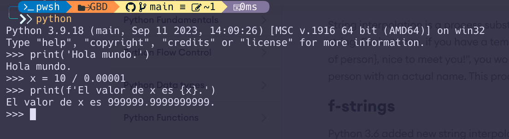

# Apuntes de la UD1 - Desarrollo de software

## Fases del desarrollo de software

### Análisis

También se le conoce como **análisis de requisitos**. En esta fase se recopilan los requisitos del sistema, es decir, se identifican las necesidades que debe satisfacer el software que se va a desarrollar. Los requisitos pueden ser funcionales (lo que el sistema debe hacer) o no funcionales (cómo debe hacerlo). Por ejemplo, un requisito funcional podría ser que el sistema permita a los usuarios registrarse y un requisito no funcional podría ser que el sistema sea fácil de usar.

Esta es una de las fase más importantes del desarrollo de software, ya que si no se recopilan correctamente los requisitos, el software resultante no cumplirá con las expectativas del cliente. Si se comete un error en esta fase, es muy costoso corregirlo en fases posteriores del desarrollo. Esto se traduce en pérdidas de tiempo y dinero.

### Diseño

En esta fase se definen la arquitectura del sistema y los componentes que lo forman. El objetivo es transformar los requisitos recopilados en la fase de análisis en un diseño detallado que permita la implementación del sistema.

Se selecciona la tecnología quese va a utilizar para desarrollar el sistema: lenguaje de programación, base de datos, entorno de desarrollo, etc.

A partir de ahí se definen las estructuras de datos, los algoritmos y las interfaces de usuario que se van a utilizar en el sistema, las entidades y las relaciones, etc.

### Implementación / codificación

En esta fase se escribe el código fuente del sistema. El código fuente es el conjunto de instrucciones que le indican al ordenador qué operaciones debe realizar. El código fuente se escribe en un lenguaje de programación, ya seleccionado en la fase de diseño, y se guarda en archivos de texto plano. Dependiendo del proyecto podrían utilizarse varios lenguajes de programación.

Es en esta fase donde se usará un IDE (Entorno de Desarrollo Integrado) para escribir el código fuente, compilarlo y ejecutarlo. Un IDE es una herramienta que facilita el desarrollo de software, ya que proporciona un editor de texto, un compilador, un depurador, etc.

### Compilación

En esta fase obtenemos un programa ejecutable a partir del código fuente generado en la fase de codificación. Para ello, el código fuente se traduce a lenguaje máquina específico del procesador. El resultado de esta traducción es un archivo ejecutable que contiene el programa en lenguaje máquina. Este archivo se puede ejecutar en cualquier ordenador que tenga el mismo procesador (arquitectura) y el mismo sistema operativo que el que se utilizó para compilar el programa.

Veamos esto en algo más de detalle.

#### Ejecución del código fuente

Una vez tenemos el código fuente escrito es necesario ejecutarlo para que el ordenador realice las operaciones que se han programado.

Atendiendo a la forma en que se ejecuta el código podemos distinguir dos tipos de lenguajes de programación: los lenguajes compilados y los lenguajes interpretados.

* **Lenguajes compilados**: Los lenguajes compilados son aquellos en los que el código fuente se traduce a un lenguaje máquina específico del procesador. El resultado de esta traducción es un archivo ejecutable que contiene el programa en lenguaje máquina. Este archivo se puede ejecutar en cualquier ordenador que tenga el mismo procesador (arquitectura) y el mismo sistema operativo que el que se utilizó para compilar el programa. Ejemplos de lenguajes compilados son C, C++, Pascal, etc.
* **Lenguajes interpretados**: Los lenguajes interpretados son aquellos en los que el código fuente se traduce (*interpreta*) a lenguaje máquina en tiempo de ejecución. El programa que se encarga de realizar esta traducción se llama intérprete. El intérprete lee el código fuente, lo traduce a lenguaje máquina y lo ejecuta. Ejemplos de lenguajes interpretados son Python, PHP, JavaScript, etc.

#### Lenguajes semicompilados

Existe una tercera categoría de lenguajes de programación que son los lenguajes semicompilados. Estos lenguajes son compilados en el sentido de que generan código máquina, pero no para una máquina real, sino para una máquina virtual.

En el caso de Java, por ejemplo, el compilador genera código máquina para la máquina virtual de Java (Java Virtual Machine - JVM). Este código se ejecuta en la JVM, que es un programa que simula un ordenador virtual. La ventaja de este enfoque es que el código Java es independiente de la plataforma, es decir, se puede ejecutar en cualquier ordenador que tenga una JVM instalada.

#### RPL (Run-Print-Loop)

En los lenguajes interpretados es muy común que se hable de RPL. Un RPL es un intérprete que ejecuta el código que escribe el usuario (*run*), muestra el resultado de la ejecución (*print*) y queda a la espera de que el usuario escriba la siguiente instrucción para repetir el proceso (*loop*).

Por ejemplo, en Python, podemos ejecutar un RPL con el comando `python` en la consola:

### Pruebas

Las pruebas de software son el proceso de comprobar que una aplicación hace lo que se espera que haga, es decir, lo que hemos determinado en la fase de análisis. El objetivo de las pruebas es detectar errores en el software antes de que llegue a los usuarios finales. Existen varios tipos de pruebas, entre las que destacan las pruebas unitarias, las pruebas de integración, las pruebas de sistema y las pruebas de aceptación.

* **Pruebas unitarias**: Son pruebas que se realizan sobre unidades de código, es decir, sobre las partes más pequeñas del software. El objetivo de estas pruebas es comprobar que cada unidad de código funciona correctamente de forma aislada.
* **Pruebas de integración**: Son pruebas que se realizan sobre grupos de unidades de código que se han probado individualmente. El objetivo de estas pruebas es comprobar que las unidades de código se integran correctamente y que funcionan bien en conjunto.
* **Pruebas de sistema**: Son pruebas que se realizan sobre el sistema completo. El objetivo de estas pruebas es comprobar que el sistema cumple con los requisitos especificados en la fase de análisis.
* **Pruebas de aceptación**: Son pruebas que se realizan en las últimas etapas antes de sacar la nueva versión. Son realizadas por parte del cliente para comprobar que el sistema cumple con sus expectativas. El objetivo de estas pruebas es validar que el sistema satisface las necesidades del cliente.

### Explotación

Esta es la última fase del ciclo de vida del software. En esta fase se pone en marcha el sistema y se pone a disposición de los usuarios finales. El objetivo de esta fase es que el sistema sea utilizado por los usuarios para los que se ha desarrollado.

En esta fase se instalará y configurará el software que hemos desarrollado. También se proporcionará la formación necesaria a los usuarios para que puedan utilizar el sistema de forma eficiente. Además, se realizará un seguimiento del sistema para detectar posibles errores y corregirlos.

Esta fase también incluye las *fase* o *subfase* de **mantenimiento**.

### Mantenimiento

Esta fase consiste en monitorizar el correcto funcionamiento del software y corregir los errores que se detecten. También se pueden realizar mejoras en el software para añadir nuevas funcionalidades o para adaptarlo a nuevos requisitos. El mantenimiento del software es una tarea continua que se realiza a lo largo de toda la vida del software.

### Documentación

La documentación no es una fase en sí misma, sino que es un proceso que se lleva a cabo a lo largo de todo el ciclo de vida del software. La documentación es importante para que otras personas puedan entender cómo funciona el software y cómo se ha desarrollado. La documentación puede ser de varios tipos: documentación de usuario, documentación técnica, manuales de usuario, manuales de instalación, etc.

## Frameworks

Un *framework* es una estructura conceptual y tecnológica que sirve de base para el desarrollo de software. Un *framework* proporciona una serie de herramientas y componentes que facilitan el desarrollo de aplicaciones. Los *frameworks* permiten a los desarrolladores centrarse en la lógica de negocio de la aplicación, en lugar de tener que preocuparse por cuestiones técnicas.

En general los *frameworks* están ligados a un lenguaje de programación específico y están diseñados con un propósito concreto. Por ejemplo, existen *frameworks* para el desarrollo de aplicaciones web, para el desarrollo de aplicaciones móviles, para el desarrollo de aplicaciones de escritorio, etc.

### Por qué usar un framework

Los *frameworks* permiten ahorrar tiempo y reducir el riesgo de cometer errores puesto que evitan escribir todo desde cero. Además, los *frameworks* suelen seguir buenas prácticas de programación y proporcionan una estructura y una arquitectura bien definida para el desarrollo de aplicaciones. Otras ventajas de usar un *framework* son:

* Código más seguro: Las *piezas* que incluye el *framework* suelen estar probadas y ser seguras.
* Facilidad para realizar pruebas y depuración: Los *frameworks* suelen incluir herramientas para realizar pruebas y depuración de aplicaciones.
* Evitar duplicidad de código: Los *frameworks* suelen proporcionar componentes reutilizables que permiten evitar la duplicidad de código.

Por otro lado también hay inconvenientes en el uso de *frameworks*:

* Curva de aprendizaje: Los *frameworks* suelen tener una curva de aprendizaje pronunciada.
* Limitaciones: Los *frameworks* pueden imponer limitaciones a la hora de desarrollar aplicaciones.
* Dependencia: Los *frameworks* pueden crear dependencia con el *framework*. Si más adelante se quiere cambiar de *framework* posiblemente será necesario reescribir la aplicación.

### Ejemplos de frameworks

* **Django**: *Framework* para el desarrollo de aplicaciones web en Python (del lado del servidor).
* **Spring**: *Framework* para el desarrollo de aplicaciones empresariales en Java.
* **Angular**: *Framework* para el desarrollo de aplicaciones web en TypeScript (del lado del cliente).
* **React**: *Framework* para el desarrollo de aplicaciones web en JavaScript (del lado del cliente).
* **Flutter**: *Framework* para el desarrollo de aplicaciones móviles en Dart.
* **.NET**: *Framework* para el desarrollo de aplicaciones en C#.NET.
* **Ruby on Rails**: *Framework* para el desarrollo de aplicaciones web en Ruby.
* **Laravel**: *Framework* para el desarrollo de aplicaciones web en PHP.
* **Qt**: *Framework* para el desarrollo de aplicaciones de escritorio en C++.
* **Electron**: *Framework* para el desarrollo de aplicaciones de escritorio en JavaScript.
* **Unity**: *Framework* para el desarrollo de videojuegos en C#.
* etc.

## Lenguajes de programación

Un lenguaje de programación es un lenguaje formal que se utiliza para escribir instrucciones que se pueden traducir a código máquina y que permiten controlar el comportamiento de una máquina. Los lenguajes de programación se utilizan para desarrollar software, es decir, programas informáticos que se ejecutan en un ordenador.

El objetivo de un lenguaje de programación es facilitar la escritura de programas informáticos. Los lenguajes de programación permiten a los programadores escribir instrucciones en un lenguaje que es más fácil de entender que el lenguaje máquina. Dicho de otra forma, un lenguaje de programación permite abstraerse de los detalles de la máquina (arquitectura del procesador, memoria, sistema operativo, etc.) y centrarse en la lógica del programa.

Todo lenguaje de programación consta de:

* Alfabeto: Conjunto de símbolos que se pueden utilizar para escribir instrucciones.
* **Sintaxis**: Conjunto de reglas que definen la estructura del lenguaje.
* **Semántica**: Conjunto de reglas que definen el significado de las instrucciones.

Además de estos tres elementos hay que tener en cuenta que todo lenguaje conste de un conjunto de **palabras reservadas** que no se pueden utilizar como identificadores. Estas son las plataformas con significado especial que se utilizan para escribir programas.

### Alto y bajo nivel

Cuando se habla de *nivel* con respecto a un lenguaje de programación se hace referencia al nivel de abstracción del lenguaje. Es decir, cuan *alejado* está del hardware. Los lenguajes de alto nivel son aquellos que están más cerca del lenguaje humano y los lenguajes de bajo nivel son aquellos que están más cerca del lenguaje máquina.

Ejemplos de lenguajes de alto nivel son Python, Java, C#, JavaScript, etc. Ejemplos de lenguajes de bajo nivel son C, C++, Ensamblador, etc.

### Clasificación de los lenguajes de programación

Clasificar los lenguajes de programación es cada vez más difícil debido a la gran cantidad de lenguajes que existen y a la diversidad de paradigmas de programación. Los lenguajes actuales toman elementos de diferentes paradigmas y no se pueden clasificar fácilmente en una única categoría.

Es por ello más interesante hablar de paradigmas de programación antes que categorías. Algunos de los paradigmas de programación más conocidos son:

* **Programación imperativa**: Se basa en la ejecución de instrucciones que modifican el estado del programa. Ejemplos de lenguajes imperativos son C, C++, Java, etc.
* **Programación declarativa**: Se basa en la descripción de la solución en lugar de en la secuencia de instrucciones. Ejemplos de lenguajes declarativos son SQL, Prolog, etc.
* **Programación orientada a objetos**: Se basa en la creación de objetos que encapsulan datos y comportamiento. Ejemplos de lenguajes orientados a objetos son Java, C#, Python, etc.
* **Programación funcional**: Se basa en la aplicación y composición de funciones. En estos lenguajes las funciones son el elemento fundamental. Ejemplos de lenguajes funcionales son Erlang, Haskell, etc.

Dependiendo de cómo se ejecuten las instrucciones, los lenguajes de programación se pueden clasificar en dos tipos:

* **Lenguajes compilados**: Son aquellos en los que el código fuente se traduce a un lenguaje máquina específico del procesador. El resultado de esta traducción es un archivo ejecutable que contiene el programa en lenguaje máquina. Este archivo se puede ejecutar en cualquier ordenador que tenga el mismo procesador (arquitectura) y el mismo sistema operativo que el que se utilizó para compilar el programa. Ejemplos de lenguajes compilados son C, C++, Pascal, etc.
* **Lenguajes interpretados:** Son aquellos en los que el código fuente se traduce (*interpreta*) a lenguaje máquina en tiempo de ejecución. El programa que se encarga de realizar esta traducción se llama intérprete. El intérprete lee el código fuente, lo traduce a lenguaje máquina y lo ejecuta. Ejemplos de lenguajes interpretados son Python, PHP, JavaScript, etc.

Como comentábamos antes, también hay lenguajes semicompilados, como Java, que generan código máquina para una máquina virtual. Son compilados en el sentido de que se genera código objeto, pero no para una máquina real, sino para una máquina virtual. Como ejemplo de máquinas virtuales tenemos la JVM de Java, el CLR de .NET o BEAM de Erlang. Estas máquinas virtuales son programas que simulan un ordenador y que permiten ejecutar este código máquina en cualquier ordenador que tenga dicha máquina virtual instalada.

En el caso de Java, por ejemplo, podremos escribir un programa en Java y ejecutarlo en cualquier ordenador que tenga una JVM instalada, independientemente de la arquitectura del procesador o del sistema operativo.

