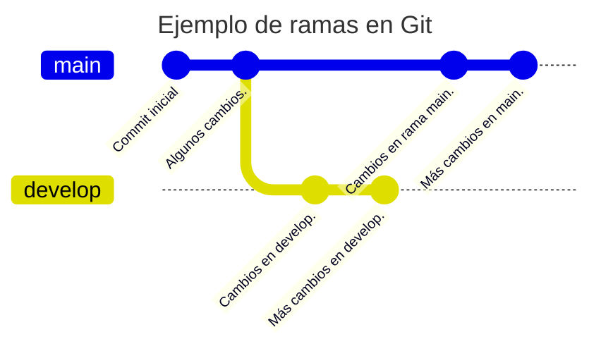
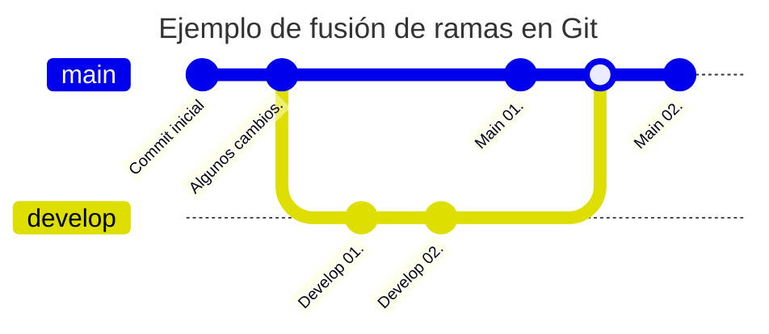
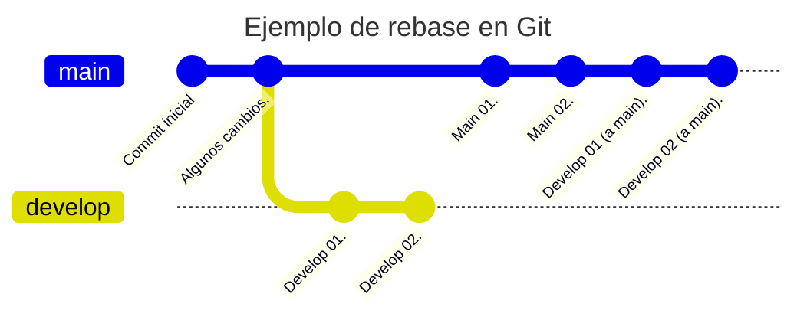

# Apuntes de Git

## ¿Qué es Git?

### ¿Qué es un sistema de control de versiones?

Un sistema de control de versiones (VCS: Version Control System) es un sistema que registra los cambios en un conjunto de archivos (un proyecto) en forma de instantáneas a lo largo del tiempo. Estas instantáneas nos permiten conocer quién ha realizado un cambio, cuándo se ha realizado y qué se ha cambiado. Si necesitamos retroceder a una versión anterior de un fichero o de un proyecto completo, podemos hacerlo.

También hemos de tener en cuenta que este registro no tiene como objetivo ser un histórico de los cambios, sino una forma de colaborar con otros desarrolladores en un proyecto. Por tanto, se pueden alterar tanto en contenido como la estructura de las *instantáneas*.

Aunque los VCS son muy utilizados en el desarrollo de software, también se pueden utilizar en otros ámbitos, como el diseño gráfico, la redacción de documentos, etc.

## Utilidad de GIT

GIT es un sistema de control de versiones distribuido, es decir, todos aquellos que participen en un proyecto gestionado mediante Git dispondrá de una copia del mismo. Esto permite tanto trabajar sin conexión a Internet como tener una copia de seguridad del proyecto. Si el *repositorio* central falla, se puede recuperar el proyecto a partir de cualquiera de las copias locales. Es decir, no hay un único punto de fallo.

## Características de GIT

* Git es un sistema de control de versiones distribuido de manera que no tiene un único punto de fallo.
  * Cada usuario tiene una copia local **completa** del repositorio.
* Git es Open Source y gratuito.
* Está diseñado para manejar proyectos de cualquier tamaño con rapidez y eficiencia.
* Casi todas las operaciones son locales (aunque posteriormente se pueden sincronizar con un servidor remoto).
  * No es necesario estar conectado para trabajar.
* Git *siempre* añade datos. Nunca los borra.
  * Esto es importante porque si borramos algo por error, siempre podemos recuperarlo. **Y si lo *subimos* por error, no siempre podemos borrarlo** (al menos fácilmente).

**Tres estados de GIT**: Todo archivo en un repositorio de GIT puede estar en tres estados:

* Modificado (*modified*): hemos cambiado un fichero pero no lo hemos guardado en la base de datos.
* Preparado (*staged*): hemos marcado un fichero modificado en su versión actual para que vaya en la próxima instantánea (*commit*).
* Confirmado (*committed*): hemos guardado los cambios (de los ficheros previamente marcados, *staged*) en la base de datos como una *instantánea*.

**Tres áreas de GIT**

* Directorio de trabajo (*working directory*): donde se encuentran los archivos de nuestro proyecto. Aquí podremos tener los ficheros *vigilados* (*tracked*) por Git o *no vigilados* (*untracked*).
* Área de preparación (*staging area*): donde se encuentran los archivos marcados (*staged*) para la próxima instantánea (*commit*).
* Directorio Git (*Git directory*): donde GIT guarda los metadatos y la base de datos de los cambios. Aquí se encuentra la historia del proyecto. De nuevo, recordar que la historia se puede modificar.

**Flujo de trabajo básico en GIT**: Una forma usar Git podría ser la siguiente (aunque hay muchas otras formas):

1. Realizamos cambios en los archivos de nuestro proyecto.
2. Selecciones los archivos que queremos incluir (*staged*) en la siguiente instantánea (*commit*).
3. Realizamos el *commit* para salvar los cambios en forma de una instantánea.

## Instalación de GIT

### En Linux (Ubuntu)

### En Windows

## Configuración de GIT

Git necesita saber quién eres para poder registrar los cambios que realizas en un proyecto. Por tanto, es necesario configurar tu nombre y tu dirección de correo electrónico antes de poder realizar un *commit*. Para ello, usamos los siguientes comandos:

```bash
git config --global user.name "mourazos"
git config --global user.email "mourazos@iessanclemente.net"
```

## Comandos básicos de GIT

### Inicializar un repositorio

Para inicializar un repositorio en un directorio, usamos el comando `git init`.

### Ver el estado de los archivos

Para ver el estado de los archivos en un repositorio, usamos el comando `git status`.

### Clonar un repositorio

Para clonar un repositorio, usamos el comando `git clone url_repositorio`.

### Añadir archivos al área de preparación (staging area)

Para añadir un archivo al área de preparación, usamos el comando `git add nombre_archivo`.

### Realizar un commit

Para realizar un commit, usamos el comando `git commit -m "mensaje_commit"`.

Si queremos añadir todos los archivos modificados al área de preparación y realizar un commit, podemos usar el comando `git commit -am "mensaje_commit"`.


### Remotos

#### Para subir los cambios a un repositorio remoto

Para subir los cambios a un repositorio remoto, usamos el comando `git push origin nombre_rama`.

## GUIs de GIT

### [Lazygit](https://github.com/jesseduffield/lazygit)


### Ramas en Git (Branches)

Las ramas en Git son simplemente apuntadores móviles a uno de los *commits*. Por defecto, cuando creamos un nuevo proyecto, se crea una rama principal llamada `master` (o `main` dependiendo de la versión). Al crear una nueva rama, se crea un nuevo apuntador que podemos mover a cualquier *commit*. Esto nos permite trabajar en paralelo en diferentes funcionalidades o versiones de nuestro proyecto.



La rama en uso (o activa) se llama `HEAD`. Cuando creamos un nuevo *commit*, `HEAD` se mueve al nuevo *commit*. Si cambiamos de rama (`cit checkout`), `HEAD` se mueve a la nueva rama (a su último *commit*).

El comando para crear una nueva rama es `git branch nombre_rama`. Para cambiar de rama, usamos `git checkout nombre_rama`. Es común combinar estos dos comandos en uno solo: `git checkout -b nombre_rama` que crea una nueva rama y se cambia a ella.

Desde la versión 2.23 de Git, se recomienda usar `git switch` en lugar de `git checkout` para cambiar de rama.

#### Fusionar ramas (Merge)

La fusión de ramas es el proceso de combinar dos ramas en una sola con el objetivo de **integrar los cambios de una rama en la otra**. Para fusionar una rama con la rama actual, usamos el comando `git merge nombre_rama` o bien `git merge nombre_rama nombre_rama_base`.

Si hay conflictos, debemos resolverlos manualmente.



#### Rebase

La operación de *rebase* es una forma de, al igual de *merge*, incluir los cambios de una rama en otra. En lugar de fusionar dos ramas, se reescribe la historia de una rama sobre otra. Esto puede ser útil para mantener una historia más limpia y ordenada.
El comando para realizar un rebase es `git rebase nombre_rama`.



### Deshacer cambios

Las instrucciones que podemos usar para deshacer cambios en Git son:

* `git checkout ref_commit`: deshace los cambios en un archivo que no ha sido añadido al área de preparación.
* `git reset nombre_archivo`: deshace los cambios en un archivo que ha sido añadido al área de preparación.
* `git revert ref_commit`: deshace los cambios hasta un *commit* concreto.

### Resolución de conflictos


