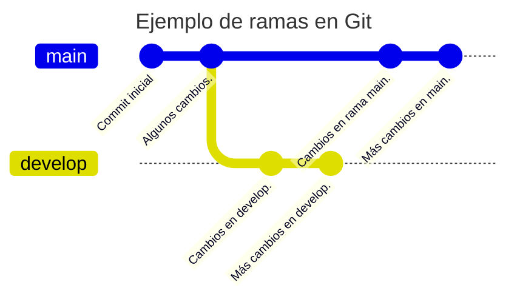
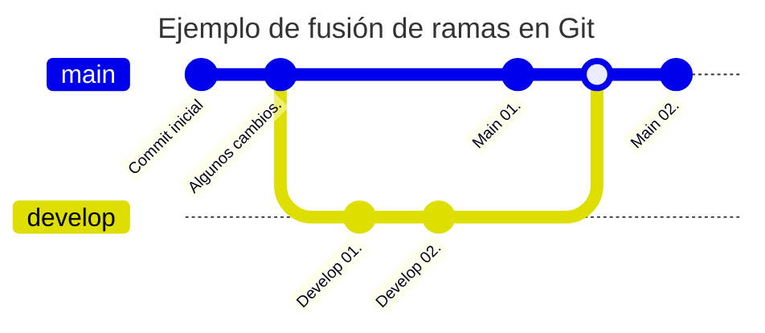
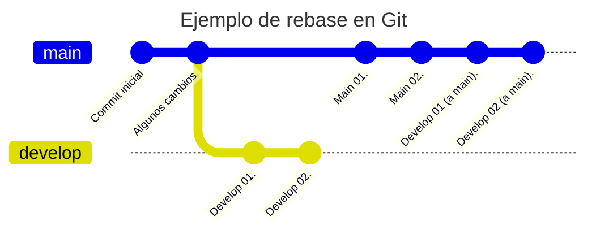

# Apuntes de Git

[TOC]

## ¿Qué es Git?

Git es un sistemas de control de versiones que surgió en el 2005. Su desarrollo surgió a raíz de la necesidad de un sistema de control de versiones que permitiera gestionar el desarrollo del kernel de Linux. Aunque existen otros sistemas de control de versiones, Git se ha convertido en uno de los más populares y extendidos en la actualidad.

Los objetivos que se buscaban con la creación de Git eran los siguientes:

* Velocidad.
* Diseño sencillo.
* Soporte para desarrollo no lineal (miles de ramas paralelas).
* Totalmente distribuido.
* Capaz de manejar grandes proyectos como el kernel de Linux eficientemente.

### ¿Qué es un sistema de control de versiones?

Un sistema de control de versiones (VCS: Version Control System) es un sistema que registra los cambios en un conjunto de archivos (un proyecto) en forma de instantáneas a lo largo del tiempo. Estas instantáneas nos permiten conocer quién ha realizado un cambio, cuándo se ha realizado y qué se ha cambiado. Si necesitamos retroceder a una versión anterior de un fichero o de un proyecto completo, podemos hacerlo.

También hemos de tener en cuenta que este registro no tiene como objetivo ser un histórico de los cambios, sino una forma de colaborar con otros desarrolladores en un proyecto. Por tanto, se pueden alterar tanto en contenido como la estructura de las *instantáneas*.

Aunque los VCS son muy utilizados en el desarrollo de software, también se pueden utilizar en otros ámbitos, como el diseño gráfico, la redacción de documentos, etc.

## Utilidad de GIT

GIT es un sistema de control de versiones distribuido, es decir, todos aquellos que participen en un proyecto gestionado mediante Git podrán disponer de una copia del mismo. Esto permite tanto trabajar sin conexión a Internet como tener una copia de seguridad del proyecto. Si el *repositorio* central falla, se puede recuperar el proyecto a partir de cualquiera de las copias locales. Es decir, no hay un único punto de fallo.

Un *repositorio* en Git es un directorio (oculto) que contiene todas las *versiones* de los archivos de un proyecto, así como los metadatos necesarios para gestionar el proyecto. En un proyecto gestionado con Git, cada usuario tiene una copia completa del repositorio (de ahí que Git se considere distribuido).

## Características de GIT

* Git es un sistema de control de versiones distribuido de manera que no tiene un único punto de fallo.
  * Cada usuario tiene una copia local **completa** del repositorio.
* Git es Open Source y gratuito.
* Está diseñado para manejar proyectos de cualquier tamaño con rapidez y eficiencia.
* Casi todas las operaciones son locales (aunque posteriormente se pueden sincronizar con un servidor remoto).
  * No es necesario estar conectado para trabajar.
* Git *siempre* añade datos. Nunca los borra.
  * Esto es importante porque si borramos algo por error, siempre podemos recuperarlo. **Y si lo *subimos* por error, no siempre podemos borrarlo** (al menos fácilmente).

### Tres estados de GIT

Todo archivo gestionado en un repositorio de GIT puede estar en tres estados:

* Modificado (*modified*): hemos cambiado un fichero pero no lo hemos guardado en la base de datos.
* Preparado (*staged*): hemos marcado un fichero modificado en su versión actual para que vaya en la próxima instantánea (*commit*).
* Confirmado (*committed*): hemos guardado los cambios (de los ficheros previamente marcados, *staged*) en la base de datos como una *instantánea*.

### Tres áreas de GIT

* Directorio de trabajo (*working directory*): donde se encuentran los archivos de nuestro proyecto. Aquí podremos tener los ficheros *vigilados* (*tracked*) por Git o *no vigilados* (*untracked*).
* Área de preparación (*staging area*): donde se encuentran los archivos marcados (*staged*) para la próxima instantánea (*commit*).
* Directorio Git (*Git directory*): donde GIT guarda los metadatos y la base de datos de los cambios. Aquí se encuentra la historia del proyecto. De nuevo, recordar que la historia se puede modificar.

Los ficheros con los que estamos trabajando, es decir, editando, modificando, compilando, etc. son los que se encuentran el el **directorio de trabajo**.

### Flujo de trabajo básico en GIT

Git no prescribe un flujo de trabajo concreto, si no que proporciona las herramientas necesarias para que cada equipo de desarrollo pueda definir su propio flujo de trabajo.

Una forma básica de usar Git podría ser la siguiente (aunque hay muchas otras formas):

1. Realizamos cambios en los archivos de nuestro proyecto.
2. Selecciones los archivos que queremos incluir (*staged*) en la siguiente instantánea (*commit*).
3. Realizamos el *commit* para salvar los cambios en forma de una instantánea.

## Instalación de GIT

### En Linux (Ubuntu)

Git está incluido en la mayoría de gestores de paquetes de las distribuciones de Linux. Para instalarlo en Ubuntu, usamos el siguiente comando:

```bash
sudo apt install git
```

### En Windows

La forma más sencilla de instalar git en Windows (versiones 11 y algunas de Windows 10) es usar la herramienta de línea de comandos `winget`. Para ello, usamos el siguiente comando:

```powershell
winget install git.git
```

## Configuración de GIT

Git necesita saber quién eres para poder registrar los cambios que realizas en un proyecto. Por tanto, es necesario configurar tu nombre y tu dirección de correo electrónico antes de poder realizar un *commit*. Para ello, usamos los siguientes comandos:

```bash
git config --global user.name "mourazos"
git config --global user.email "mourazos@iessanclemente.net"
```

Esto no es estrictamente necesario si utilizamos Git para proyectos personales sin usar un repositorio *remoto*. Pero como el uso más común de Git es colaborativo, es necesario establecer estos valores.

### `.gitignore`

Es importante evitar que Git incluya en nuestro proyecto ficheros que **no queremos compartir** o hacer públicos (como ficheros temporales, ficheros de configuración, tokens, claves, etc.). Esto es especialmente importante si tenemos pensado compartir nuestro proyecto en un repositorio público en alguno de los servicios de alojamiento de repositorios (como GitHub, GitLab, Bitbucket, etc.).

Para indicar a Git qué ficheros o directorios ha de *ignorar*, podemos crear un fichero llamado `.gitignore` en la raíz del proyecto. En este fichero podemos incluir los nombres de los ficheros o directorios que queremos que Git ignore.

Por ejemplo, si queremos que Git ignore los ficheros ejecutables o el directorio `node_modules` (que contiene las dependencias de un proyecto Node.js), podemos añadir las siguientes líneas al fichero `.gitignore`:

```git
# Ignora los ficheros con extensión .exe, .sh y .bat
*.exe
*.sh
*.bat

# Ignora el directorio node_modules
node_modules/
```

Se puede consultar una referencia de los patrones a usar dentro de `.gitignore` en la [documentación de Git](https://git-scm.com/docs/gitignore).

## Comandos básicos de GIT

### Inicializar un repositorio

Para inicializar un repositorio en un directorio, usamos el comando `git init`.

Esta instrucción crea un directorio `.git` en el directorio actual. Este directorio contiene todos los metadatos y la base de datos de los cambios del proyecto. Si borramos este directorio, perderemos todo el historial del proyecto.

### Ver el estado de los archivos

Para ver el estado de los archivos en un repositorio, usamos el comando `git status`.

### Clonar un repositorio

Para clonar un repositorio, usamos el comando `git clone url_repositorio directorio_destino`.

Este comando crea en el directorio de destino una copia completa del repositorio indicado en la URL.

### Añadir archivos al área de preparación (staging area)

Para añadir un archivo al área de preparación, usamos el comando `git add nombre_archivo`.

Si queremos añadir todos los archivos modificados al área de preparación, usamos el comando `git add .`.

### Realizar un commit

Para realizar un commit, usamos el comando `git commit -m "mensaje_commit"`.

Si queremos añadir todos los archivos modificados al área de preparación y realizar un commit, podemos usar el comando `git commit -am "mensaje_commit"`.

### Remotos

Los repositorios remotos son versiones de tu proyecto que se encuentran alojadas en Internet o en una red. Puedes tener varios repositorios remotos, cada uno de los cuales puede ser de solo lectura o de lectura/escritura.

Para ver los repositorios remotos de un proyecto, usamos el comando `git remote -v`.

#### Añadir un repositorio remoto

Para añadir un repositorio remoto, usamos el comando `git remote add nombre_repositorio url_repositorio`.

Es común que el repositorio remoto principal se llame `origin`, de modo que el comando quedaría `git remote add origin url_repositorio`.

#### Para subir los cambios a un repositorio remoto

Para subir los cambios a un repositorio remoto, usamos el comando `git push origin nombre_rama`.

### Ramas en Git (Branches)

Las ramas en Git son simplemente apuntadores móviles a uno de los *commits*. Por defecto, cuando creamos un nuevo proyecto, se crea una rama principal llamada `master` (o `main` dependiendo de la versión). Al crear una nueva rama, se crea un nuevo apuntador que podemos mover a cualquier *commit*. Esto nos permite trabajar en paralelo en diferentes funcionalidades o versiones de nuestro proyecto.
Cuando decimos que una rama *apunta a un commit* significa que los cambios (y *commits*) que hagamos en esa rama se añadirán a partir de ese *commit*.



La rama en uso (o activa) se llama `HEAD`. Cuando creamos un nuevo *commit*, `HEAD` se mueve al nuevo *commit*. Si cambiamos de rama `HEAD` se mueve a la nueva rama (a su último *commit*).

El comando para crear una nueva rama es:

```git
git branch nombre_rama
```

Y si queremos *movernos* a dicha rama usaríamos el comando:

```git
git checkout nombre_rama
```

Estos dos comandos son tan comunes que se pueden combinar en uno solo:

```git
git checkout -b nueva_rama
```

Que crea una nueva rama y se cambia a ella.

**Nota:** Desde la versión 2.23 de Git, se recomienda usar `git switch` en lugar de `git checkout` para cambiar de rama.

Así:

```git
git switch nombre_rama
```

Cambia de rama y ...

```git
git switch -c nueva_rama
```

Crea una nueva rama y se cambia a ella.

Para más información sobre éste y otros comandos de Git podemos consultar la [página de documentación de Git](https://git-scm.com/docs/git-switch).

#### Fusionar ramas (Merge)

La fusión de ramas es el proceso de combinar dos ramas en una sola con el objetivo de **integrar los cambios de una rama en la otra**. Para fusionar una rama con la rama actual, usamos el comando `git merge nombre_rama` o bien `git merge nombre_rama nombre_rama_base`.

El merge se aplicará *sobre* la rama actual, por lo que es importante estar en la rama que queremos que reciba los cambios. Si queremos fusionar la rama `develop` con la rama `main`:

```git
git checkout main
git merge develop
```

Si hay conflictos, debemos resolverlos manualmente.



#### Rebase

La operación de *rebase* es una forma de, al igual de *merge*, incluir los cambios de una rama en otra. En lugar de fusionar dos ramas, se reescribe la historia de una rama sobre otra. Esto puede ser útil para mantener una historia más limpia y ordenada.
El comando para realizar un rebase es `git rebase nombre_rama`: Esto hace que **el _rebase_ se aplique DESDE la rama actual a `nombre_rama`**.
Repitámoslo par que quede claro: Si queremos hacer un rebase **desde** la rama `develop` a la rama `main` debemos de: 

* Cambiar de rama a `develop`.
* Escribir el comando `git rebase main`.

Al contrario que en el caso de `mergue` hemos de estar en la rama **dese la cual** queremos que se envíen los cambios:

```git
git checkout develop
git rebase main
```



### Deshacer cambios

Las instrucciones que podemos usar para deshacer cambios en Git son:

* `git checkout ref_commit`: deshace los cambios en un archivo que no ha sido añadido al área de preparación.
* `git reset nombre_archivo`: deshace los cambios en un archivo que ha sido añadido al área de preparación.
* `git revert ref_commit`: deshace los cambios hasta un *commit* concreto.

### Resolución de conflictos

#### ¿Qué es un conflicto?

En Git se producen conflictos cuando dos o más personas han cambiado las mismas líneas de un fichero o si alguien borra un fichero mientras otro usuarios lo está modificando.
En estos casos Git no puede decidir *quién tiene la razón* por lo que marca el fichero como conflicto y detiene el proceso de fusión. Es entonces responsabilidad del desarrollador resolver el conflicto.

**Nota:** Los conflictos sólo afectan al desarrollador que realiza la fusión, el resto del equipo no es consciente del conflicto.

Para resolver el conflicto Git incluye ambas versiones en el fichero y marca las diferencias con `<<<<<<<`, `=======` y `>>>>>>>` donde:

* `<<<<<<<` marca el inicio de la versión actual.
* `=======` marca el inicio de la versión en conflicto.
* `>>>>>>>` marca el final de la versión en conflicto.

Nosotros hemos de editar el fichero para decidir qué versión queremos mantener y eliminar las marcas de conflicto. Una vez resuelto el conflicto, debemos añadir el fichero al área de preparación y realizar un *commit*: `git add nombre_fichero` y `git commit -m "mensaje_commit"`.

## GUIs de GIT

Las interfaces gráficas de usuario (GUIs) de Git son herramientas que nos permiten gestionar los repositorios de Git de forma gráfica.

### [GitHub Desktop](https://desktop.github.com/)

Es una herramienta desarrollada por GitHub para gestionar repositorios de Git. Es una herramienta muy sencilla y fácil de usar, pero no tiene todas las funcionalidades de Git. Es muy sencilla y fácil de usar, pero no tiene todas las funcionalidades de Git.


### [GitKraken](https://www.gitkraken.com/)

ES una herramienta de pago, aunque dispone de versiones gratuitas con algunas limitaciones. Es una herramienta muy potente y completa.


### [Lazygit](https://github.com/jesseduffield/lazygit)

Es una herramienta gráfica de terminal (TUI) para Git. Es muy sencilla y fácil de usar.


