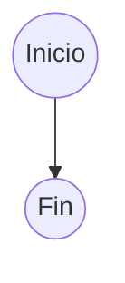
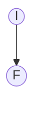
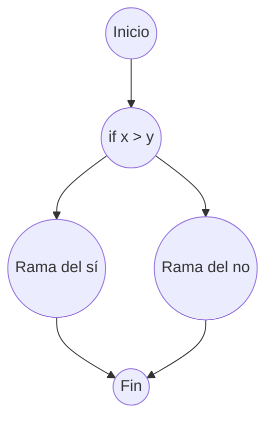
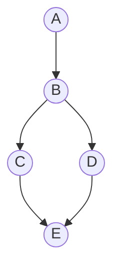
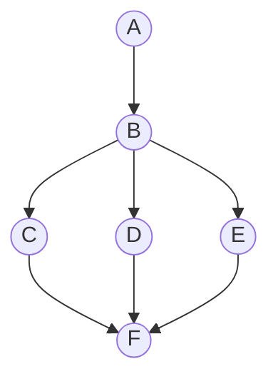
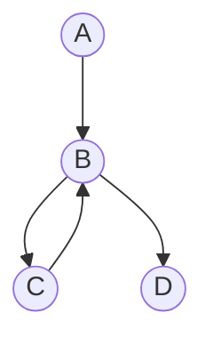
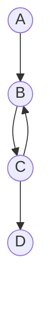

# Complejidad ciclomática

## Definición y utilidad

Thomas J. McCabe, en 1976, propuso un método para calcular la complejidad ciclomática de un programa. La complejidad ciclomática es una medida de la complejidad de un programa. Se define como **el número de caminos lineales independientes** a través del código fuente. Se calcula utilizando el grafo de control del flujo del programa. Se puede utilizar para medir la complejidad de un método, función o procedimiento.

Este método es preferible a medir la _cantidad_ de código escrito, ya que la cantidad de código no siempre refleja la complejidad del código. La complejidad ciclomática es una medida más precisa de la complejidad de un programa.

La idea es evitar en la medida de lo posible escribir procedimientos con una complejidad ciclomática alta, ya que son más difíciles de entender, mantener y probar. Como siempre esta no es una regla estricta ya que por distintos motivos habrá casos en los que sea necesario escribir procedimientos con una complejidad ciclomática alta.

## Cálculo

Para calcular la complejidad ciclomática de un programa primero habrá que dibujar el grafo de control del flujo del programa. Este grafo se construye a partir de las estructuras de control del programa, como las sentencias `if`, `for`, `while`, `switch`, etc.

### Grafos

#### Secuencia

Una secuencia es una sucesión de instrucciones que se ejecutan una detrás de otra. En el grafo de control del flujo del programa, una secuencia se representa con un nodo de inicio y un nodo de fin.



Para que quede menos chapucero lo podemos simplificar a:



#### Estructura condicional

La sentencia `if` permite ejecutar un bloque de código si se cumple una condición. Si la condición no se cumple, se puede ejecutar otro bloque de código. En el grafo de control del flujo del programa, un `if` se representa con un nodo de inicio, un nodo de decisión y dos nodos de fin.

```python
if x > y:
  print(f"x (= {x}) es mayor que y (= {y}).")
else:
  print(f"x (= {x}) no es mayor que y (= {y}).")
```

En Java se escribiría de la siguiente manera:

```java
if (x < y) {
  system.out.println("x (= " + x + ") es menor que y (= " + y + ").");
} else {
  system.out.println("x (= " + x + ") no es menor que y (= " + y + ").");
}
```





#### Estructura _case_ / _switch_ / elif

La sentencia `switch` (en Python `match`) permite comparar una variable con una lista de valores y ejecutar un bloque de código dependiendo del valor de la variable.

```python
match dayOfWeek:
  case "monday" | "tuesday" | "wednesday" | "thursday" | "friday":
    print("Working day.")
  case "saturday" | "sunday":
    print("Resting day.")
  case _: 
    print("Invalid day.")
```

Una estructura equivalente en Java sería:

```java
if (x <= 10) {
  system.out.println("x (= " + x + ") es menor o igual a 10.");
} else if (x <= 20) {
  system.out.println("x (= " + x + ") es menor o igual a 20.");
} else {
  system.out.println("x (= " + x + ") es mayor que 20.");
}
```

Con esto quiero decir que, an nivel de complejidad ciclomática, un `if` con múltiples `elif` es equivalente a un `switch` / `case`.



#### Bucle _for_

Un bucle _for_ repite un bloque de código un número determinado de veces. En el grafo de control del flujo del programa, un bucle _for_ se representa con un nodo de inicio, un nodo de decisión y un nodo de fin.

```python
for i in range(10):
  print(i)
```

En Java sería

```java
for (int i = 0; i < 10; i++) {
  system.out.println(i);
}
```

Y su grafo sería:



#### Bucle _while_

Aunque el código del bucle _while_ no es idéntico al de un _for_ sus grafos son iguales.

```python
while x < 10:
  print(x)
  x += 1
```

Como podemos ver el código haría lo mismo.


#### Bucle _do while_ / _repeat until_

Python no tiene un bucle _do while_ pero en Java sería:

```java
i = 0;
do {
  system.out.println("i");
  ++i;
} while (i < 10);
```

Y su grafo sería prácticamente igual al de un bucle _while_.



En cualquier caso todos estos grafos implican la misma complejidad ciclomática. Es decir, sea cual el tipo de bucle que utilicemos, la complejidad ciclomática resultante será la misma.

### Fórmula(s)

Existen varias fórmulas que nos permiten calcular la complejidad ciclomática de un programa a partir de su grafo de control del flujo. La fórmula más común es la siguiente:

$$M = E - N + 2P$$

Donde:

* $M$ es la complejidad ciclomática.
* $E$ es el número de aristas del grafo.
* $N$ el número de nodos del grafo.
* $P$ es el número de componentes conectados.

El número de componentes conectados será 1 en la mayoría de los casos, con lo que la fórmula se simplifica a:

$$M = E - N + 2$$

**Si realizamos una conexión entre el nodo final y el inicial del grafo la fórmula se simplifica a:**

$$M = E - N + 1$$

Otra forma de calcular la complejidad ciclomática es contar el número de regiones del grafo de control del flujo (si **no** conectamos el nodo final al inicial habrá que sumarle 1). Una región es un área del grafo que está rodeada por aristas y nodos. La región exterior no se cuenta.
