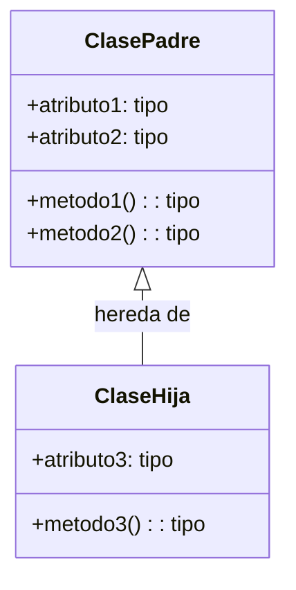
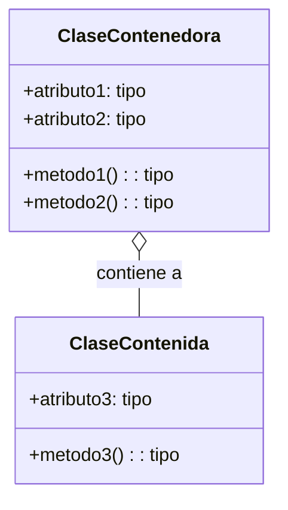
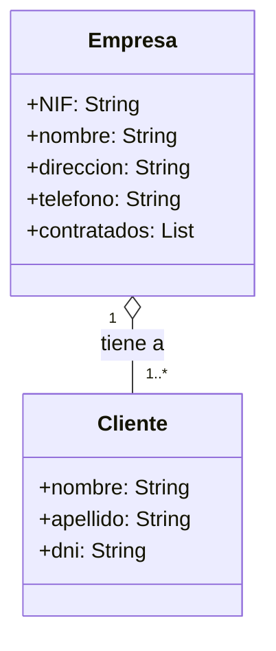
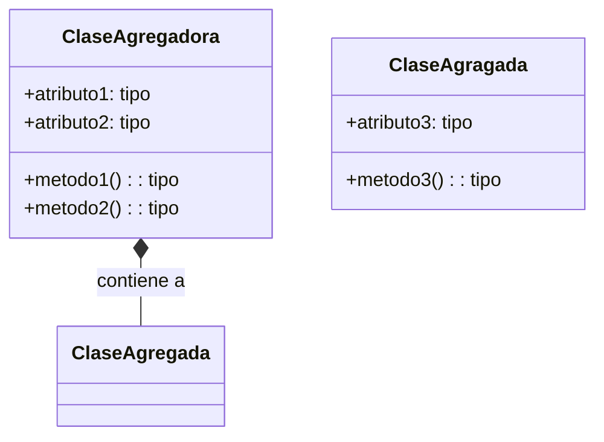
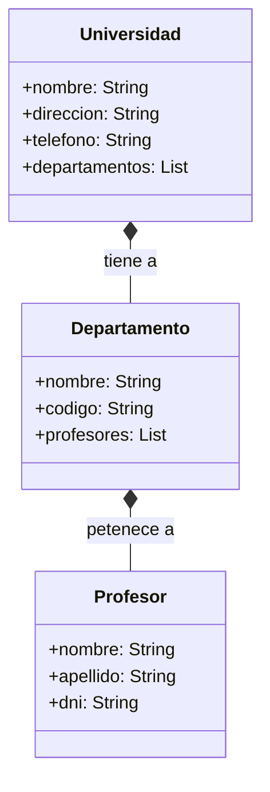

# Diagramas de clases

## Especificación de una clase

### Atributos

### Métodos

## Relaciones entre clases

### Cardinalidad de una relación

### Relación de herencia

Una relación de herencia representa una relación entre dos clases, donde una clase (la subclase) hereda los atributos y métodos de otra clase (la superclase).

### Relaciones de agregación y composición

Clases que contienen (como atributos) otras clases.

Cuando hablamos de agregación las clases que están contenidas pueden existir por sí solas, mientras que en la composición no pueden existir sin la clase contenedora.

### Relación de agregación

Se representa mediante una línea con un rombo vacío en el extremo de la clase contenedora.

Por ejemplo, podemos decir que una **empresa** tiene _contratos_ con varios **clientes**. En este caso, la empresa puede existir sin los clientes, y los clientes pueden existir sin la empresa.

#### Relación de composición

En el caso de una composición, podemos decir que una **universidad** tiene _departamentos_ y cada departamento tiene _profesores_. En este caso, la universidad no puede existir sin los departamentos, y los departamentos no pueden existir sin la universidad. Por lo tanto, la relación es de composición.

