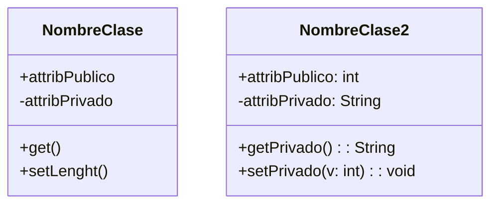

# Diseño orientado a objetos. Diagramas estructurales

## Introducción a la programación orientada a objetos

### Paradigma

El paradigma de programación orientada interpreta la realidad como un conjunto de objetos que interactúan entre sí. Cada objeto tiene su propio estado y comportamiento al que podemos acceder a través de métodos.

Las ideas fundamentales de la programación orientada a objetos son:

* Abstracción: Se interpreta y descompone el problema en jerarquías de objetos.
* Encapsulamiento: Se ocultan los detalles de implementación y se exponen solo las interfaces necesarias.
* Polimorfismo: Un _mismo método_ puede tener diferentes implementaciones dependiendo del objeto que lo invoque y de cómo se le invoque.
* Herencia: Se pueden crear nuevas clases a partir de clases ya existentes, heredando sus atributos y métodos. Este mecanismo es el que da lugar a una jerarquía de clases.

Estos son los conceptos básicos de la programación orientada a objetos. Aunque estos son sus elementos básicos podemos añadir una par de características que son muy comunes en la mayoría de lenguajes orientados a objetos:

* Reutilización: El hecho de permitir heredar elementos de una clase hace que no haya que repetir dicho código facilitando la reutilización de código. El polimorfismo también ayuda a la reutilización de código, ya que permite utilizar el mismo método en diferentes clases sin necesidad de duplicar el código.
* Recolección de basura: La mayoría de lenguajes orientados a objetos permiten la recolección de basura, es decir, la eliminación de objetos que ya no son necesarios. Esto se hace para liberar memoria y evitar fugas de memoria.
* Ocultación: Es común que se vean a las clases como cajas negras, es decir, que no se vean los detalles de implementación. El objetivo es evitar el acoplamiento entre clases y facilitar el mantenimiento del código.
* Extensibilidad: La mayoría de lenguajes orientados a objetos permiten la creación de nuevas clases a partir de clases ya existentes, lo que facilita la extensión del código y la creación de nuevas funcionalidades.

### Críticas

Hay ciertas afirmaciones que se realizan con respecto a la programación orientada a objetos que merecen ser analizadas de una manera crítica:

> Permite desarrollar software en mucho menos tiempo, con menos coste y de mayor calidad gracias a la reutilización porque al ser completamente modular facilita la creación de código reusable dando la posibilidad de reutilizar parte del código para el desarrollo de una aplicación similar.

También es cierto que el hecho de trabajar con abstracciones puede aumentar _artificialmente_ la complejidad de la solución en la que estamos trabajando. Con respecto a

> Se consigue aumentar la calidad de los sistemas, haciéndolos más extensibles ya que es muy sencillo aumentar o modificar la funcionalidad de la aplicación modificando las operaciones.

> El software orientado a objetos es más fácil de modificar y mantener porque se basa en criterios de modularidad y encapsulación en el que el sistema se descompone en objetos con unas responsabilidades claramente especificadas e independientes del resto.

> La tecnología de objetos facilita la adaptación al entorno y el cambio haciendo aplicaciones escalables. Es sencillo modificar la estructura y el comportamiento de los objetos sin tener que cambiar la aplicación.

## Diagramas estructurales

### Diagramas de clases

Un diagrama de clases UML consiste en una notación gráfica para visualizar sistemas orientados a objetos. Estos diagramas representan la estructura de un sistema monstrando:

* Sus **clases**.
* Sus **atributos y métodos**.
* Las relaciones entre los objetos.

Una clase es un concepto que encapsula un estado (atributos) y comportamiento (métodos). Un objeto es una instancia de una clase. Un diagrama de clases es un modelo estático que representa la estructura de un sistema.

Los atributos de una clase tendrán un tipo y sus métodos una _firma_. El único elemento obligatorio de un diagrama de clases es el nombre de la claser.sdj

La clase de la izquierda no muestra los tipos de los atributos ni las _firmas_ de los métodos, la de la derecha sí.
