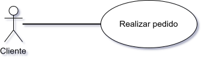
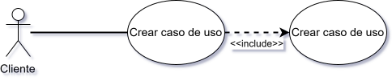
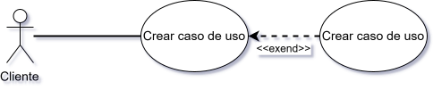
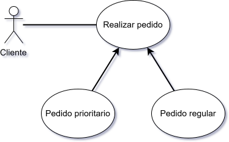
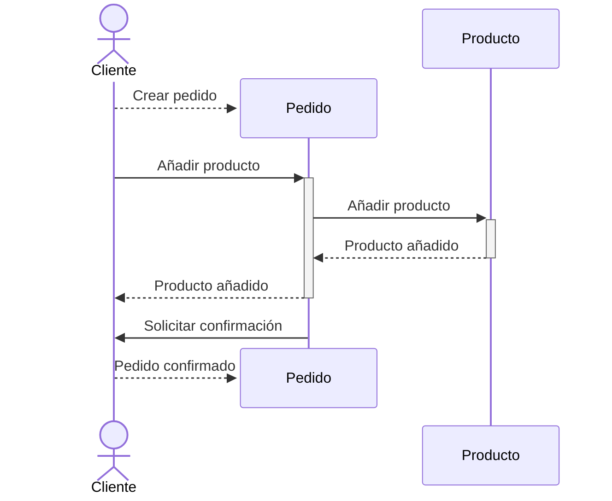

# Diagramas de comportamiento

A diferencia de los diagramas estructurales, que muestran las relaciones entre los elementos estáticos del modelo, los diagramas de comportamiento muestran cómo interactúan esos elementos a lo largo del tiempo. Los diagramas de comportamiento son útiles para modelar la lógica de negocio y los procesos dentro del sistema.

Nos permiten visualizar, especificar, construir y documentar los aspectos dinámicos de un sistema: el flujo de mensajes, los estados por los que pasa un objeto, la interacción de un sujeto con el sistema, etc.

Hay cuatro tipos de diagramas de comportamiento:

* Diagramas de casos de uso: Muestran las relaciones entre los _actores_ (usuarios del sistema) y las acciones que pueden realizar en el sistema: los casos de uso.
* Diagramas de interacción: Estos se subdividen en dos tipos: diagramas de secuencia y diagramas de colaboración.
  * Los diagramas de secuencia muestran cómo los objetos interactúan entre sí **a lo largo del tiempo** mediante intercambio de mensajes.
  * Los diagramas de comunicación se centran, también en el intercambio de mensajes, pero en este caso se centran en la organización o estructura de los objetos que participan en la interacción.
* Diagramas de estados: Ilustran como un elemento, generalmente un objeto, se pueden cambiar a distintos estados a lo largo de su ciclo de vida. Los estados son los diferentes modos en los que un objeto puede estar en un momento dado.
* Diagramas de actividad: Representan los procesos del negocio a alto nivel. También pueden utilizarse para modelar la lógica compleja o procesos en paralelo dentro del sistema.

En este tema daremos más importancia a los diagramas de **casos de uso** y **de secuencia**.

## Diagramas de casos de uso

Los diagramas de casos de uso se centran en el punto de vista del usuario. Representan las distintas funcionalidades que ofrece el sistema a los usuarios (actores). Estas funcionalidades, a fin de cuentas, se llevarán a cabo en forma de  interacciones entre el actor y la aplicación.

Estos diagramas son especialmente útiles para determinar las funcionalidades que tiene que desempeñar el sistemas y, de esta forma, ayudar a definir los requisitos del mismo (**fase de captura de requisitos**). Se utilizarán, por lo tanto, en la fase de análisis del sistema y para comunicarse entre el cliente y el analista.

Un diagrama de casos de uso ha de decir **qué** comportamiento se espera de manera comprensible par el cliente (no informático) sin utilizar tecnicismos pero no del **cómo**.

### Elementos de un diagrama de casos de uso

Los elementos del diagramas de casos de uso serán: **actor**, **caso de uso** y **relaciones**.

#### Actor

El actor representa un _rol_ o papel desempeñado por un elemento ajeno al sistema. Este elemento puede ser un usuario, un sistema o un dispositivo que interactúe con el sistema. El actor interactúa con el sistema para llevar a cabo una tarea o función específica.

Sus característica fundamentales son:

* Está fuera de los límites del sistema.
* Un mismo actor puede participar en varios casos de uso.
* En un caso de uso puede participar más de un actor.
* Los actores son el punto de inicio de los casos de uso.
* Los actores principales figurarán el la parte superior del diagrama y los secundarios en la parte inferior.

Un diagrama básico de casos de uso tendrá el siguiente aspecto:

En el diagrama anterior podemos ver un actor (cliente) que interactúa con el sistema invocando (relación de asociación) un caso de uso (Realizar pedido).

#### Caso de uso

Un caso de uso describe una funcionalidad o comportamiento del sistema desde el punto de vista del actor. Es una secuencia de acciones que el sistema lleva a cabo para proporcionar un resultado observable al actor. Un caso de uso puede incluir varios pasos y puede involucrar la interacción con otros casos de uso.

Se representan por medio de un óvalo dentro del cual se nombran mediante un verbo en infinitivo seguido de un sustantivo. Por ejemplo: "Registrar usuario", "Buscar producto", "Realizar compra".

Los casos de uso se suelen representar de forma descendiente situando los más importantes en la parte superior.
La acción correspondiente al caso de uso no puede ni excesivamente genérica ni demasiado específica.

#### Relaciones

Una relación indica una acción o flujo de información. Pueden ser de varios tipos:

* Asociación: Indica una **invocación** desde un actor o un caso de uso a otro caso de uso.
  * Se representa mediante una línea continua entre el actor y el caso de uso o entre dos casos de uso.
* Inclusión: Se produce entre dos casos de uso e indica que **uno de ellos necesita al otro** para realizar su función. Es decir, la funcionalidad de un caso de uso **necesita** del otro para poder llevarse a cabo.
  * Se representa mediante una línea discontinua con una flecha que apunta al caso de uso incluido y la etiqueta `<<include>>`.
* Extensión: Se produce entre dos casos de uso e indica que **uno de ellos amplía la funcionalidad del otro**. Es decir el primer caso de uso **no depende** del segundo para realizar su función pero el segundo puede **opcionalmente** añadir aspectos a la funcionalidad del primero.
  * Se representa mediante una línea discontinua con una flecha que apunta al caso de uso base y la etiqueta `<<extend>>`.
* Generalización: Se produce entre un **caso de uso padre y un caso de uso hijo**. El **hijo hereda la funcionalidad del padre y puede añadirle más funcionalidades**. El padre es una _generalización_ del hijo y el hijo una _especialización_ del padre. De este modo, podríamos substituir el caso padre por el hijo y no variaría el comportamiento del sistema.
  * Se representa mediante una línea continua con una flecha que apunta al caso de uso padre.

Un ejemplo de asociación:

Un ejemplo de inclusión:

Un ejemplo de extensión:

Un ejemplo de generalización:

## Diagramas de interacción

Los diagramas de interacción muestran cómo los objetos interactúan entre sí a lo largo del tiempo mediante el intercambio de mensajes. Estos diagramas son útiles para modelar la lógica de negocio y los procesos dentro del sistema.

Permiten visualizar el sistema como un conjunto de eventos ordenados en el tiempo. Los diagramas de interacción se dividen en cuatro tipos:

* **Diagramas de secuencia**: Muestran cómo los objetos interactúan entre sí a lo largo del tiempo mediante el intercambio de mensajes. Se centran en el orden temporal de los mensajes.
* Diagramas de colaboración / comunicación: Representan las relaciones e interacciones entre distintos objetos de software. Enfatizan los aspectos estructurales más que el flujo de los mensajes. Se centran más en la secuencia de mensajes intercambiados entre los objetos que en la cronología. Se centran en la organización o estructura de los objetos que participan en la interacción.
* Diagramas de tiempo: Representan en una línea temporal los cambios que se producen en uno o varios objetos, respondiendo a los eventos que se producen en el sistema. El conjunto del diagrama ilustra el comportamiento del sistema y como los objetos interactúan entre sí.
* Diagramas globales de interacciones: El diagrama global de interacciones ofrece una vista de alto nivel de un modelo de interacción. El diagrama actúa como una vista global del flujo de control entre las distintas interacciones, además del flujo de actividad entre los distintos diagramas.

### Diagramas de secuencia

Son los diagramas más utilizados para representar la interacción entre objetos. Se centran en el orden temporal de los mensajes intercambiados entre los objetos. Los diagramas de secuencia son útiles para modelar la lógica de negocio y los procesos dentro del sistema.

#### Elementos de un diagrama de secuencia

Los elementos de un diagrama de secuencia serán:

* Participantes: Representan los objetos o actores que participan en la interacción. Se representan mediante el símbolo de actor previamente viso o rectángulos en la parte superior del diagrama.
  * Actor: Normalmente inicia la interacción y se situará a la izquierda del diagrama.
  * Objeto: Se corresponde con la instancia de una clase. Se representa mediante un rectángulo con el nombre del objeto seguido de dos puntos y el nombre de su clase. Por ejemplo: `cliente_vip: Cliente`.
* Línea de vida: Representa la existencia de un objeto a lo largo del tiempo. Se representa mediante una línea vertical que desciende desde el participante. La línea de vida comienza cuando el objeto se crea y termina cuando se destruye. El transcurso del tiempo se representa de arriba a abajo.
* Activaciones: Representan el tiempo en el que un objeto está activo realizando alguna operación. Se representan mediante un rectángulo vertical que se sitúa sobre la línea de vida del objeto. La activación comienza cuando el objeto recibe un mensaje y termina cuando el objeto envía un mensaje o se destruye.
* Mensajes: Representan la comunicación entre los participantes. Se representan mediante flechas que van de un participante a otro. Los mensajes se numeran para indicar el orden en que se envían. Pueden ser de cuatro tipos:
  * Sincrónicos (el remitente espera una respuesta). Se representan mediante una flecha sólida. La respuesta se representa mediante una línea discontinua que vuelve al remitente.
  * Asíncronos (el remitente no espera una respuesta). Se representan con una punta de flecha abierta.
  * De creación: Indican la creación o _instanciación_ de un objeto. Se representan mediante una flecha discontinua con una punta de flecha abierta que termina en el rectángulo del objeto creado. Opcionalmente tienen la etiqueta `create`.
  * De destrucción: Indican la destrucción de un objeto. Se representan como un mensaje normal que opcionalmente tiene la etiqueta `destroy`.

Un ejemplo de diagrama de secuencia sería el siguiente:

Como en casi todos los diagramas no todas las herramientas contemplan todos los elementos. En este caso, mermaid no contempla la notación destrucción de objetos con la `X` al final de la línea de vida, simplemente hace desaparecer el objeto.

## Diagramas de estados

## Diagramas de actividad
