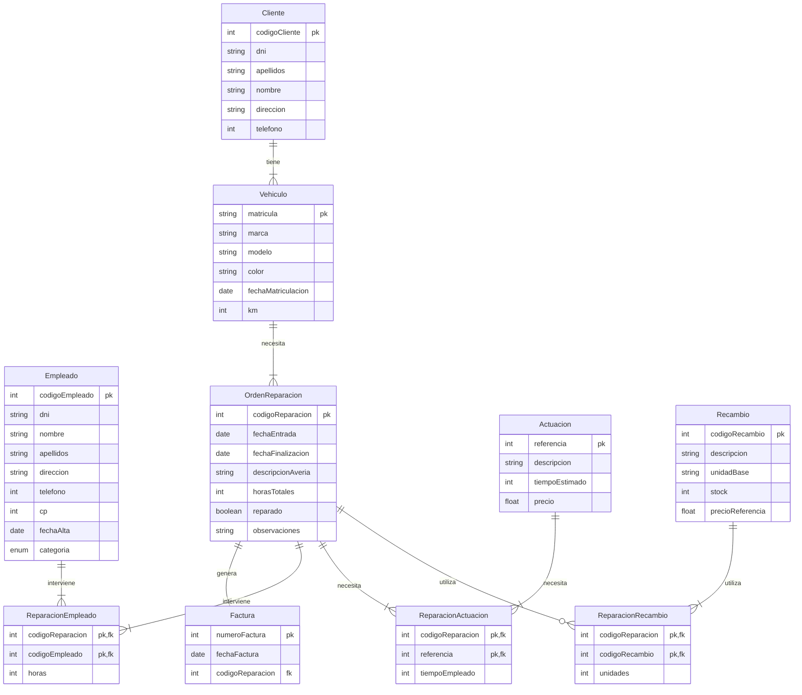
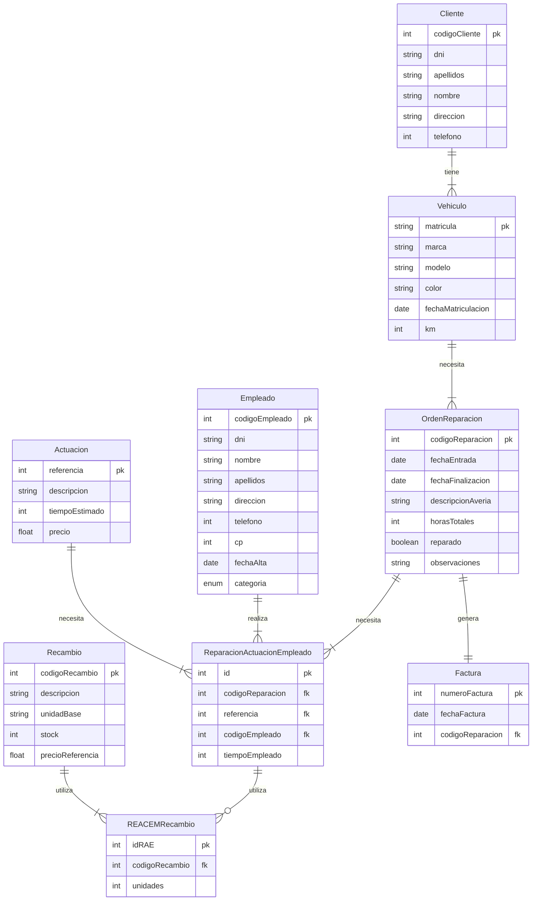

# Solución Tarea 1 UD2 - Apartado 1

## Enunciado Apartado 1

Siguiendo con el caso práctico que venimos analizando a lo largo de la unidad vamos a ayudar a Alejandra a establecer un modelo lógico que recoja el funcionamiento de talleres FABER, un taller mecánico que organiza su actividad de la siguiente forma:

* Una serie de **clientes** traen sus **vehículos** a reparar. En el momento en que llega un cliente nuevo le recibe un empleado de la administración quien registra la información necesaria del cliente, del vehículo y de la posible avería.
* Con estos datos se imprime una **orden de reparación** que se coloca en un tablero donde el jefe de los mecánicos se la adjudica a un **empleado** para que efectúe la reparación, entregándole una copia de la misma.
* En esta hoja cada mecánico añade manualmente todas las **actuaciones** que ha llevado a cabo y el tiempo empleado y las piezas sustituidas.
* Una vez finalizada la reparación el empleado entrega la orden a la administración del taller donde se traslada esta información al ordenador.
* Cuando viene el cliente a retirar su vehículo se prepara la **factura** que recoge todas las **actuaciones** que se han llevado a cabo, su precio y el importe.

Los datos que será necesario recoger en nuestra base de datos son:

* Datos del cliente: DNI, Apellidos, Nombre, Dirección y Teléfono. Se le asigna además un Código de Cliente.
* Datos del vehículo: Matrícula, Marca, Modelo, Color y la Fecha de matriculación.
* Datos previos, relativos a la reparación que se quiere efectuar que son:
  * Fecha de la entrada
  * Los km que tiene el coche.
  * La descripción de la posible avería

Una vez efectuada la reparación se añade lo siguiente:

* Fecha de finalización
* Horas totales empleadas en la reparación.
* Si está reparado o no
* Las observaciones que se consideren necesarias

Además se necesita saber para cada reparación:

* Empleados que han intervenido y las horas que interviene cada uno. Los datos de los empleados que están registrados en nuestro taller son: DNI, Nombre, Apellidos, Dirección, Teléfono, CP, Fecha de alta y Categoría. La empresa añade un Código de empleado.
* Actuaciones que se han llevado a cabo y el tiempo empleado en cada una de ellas. Se recoge una descripción de las actuaciones que se pueden llevar a cabo: Referencia, Descripción (por ejemplo sustituir batería, etc.), tiempo estimado y precio.
* Recambios y piezas que se han sustituido y las unidades. Para ello guardamos en una tabla una lista de los recambios que se pueden sustituir: código, descripción, unidad base (por ejemplo cajas de 2 lámparas, etc.), stock y precio de referencia.
* Finalmente para elaborar la factura se necesita incluir en el encabezado: Numero de factura y fecha de la factura. El resto de los datos de la factura se obtendrán a partir del los que ya hemos recogido en la reparación.

Se pide:

* Obtener el modelo Entidad-Relación: Entidades, relaciones, atributos, claves principales, cardinalidades, tipos de correspondencia, etc.
* Obtener el modelo Relacional: pasar del modelo entidad-relación al modelo relacional aplicando correctamente las reglas de transformación, justificando la solución elegida cuando se considere necesario.

## Solución

### Entidades y atributos

* **Cliente**: <ins>CódigoCliente</ins>, DNI, Apellidos, Nombre, Dirección, Teléfono.
* **Vehículo**: <ins>Matrícula</ins>, Marca, Modelo, Color, Fecha de matriculación, Km.
* **OrdenReparación**: <ins>CódigoReparación</ins>, Fecha de entrada, Fecha de finalización, Descripción de la avería, Horas totales, Reparado, Observaciones.
* **Empleado**: <ins>CódigoCliente</ins>, DNI, Nombre, Apellidos, Dirección, Teléfono, CP, Fecha de alta, Categoría.
* **Actuación**: <ins>Referencia</ins>, Descripción, Tiempo estimado, Precio.
* **Recambio**: <ins>CódigoRecambio</ins>, Descripción, Unidad base, Stock, Precio de referencia.

### Relaciones

#### Opción a

* Cliente - Vehículo: Un cliente puede tener uno o más vehículos y un vehículo pertencerá a un único cliente.
* Vehículo - OrdenReparación: Un vehículo puede tener una o más órdenes de reparación y una orden de reparación pertenece a un único vehículo.
* OrdenReparación - Empleado: Un empleado interviene en distintas reparaciones a lo largo del tiempo y en una misma reparación intervienen uno o más empleados.
* OrdenReparación - Actuación: Una orden de reparación puede tener una o más actuaciones y una actuación puede estar en una o más órdenes de reparación.
* OrdenReparación - Recambio: Una orden de reparación puede tener uno o más recambios y un recambio puede estar en una o más órdenes de reparación.
* OrdenReparación - Factura: Una orden de reparación genera una factura y una factura pertenece a una única orden de reparación.

#### Opción b

* Cliente - Vehículo: Un cliente puede tener uno o más vehículos y un vehículo pertencerá a un único cliente.
* Vehículo - OrdenReparación: Un vehículo puede tener una o más órdenes de reparación y una orden de reparación pertenece a un único vehículo.
* OrdenReparación - Actuación: Una orden de reparación puede tener una o más actuaciones y una actuación puede estar en una o más órdenes de reparación.
* Actuación - Empleado: Un empleado puede realizar una o más actuaciones (empleando un tiempo) para cada orden de reparación y una actuación puede ser realizad un único empleado.
* Actuación - Recambio: Una actuación puede requerir uno o más recambios y un recambio puede estar en una o más actuaciones (para cada orden de reparación).
* OrdenReparación - Factura: Una orden de reparación genera una factura y una factura pertenece a una única orden de reparación.

### Diagrama Entidad-Relación / Relacional

#### Diagrama de la opción a

#### Diagrama de la opción b

