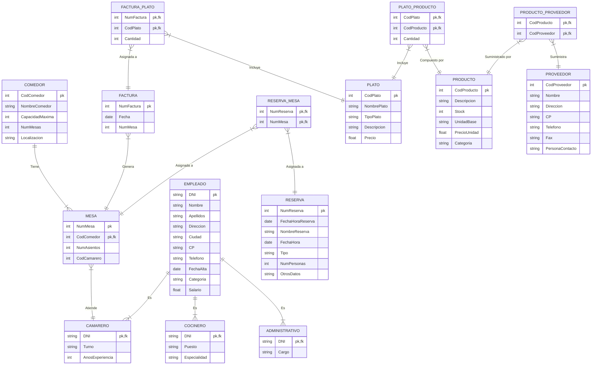

# Solución a la tarea 1 - Apartado 3

## Enunciado

Vamos a informatizar la gestión del Restaurante Mouro. Se trata de un restaurante de tres plantas, que ofrece distintos servicios a sus clientes. Inicialmente vamos a describir su funcionamiento:

* El restaurante tiene una serie de comedores, cada uno de ellos con un número fijo de mesas disponibles. De cada comedor interesa: Código y nombre del comedor, capacidad máxima de comensales, número de mesas, localización. Por ejemplo: MA, es el salón "Mar Abierto", está en la planta baja, tiene 60 mesas y capacidad para 300 comensales
* En cada comedor hay una serie de mesas. De las mesas guardamos el número de asientos y quien es el camarero que la atiende. Las mesas se numeran consecutivamente, de forma que será necesario que se añada al propio código el del comedor al que corresponden. Por ejemplo: MA, 01 es la mesa 1 del salón Mar Abierto.
* Los empleados realizan funciones distintas según sean personal de cocina, camareros o personal de administración del negocio.

De todos ellos recogemos la siguiente información: DNI, Nombre, Apellidos, Dirección, Ciudad, CP, teléfono, Fecha de alta, Categoría y Salario.

Cuando se trata de camareros queremos saber además en que turno trabaja y los años de experiencia.

De los cocineros necesitamos saber cuál es su puesto en la cocina y su especialidad (carnes, pescados, postres, etc.)

Del personal de administración necesitamos conocer el cargo que tiene.

No se da el caso de que una misma persona realice más de una función. Existen, además otras personas contratadas temporalmente como ayudantes que no se recogen en la anterior descripción.

Entre los camareros existen una serie de encargados que supervisan a otros camareros.

* Para organizar mejor el trabajo se admiten reservas de los clientes. Cuando se recibe una llamada para hacer una reserva recogemos:

Número de reserva, Fecha y hora de la reserva, Nombre de la persona que hace la reserva, la fecha y hora para la que se hace la reserva, si se trata de comida o cena , el número de personas y otros datos que puedan ser de interés.

Automáticamente se adjudican las mesas necesarias para cubrir la reserva añadiendo el número de personas que se sentarán en cada mesa.

* En la carta se exponen una serie de platos de los cuales se guarda: Un código, el nombre del plato, el tipo de plato (carnes, pescados, primeros, postres, etc.), una breve descripción y el precio.
* Para llevar mejor la gestión de las compras, de cada plato recogemos los productos o ingredientes que lo componen y en qué cantidad. De los productos guardamos: un código, la descripción, el stock, la unidad-base (docenas, kg, litros, etc.), el precio por unidad y la categoría a la que pertenece.
* Mantenemos también información de los proveedores que nos suministran esos productos: Código, Nombre, Dirección, CP, Teléfono, Fax, Persona de contacto
* Por último cuando nuestros clientes nos visitan tomamos nota manualmente de la comanda, y, una vez que hayan terminado realizamos la correspondiente factura que recoge en el encabezado el número de factura, fecha y número de mesa. A continuación una relación de los nombres de los platos, las unidades de cada plato, precio e importe (estos dos datos se obtienen de la información almacenada).

**Se pide:**

* Obtener el modelo Entidad-Relación: Entidades, relaciones, atributos, claves principales, cardinalidades, tipos de correspondencia, etc.
* Obtener el modelo Relacional: pasar del modelo entidad-relación al modelo relacional aplicando correctamente las reglas de transformación, justificando la solución cuando se considere necesario.

## Solución

### Entidades y atributos

* **COMEDOR** (<ins>CodComedor</ins>, NombreComedor, CapacidadMaxima, NumMesas, Localización)
* **MESA** (<ins>NumMesa</ins>, <ins>CodComedor</ins>, NumAsientos, CodCamarero)
* **EMPLEADO** (<ins>DNI</ins>, Nombre, Apellidos, Dirección, Ciudad, CP, Teléfono, FechaAlta, Categoría, Salario)
* **CAMARERO** (<ins>DNI</ins>, Turno, AñosExperiencia)
* **COCINERO** (<ins>DNI</ins>, Puesto, Especialidad)
* **ADMINISTRATIVO** (<ins>DNI</ins>, Cargo)
* **RESERVA** (<ins>NumReserva</ins>, FechaHoraReserva, NombreReserva, FechaHora, Tipo, NumPersonas, OtrosDatos)
* **PLATO** (<ins>CodPlato</ins>, NombrePlato, TipoPlato, Descripción, Precio)
* **PRODUCTO** (<ins>CodProducto</ins>, Descripción, Stock, UnidadBase, PrecioUnidad, Categoría)
* **FACTURA** (<ins>NumFactura</ins>, Fecha, NumMesa)

### Relaciones

* La relación entre COMEDOR y MESA es que un comedor tendrá varias mesas y una mesa pertenecerá a un comedor.
* Un EMPLEADO puede ser CAMARERO, COCINERO o ADMINISTRATIVO.

### Diagrama E/R / Relacional

