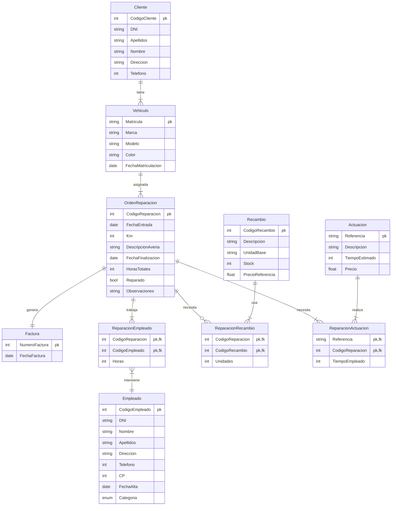
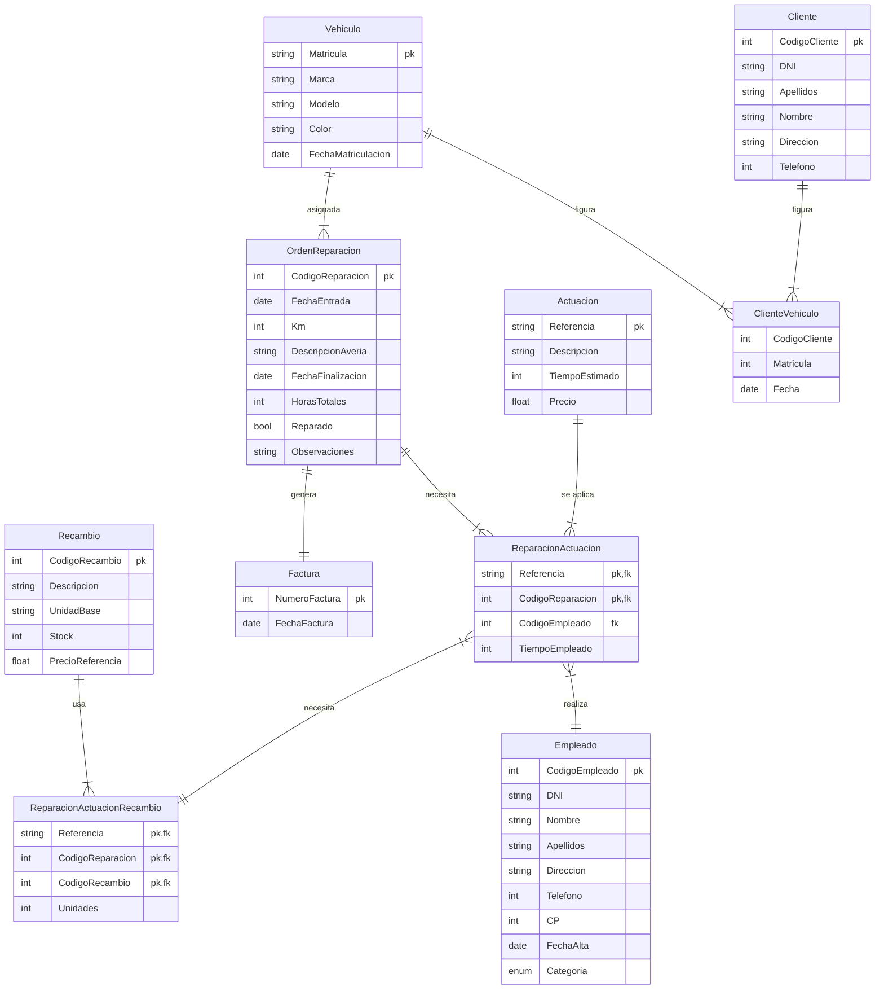

# Tareas UD2

<!-- toc -->

* [Tarea 1](#tarea-1)
  * [Enunciado apartado 1](#enunciado-apartado-1)
    * [Entidades](#entidades)
    * [Relaciones](#relaciones)
    * [Diagrama Entidad-Relación / Relacional](#diagrama-entidad-relación--relacional)
      * [Opción A](#opción-a)
      * [Opción B](#opción-b)
  * [Enunciado apartado 2](#enunciado-apartado-2)
  * [Enunciado apartado 3](#enunciado-apartado-3)

<!-- tocstop -->

## Tarea 1

### Enunciado apartado 1

Siguiendo con el caso práctico que venimos analizando a lo largo de la unidad vamos a ayudar a Alejandra a establecer un modelo lógico que recoja el funcionamiento de talleres FABER, un taller mecánico que organiza su actividad de la siguiente forma:

* Una serie de **clientes** traen sus **vehículos** a reparar. En el momento en que llega un cliente nuevo le recibe un empleado de la administración quien registra la información necesaria del cliente, del vehículo y de la posible avería.
* Con estos datos se imprime una **orden de reparación** que se coloca en un tablero donde el jefe de los mecánicos se la adjudica a un **empleado** para que efectúe la reparación, entregándole una copia de la misma.
* En esta hoja cada mecánico añade manualmente todas las **actuaciones** que ha llevado a cabo y el tiempo empleado y las piezas sustituidas.
* Una vez finalizada la reparación el empleado entrega la orden a la administración del taller donde se traslada esta información al ordenador.
* Cuando viene el cliente a retirar su vehículo se prepara la **factura** que recoge todas las **actuaciones** que se han llevado a cabo, su precio y el importe.

Los datos que será necesario recoger en nuestra base de datos son:

* Datos del cliente: DNI, Apellidos, Nombre, Dirección y Teléfono. Se le asigna además un Código de Cliente.
* Datos del vehículo: Matrícula, Marca, Modelo, Color y la Fecha de matriculación.
* Datos previos, relativos a la reparación que se quiere efectuar que son:
  * Fecha de la entrada
  * Los km que tiene el coche.
  * La descripción de la posible avería

Una vez efectuada la reparación se añade lo siguiente:

* Fecha de finalización
* Horas totales empleadas en la reparación.
* Si está reparado o no
* Las observaciones que se consideren necesarias

Además se necesita saber para cada reparación:

* Empleados que han intervenido y las horas que interviene cada uno. Los datos de los empleados que están registrados en nuestro taller son: DNI, Nombre, Apellidos, Dirección, Teléfono, CP, Fecha de alta y Categoría. La empresa añade un Código de empleado.
* Actuaciones que se han llevado a cabo y el tiempo empleado en cada una de ellas. Se recoge una descripción de las actuaciones que se pueden llevar a cabo: Referencia, Descripción (por ejemplo sustituir batería, etc.), tiempo estimado y precio.
* Recambios y piezas que se han sustituido y las unidades. Para ello guardamos en una tabla una lista de los recambios que se pueden sustituir: código, descripción, unidad base (por ejemplo cajas de 2 lámparas, etc.), stock y precio de referencia.
* Finalmente para elaborar la factura se necesita incluir en el encabezado: Numero de factura y fecha de la factura. El resto de los datos de la factura se obtendrán a partir del los que ya hemos recogido en la reparación.

Se pide:

* Obtener el modelo Entidad-Relación: Entidades, relaciones, atributos, claves principales, cardinalidades, tipos de correspondencia, etc.
* Obtener el modelo Relacional: pasar del modelo entidad-relación al modelo relacional aplicando correctamente las reglas de transformación, justificando la solución elegida cuando se considere necesario.

#### Entidades

* **Cliente**: (<ins>CódigoCliente</ins>, DNI, Apellidos, Nombre, Dirección, Teléfono).
* **Vehículo**: (<ins>Matrícula</ins>, Marca, Modelo, Color, Fecha de matriculación.).
* **Orden de reparación**: ( FechaEntrada, Km, DescripciónAvería, FechaFinalización, HorasTotales, Reparado, Observaciones).
* **Empleado**: (<ins>CódigoEmpleado</ins>, DNI, Nombre, Apellidos, Dirección, Teléfono, CP, FechaAlta, Categoría).
* **Actuaciones**: (<ins>Referencia</ins>, Descripción, TiempoEstimado, Precio).
* **Recambios**: (<ins>Código</ins>, Descripción, UnidadBase, Stock, PrecioReferencia).
* **Factura**: (<ins>NúmeroFactura</ins>, FechaFactura).

#### Relaciones

* Cliente &rarr; Vehículo: Un cliente tendrá uno o más vehículos. Podemos razonar que un vehículo, a lo largo del tiempo (_distintas fechas_), puede pertenecer a diferentes clientes.
* Cliente &rarr; Factura: Un cliente tendrá una o más facturas. Y una factura pertenecerá a un solo cliente.
* Vehículo &rarr; Orden de reparación: Un vehículo tendrá una o más órdenes de reparación. Y una orden de reparación pertenecerá a un solo vehículo.

* Relación entre Empelado y Orden de reparación: Podemos verlo de dos formas:
  * **Opción A:** Varios empelados intervendrán en una (o más) orden(es) de reparación. Relación de muchos a muchos.
    * Empleado &rarr; Orden de reparación: Un empleado intervendrá en una o más órdenes de reparación. Y una orden de reparación tendrá uno o más empleados.
    * Orden de reparación &rarr; Recambio: Una orden de reparación tendrá uno o más recambios. Y un recambio se utilizará en cero o más órdenes de reparación.
  * **Opción B:** Un empleado intervendrá en una o más **actuaciones** para completar una **Orden de reparación**. Relación de muchos a muchos.
    * Empleado &rarr; Actuación: Un empleado intervendrá en una o más actuaciones. Y una actuación de la orden tendrá un solo empleado.
    * Actuación &rarr; Orden de reparación: Una actuación aparecerá en una o más órdenes de reparación. Y una orden de reparación tendrá una o más actuaciones.
    * Actuación &rarr; Recambio: Una actuación necesitará uno o más recambios. Y un recambio se utilizará en una o más actuaciones.

* Orden de reparación &rarr; Factura: Una orden de reparación tendrá una factura. Y una factura pertenecerá a una orden de reparación. Relación de uno a uno.

#### Diagrama Entidad-Relación / Relacional

##### Opción A

##### Opción B

Esta opción **no es mejor que la anterior**. Es más compleja, no aporta más información y no es más clara. La he incluido para mostrar que existen distintas formas de modelar una base de datos dependiendo de cómo se interprete la situación.

### Enunciado apartado 2

Normaliza la siguiente relación hasta 3FN, analizando las dependencias entre los atributos:

PEDIDO (NumPedido, FechaPedido, CodProveedor, NombreProveedor, DirecciónProveedor, CodProducto, NombreProducto, PrecioProducto, Cantidad)

Recoge los datos de los pedidos a los proveedores.
Cada producto lo puede suministrar más de un proveedor.
Cada pedido incluye varios productos.
Criterios de puntuación ejercicio 2. Total 2 puntos.

### Enunciado apartado 3

Vamos a informatizar la gestión del Restaurante Mouro. Se trata de un restaurante de tres plantas, que ofrece distintos servicios a sus clientes. Inicialmente vamos a describir su funcionamiento:

* El restaurante tiene una serie de comedores, cada uno de ellos con un número fijo de mesas disponibles. De cada comedor interesa: Código y nombre del comedor, capacidad máxima de comensales, número de mesas, localización. Por ejemplo: MA, es el salón "Mar Abierto", está en la planta baja, tiene 60 mesas y capacidad para 300 comensales
* En cada comedor hay una serie de mesas. De las mesas guardamos el número de asientos y quien es el camarero que la atiende. Las mesas se numeran consecutivamente, de forma que será necesario que se añada al propio código el del comedor al que corresponden. Por ejemplo: MA, 01 es la mesa 1 del salón Mar Abierto.
* Los empleados realizan funciones distintas según sean personal de cocina, camareros o personal de administración del negocio.

De todos ellos recogemos la siguiente información: DNI, Nombre, Apellidos, Dirección, Ciudad, CP, teléfono, Fecha de alta, Categoría y Salario.

Cuando se trata de camareros queremos saber además en que turno trabaja y los años de experiencia.

De los cocineros necesitamos saber cuál es su puesto en la cocina y su especialidad (carnes, pescados, postres, etc.)

Del personal de administración necesitamos conocer el cargo que tiene.

No se da el caso de que una misma persona realice más de una función. Existen, además otras personas contratadas temporalmente como ayudantes que no se recogen en la anterior descripción.

Entre los camareros existen una serie de encargados que supervisan a otros camareros.

* Para organizar mejor el trabajo se admiten reservas de los clientes. Cuando se recibe una llamada para hacer una reserva recogemos:

Número de reserva, Fecha y hora de la reserva, Nombre de la persona que hace la reserva, la fecha y hora para la que se hace la reserva, si se trata de comida o cena , el número de personas y otros datos que puedan ser de interés.

Automáticamente se adjudican las mesas necesarias para cubrir la reserva añadiendo el número de personas que se sentarán en cada mesa.

* En la carta se exponen una serie de platos de los cuales se guarda: Un código, el nombre del plato, el tipo de plato (carnes, pescados, primeros, postres, etc.), una breve descripción y el precio.
* Para llevar mejor la gestión de las compras, de cada plato recogemos los productos o ingredientes que lo componen y en qué cantidad. De los productos guardamos: un código, la descripción, el stock, la unidad-base (docenas, kg, litros, etc.), el precio por unidad y la categoría a la que pertenece.
* Mantenemos también información de los proveedores que nos suministran esos productos: Código, Nombre, Dirección, CP, Teléfono, Fax, Persona de contacto
* Por último cuando nuestros clientes nos visitan tomamos nota manualmente de la comanda, y, una vez que hayan terminado realizamos la correspondiente factura que recoge en el encabezado el número de factura, fecha y número de mesa. A continuación una relación de los nombres de los platos, las unidades de cada plato, precio e importe (estos dos datos se obtienen de la información almacenada).

**Se pide:**

* Obtener el modelo Entidad-Relación: Entidades, relaciones, atributos, claves principales, cardinalidades, tipos de correspondencia, etc.
* Obtener el modelo Relacional: pasar del modelo entidad-relación al modelo relacional aplicando correctamente las reglas de transformación, justificando la solución cuando se considere necesario.
