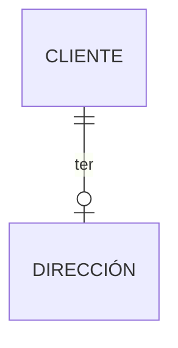
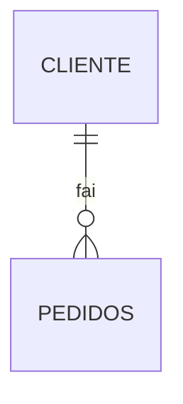

# Cardinalidades 0-1 0-N

As cardinalidades enténdense mellor mirando os diagramas entidade-relación. A continuación, unha explicación das cardinalidades 0-1 e 0-N.

**Importante: Cando miramos a cardinalidade de A a B temos que mirar que símbolo (ou que números) están no lado de B.**:


## Cardinalidade 0-1



Neste diagrama podemos ver que temos dúas entidades, `CLIENTE` e `DIRECCIÓN` e unha relación `ter`. A cardinalidade de `CLIENTE` a `DIRECCIÓN` é 0-1, isto significa que un `CLIENTE` pode ter 0 ou 1 `DIRECCIÓNS`. A cardinalidade de `DIRECCION` a `CLIENTE` é 1 e só 1, isto significa que unha `DIRECCION` só pode selo dun único `CLIENTE`.

A idea con 0 ou 1 e que un `CLIENTE` pode ter **unha ou ningunha** `DIRECCIÓN`. Pensade as tendas onde os piden o código postal cando compramos, non é obrigatorio dalo polo que algúns clientes terán código postal e outros non. Algúns clientes ponden darnos a súa dirección e ountros non querer.

## Cardinalidade 0-N



Aquí temos un diagrama con dous entidades, `CLIENTE` e `PEDIDOS` e un relación `facer`. A cardinalidade de `CLIENTE` a `PEDIDOS` é 0-N, isto significa que un `CLIENTE` pode facer 0 ou N (moitos ou ningún) `PEDIDOS`. A cardinalidade de `PEDIDOS` a `CLIENTE` é 1 e só 1, isto significa que un `PEDIDO` pode ser feito por un único `CLIENTE`.

A idea co 0 **cero** e deixar claro que non ten por que haber unha relación entre **todos** os `CLIENTES` e `PEDIDOS`. É dicir, que pode haber clientes **que aínda non fixeron ningún pedido**. A idea co N **moitos** é que un `CLIENTE` pode facer **varios** `PEDIDOS`.


```mermaid
