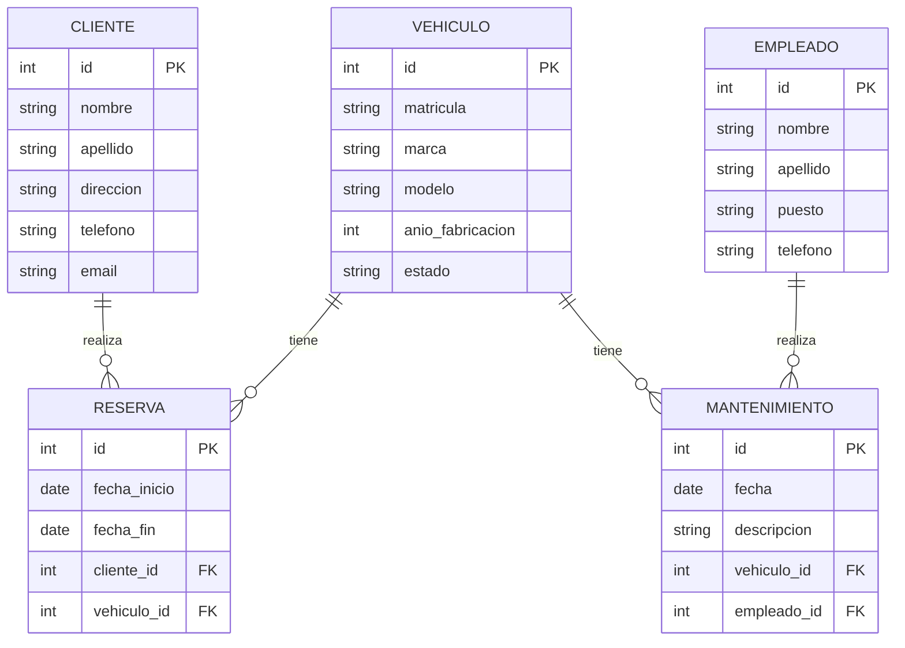

# Ejercicio 10 Modelo Entidad-Relación

## Enunciado

Una empresa de alquiler de vehículos desea diseñar una base de datos para gestionar su flota y las reservas de sus clientes. La empresa tiene los siguientes requisitos:

1. **Vehículos**: Cada vehículo tiene un identificador único, una matrícula, una marca, un modelo, un año de fabricación y un estado (disponible, en mantenimiento, alquilado).
2. **Clientes**: Cada cliente tiene un identificador único, un nombre, un apellido, una dirección, un número de teléfono y una dirección de correo electrónico.
3. **Reservas**: Cada reserva tiene un identificador único, una fecha de inicio, una fecha de fin, y está asociada a un cliente y a un vehículo.
4. **Empleados**: Cada empleado tiene un identificador único, un nombre, un apellido, un puesto de trabajo y un número de teléfono.
5. **Mantenimiento**: Cada mantenimiento tiene un identificador único, una fecha, una descripción del trabajo realizado, y está asociado a un vehículo y a un empleado.

### Requisitos adicionales

- Un cliente puede realizar múltiples reservas, pero cada reserva está asociada a un solo cliente.
- Un vehículo puede tener múltiples registros de mantenimiento, pero cada registro de mantenimiento está asociado a un solo vehículo.
- Un empleado puede realizar múltiples mantenimientos, pero cada mantenimiento está asociado a un solo empleado.

### Tareas

1. Diseña el diagrama entidad-relación (ER) que represente la información descrita.
2. Identifica las entidades, atributos y relaciones.
3. Define las cardinalidades de las relaciones.
4. Asegúrate de que todas las entidades tienen una clave primaria.
5. Incluye cualquier restricción adicional que consideres necesaria.

## Solución

