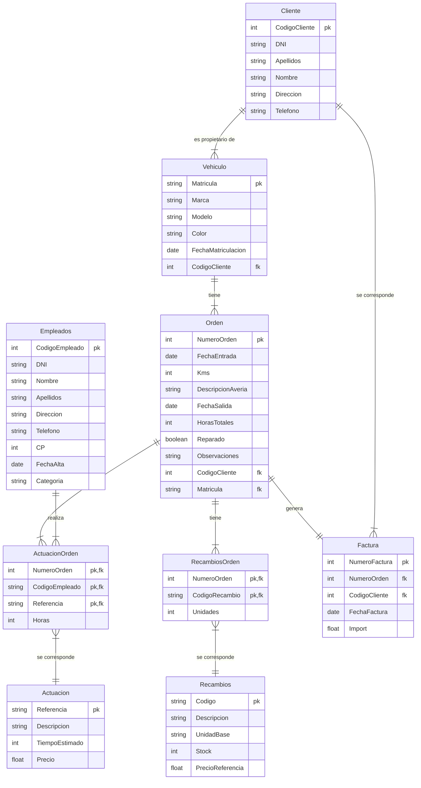
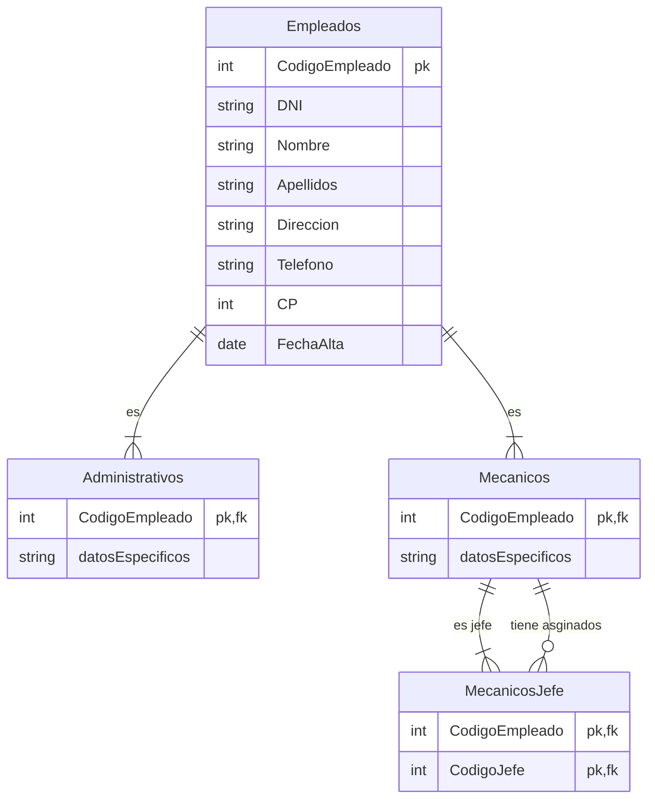

# Enunciado ejercicio 1

## Funcionamiento de talleres FABER

Siguiendo con el caso práctico que venimos analizando a lo largo de la unidad vamos a ayudar a Alejandra a establecer un modelo lógico que recoja el funcionamiento de talleres FABER, un taller mecánico que organiza su actividad de la siguiente forma:

* Una serie de **clientes** traen sus **vehículos** a reparar. En el momento en que llega un cliente nuevo le recibe un empleado de la administración quien registra la información necesaria del cliente, del vehículo y de la posible avería.
* Con estos datos se imprime una **orden de reparación** que se coloca en un tablero donde el **jefe de los mecánicos** se la adjudica a un empleado para que efectúe la reparación, entregándole una copia de la misma.
* En esta hoja cada mecánico añade manualmente todas las **actuaciones** que ha llevado a cabo y el tiempo empleado y las piezas sustituidas.
* Una vez finalizada la reparación el empleado entrega la orden a la administración del taller donde se traslada esta información al ordenador.
Cuando viene el cliente a retirar su vehículo se prepara la **factura** que recoge todas las actuaciones que se han llevado a cabo, su precio y el importe.

## Datos necesarios

Los datos que será necesario recoger en nuestra base de datos son:

Datos del cliente: DNI, Apellidos, Nombre, Dirección y Teléfono. Se le asigna además un Código de Cliente.
Datos del vehículo: Matrícula, Marca, Modelo, color y la Fecha de matriculación.
Datos previos, relativos a la reparación que se quiere efectuar que son:
Fecha de la entrada
Los km que tiene el coche.
La descripción de la posible avería
Una vez efectuada la reparación se añade lo siguiente:

Fecha de finalización
Horas totales empleadas en la reparación.
Si está reparado o no
Las observaciones que se consideren necesarias

Además se necesita saber para cada reparación:

* Empleados que han intervenido y las horas que interviene cada uno. Los datos de los empleados que están registrados en nuestro taller son: DNI, Nombre, Apellidos, Dirección, Teléfono, CP, Fecha de alta y Categoría. La empresa añade un Código de empleado.
* Actuaciones que se han llevado a cabo y el tiempo empleado en cada una de ellas. Se recoge una descripción de las actuaciones que se pueden llevar a cabo: Referencia, Descripción (por ejemplo sustituir batería, etc.), tiempo estimado y precio.
* Recambios y piezas que se han sustituido y las unidades. Para ello guardamos en una tabla una lista de los recambios que se pueden sustituir: código, descripción, unidad base (por ejemplo cajas de 2 lámparas, etc.), stock y precio de referencia.
* Finalmente para elaborar la factura se necesita incluir en el encabezado: Numero de factura y fecha de la factura. El resto de los datos de la factura se obtendrán a partir del los que ya hemos recogido en la reparación.
Se pide:

Obtener el modelo Entidad-Relación: Entidades, relaciones, atributos, claves principales, cardinalidades, tipos de correspondencia, etc.
Obtener el modelo Relacional: pasar del modelo entidad-relación al modelo relacional aplicando correctamente las reglas de transformación, justificando la solución elegida cuando se considere necesario.

Si queremos distinguir entre los empleados (administrativos, mecánicos y jefes):

