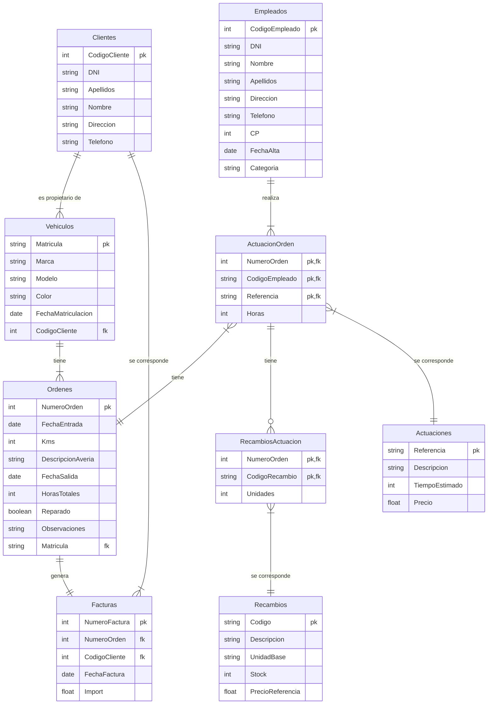
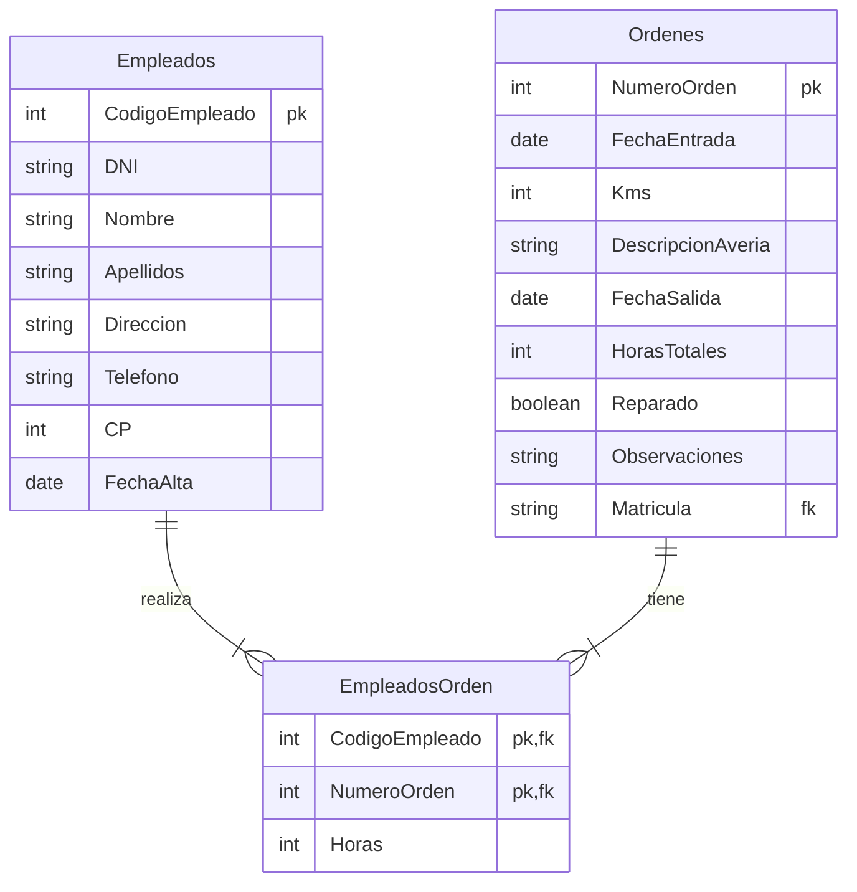
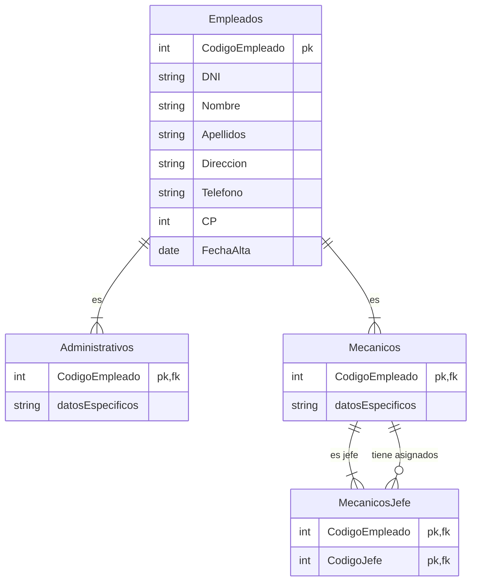

# Ejercicio 1 - Apartado 1

<!-- toc -->

* [Enunciado del primer apartado](#enunciado-del-primer-apartado)
  * [Funcionamiento de talleres FABER](#funcionamiento-de-talleres-faber)
  * [Datos necesarios](#datos-necesarios)
* [Solución](#solución)
  * [Entidades](#entidades)
  * [Relaciones](#relaciones)

<!-- tocstop -->

## Enunciado del primer apartado

### Funcionamiento de talleres FABER

Siguiendo con el caso práctico que venimos analizando a lo largo de la unidad vamos a ayudar a Alejandra a establecer un modelo lógico que recoja el funcionamiento de talleres FABER, un taller mecánico que organiza su actividad de la siguiente forma:

* Una serie de **clientes** traen sus **vehículos** a reparar. En el momento en que llega un cliente nuevo le recibe un empleado de la administración quien registra la información necesaria del cliente, del vehículo y de la posible avería.
* Con estos datos se imprime una **orden de reparación** que se coloca en un tablero donde el **jefe de los mecánicos** se la adjudica a un empleado para que efectúe la reparación, entregándole una copia de la misma.
* En esta hoja cada mecánico añade manualmente todas las **actuaciones** que ha llevado a cabo y el tiempo empleado y las piezas sustituidas.
* Una vez finalizada la reparación el empleado entrega la orden a la administración del taller donde se traslada esta información al ordenador.
Cuando viene el cliente a retirar su vehículo se prepara la **factura** que recoge todas las actuaciones que se han llevado a cabo, su precio y el importe.

### Datos necesarios

Los datos que será necesario recoger en nuestra base de datos son:

* Datos del cliente: DNI, Apellidos, Nombre, Dirección y Teléfono. Se le asigna además un Código de Cliente.
* Datos del vehículo: Matrícula, Marca, Modelo, color y la Fecha de matriculación.
* Datos previos, relativos a la reparación que se quiere efectuar que son:
  * Fecha de la entrada
  * Los km que tiene el coche.
  * La descripción de la posible avería

Una vez efectuada la reparación se añade lo siguiente:

* Fecha de finalización.
* Horas totales empleadas en la reparación.
* Si está reparado o no.
* Las observaciones que se consideren necesarias.

Además se necesita saber para cada reparación:

* Empleados que han intervenido y las horas que interviene cada uno. Los datos de los empleados que están registrados en nuestro taller son: DNI, Nombre, Apellidos, Dirección, Teléfono, CP, Fecha de alta y Categoría. La empresa añade un Código de empleado.
* Actuaciones que se han llevado a cabo y el tiempo empleado en cada una de ellas. Se recoge una descripción de las actuaciones que se pueden llevar a cabo: Referencia, Descripción (por ejemplo sustituir batería, etc.), tiempo estimado y precio.
* Recambios y piezas que se han sustituido y las unidades. Para ello guardamos en una tabla una lista de los recambios que se pueden sustituir: código, descripción, unidad base (por ejemplo cajas de 2 lámparas, etc.), stock y precio de referencia.
* Finalmente para elaborar la factura se necesita incluir en el encabezado: Numero de factura y fecha de la factura. El resto de los datos de la factura se obtendrán a partir del los que ya hemos recogido en la reparación.
Se pide:

* Obtener el modelo Entidad-Relación: Entidades, relaciones, atributos, claves principales, cardinalidades, tipos de correspondencia, etc.
* Obtener el modelo Relacional: pasar del modelo entidad-relación al modelo relacional aplicando correctamente las reglas de transformación, justificando la solución elegida cuando se considere necesario.

## Solución

La solución no es única ya que en este enunciado hay elementos que se prestan a interpretaciones distintas. En cualquier caso, la solución que se propone es la siguiente:

### Vídeo de la solución

[Vídeo de la solución](https://www.youtube.com/embed/rkBYL2f2q1U?si=zNhjdfdq2HHc77HA)

<iframe width="560" height="315" src="https://www.youtube.com/embed/rkBYL2f2q1U?si=zNhjdfdq2HHc77HA" title="YouTube video player" frameborder="0" allow="accelerometer; autoplay; clipboard-write; encrypted-media; gyroscope; picture-in-picture; web-share" referrerpolicy="strict-origin-when-cross-origin" allowfullscreen></iframe>

### Entidades

Las entidades que se pueden identificar son:

* **Clientes**, con los atributos: CodigoCliente, DNI, Apellidos, Nombre, Dirección y Teléfono.
* **Vehículos**, con los atributos: Matrícula, Marca, Modelo, Color, FechaMatriculación y CodigoCliente.
* **Empleados**, con los atributos: CodigoEmpleado, DNI, Nombre, Apellidos, Dirección, Teléfono, CP, FechaAlta y Categoría.

Con respecto a **Empleados** se podrían considerar varias opciones. Podemos entender que hay varios tipos de empleados: Administrativos, Mecánicos y Jefes de mecánicos. En este caso tendríamos una entidad Empleados y tres entidades más, una para cada tipo de empleado. El problema con esta solución es que **no hay ningún atributo especial que distinga a los empleados de un tipo u otro**.

Otra opción sería considerar que hay un único tipo de empleado y que hay un campo en la entidad Empleados que nos indica el tipo de empleado que es. TipoEmpleado podría tener tres valores posibles: Mecánico, Jefe de mecánicos o Administrativo. En este caso tendríamos una única entidad Empleados.

Puesto que **sólo se menciona la existencia de un jefe** tampoco tendría mucho sentido reflejar el hecho en la base de datos. No se especifica un mecanismo para que el jefe asigne las reparaciones (órdenes en nuestro diseño) al resto ni en qué se distingue el jefe de cualquier otro mecánico.

En cualquier caso, se pueden considerar las dos opciones. En el mundo real necesita más información para decidir cuál es la mejor opción o si than siquiera hay que aplica

* **Órdenes**, con los atributos: NumeroOrden, FechaEntrada, Kms, DescripciónAvería, FechaSalida, HorasTotales, Reparado, Observaciones, CodigoCliente y Matrícula.
* **ActuaciónOrden**, con los atributos: NumeroOrden, CodigoEmpleado, Referencia y Horas.
* **Actuaciónes**, con los atributos: Referencia, Descripción, TiempoEstimado y Precio.

He decidido llamar a la _reparación_ **Orden**. Una reparación estará asociada a un vehículo y estará formada por una o más actuaciones. Cada actuación de la orden (_ActuaciónOrden_) será realizada por un único empleado y tendrá que ser una de las actuaciones predefinidas (_Actuaciones_). De esta forma podremos saber cuantos _Empleados_ han participado en una reparación _repasando_ las _ActuacionesOrden_ de la misma.

* **RecambiosOrden**, con los atributos: NumeroOrden, CodigoRecambio y Unidades.
* **Recambios**, con los atributos: Código, Descripción, UnidadBase, Stock y PrecioReferencia.
* **Facturas**, con los atributos: NumeroFactura, NumeroOrden, CodigoCliente y FechaFactura.

Con respecto a la _Facturas_, **no es necesario** que se relacione directamente con el cliente. Puesto la que factura está ya asociada a una _Ordenes_ y esta a su vez a un _Clientes_ podemos obtener la información del cliente a partir de la _Ordenes_.

_RecambiosOrden_ y _Recambios_ tienen un funcionamiento análogo a _ActuaciónOrden_ y _Actuación_. Cada _RecambiosOrden_ se corresponde con un _Recambios_ y se asocia a una _Orden_. Podría interpretarse que los _Recambios_ se asocian a las _Actuaciones_ y no a las _Ordenes_ pero en el enunciado no se aclara. Las dos opciones serían aceptables.

### Relaciones

Los **Clientes** pueden tener **uno o más Vehículos**. No tiene sentido que tengamos un cliente en el taller si no le estamos (o ya le hemos) reparado algún vehículo. A su vez, a cada **vehículo** le corresponderán **una o más Órdenes** (de reparación / reparaciones).

_También podríamos tener en cuenta que un **Vehículo** podría pertenecer a varios **Clientes** a lo largo de tiempo (por ejemplo, un coche que ha sido vendido) o constar como que es de varias personas (el coche de una familia que hoy trae uno de los miembros y otro día, otro). En dicho caso la relación sería M:N y habría que indicar la fecha en que se constató la **pertenencia**. En esta solución no la hemos considerado._

Con respecto a los **Empleados**, en el enunciado se de información _hasta cierto punto_ contradictoria, pues se dice que: _"el jefe de los mecánicos se la adjudica (la orden de reparación) a un empleado para que efectúe la reparación, entregándole una copia de la misma (orden)"_. Esto podría interpretarse como que cada _reparación_ la realiza un único empleado pero más adelante se da a entender que pueden ser varios: _"para cada reparación (se necesita saber): Empleados que han intervenido y las horas que interviene cada uno."_ La solución por la que he optado es que una _Orden de reparación_ esté compuesta de **una o más Actuaciones** y que cada **Actuación** esté asociada a un único **Empleado**.
De este modo sabremos qué empleados han participado en una reparación (a través de sus actuaciones) quién ha hecho qué (aunque no se pida) y cuanto tiempo ha dedicado cada uno.

Como he dicho, cada **Orden** tendrá una o más **Actuaciones** y cada **Actuación** podrá formar parte de una o más **Órdenes**, por lo que tendremos que crear una tabla intermedia **ActuaciónOrden** que las conecte. _En esta tabla se indicará también el empleado que ha realizado la actuación y el tiempo que ha empleado en ella._

En esta solución he tomado la decisión de que un **Empleado** realiza una o más **Actuaciones** por cada **Orden**, pero cada **Actuación** de cada **Orden** será realizada por un único **Empleado**. En **ActuaciónOrden** se guardará el tiempo que ha empleado cada empleado en cada actuación de cada orden. Para saber el tiempo total que dedica un empleado a una **Orden** se podrían sumar las horas de todas las actuaciones que ha realizado dicho empleado asociadas a dicha **Orden**.

La relación **Jefe** **Mecánicos** no la represento, incluyo un ejemplo de cómo podría hacerse algo por el estilo al final de la solución. No la incluyo pues, aparentemente, sólo hay un jefe y no se menciona que tenga ninguna función especial (salvo asignar órdenes de trabajo) relevante para el diseño de la base de datos, ya que no se dice que se guarde dicha información en ningún lado. Además no se habla de distintos grupos de mecánicos cada uno con su jefe, si no que habría un único jefe para todos los mecánicos. Si queremos reflejar esto podría crear un campo _EsJefe_ booleano en la tabla _Empleados_ que sea cierto si el empleado es jefe.

Respecto a la relación entre factura y cliente, **aunque la he reflejado en el diagrama** no sería necesario. Pues se puede llegar desde la factura al cliente a partir de la **Orden** y el _Vehículo_ (si decidimos que un vehículo lo es de un único cliente).

Si queremos relacionar a los mecánicos directamente con las reparaciones:

Si queremos distinguir entre los empleados (administrativos, mecánicos y jefes):

