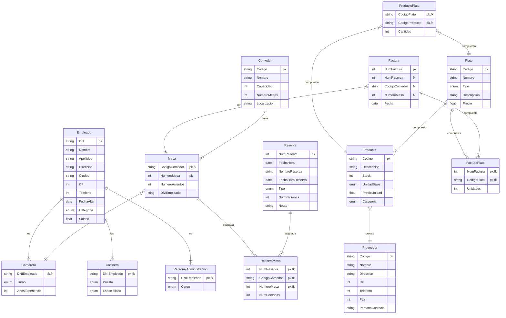

# Ejercicio 1 - Apartado 3

<!-- toc -->

* [Enunciado del tercer apartado](#enunciado-del-tercer-apartado)
* [Solución](#solución)
  * [Entidades](#entidades)
  * [Relaciones](#relaciones)
    * [Cocineros y platos](#cocineros-y-platos)
  * [Diagrama Entidad-Relación](#diagrama-entidad-relación)

<!-- tocstop -->

## Enunciado del tercer apartado

Vamos a informatizar la gestión del Restaurante Mouro. Se trata de un restaurante de tres plantas, que ofrece distintos servicios a sus clientes. Inicialmente vamos a describir su funcionamiento:

* El restaurante tiene una serie de **comedores**, cada uno de ellos con un número fijo de **mesas** disponibles. De cada comedor interesa: Código y nombre del comedor, capacidad máxima de comensales, número de mesas, localización. Por ejemplo: MA, es el salón "Mar Abierto", está en la planta baja, tiene 60 mesas y capacidad para 300 comensales.
* En cada comedor hay una serie de **mesas**. De las mesas guardamos el número de asientos y quien es el **camarero** que la atiende. Las mesas se numeran consecutivamente, de forma que será necesario que se añada al propio código el del comedor al que corresponden. Por ejemplo: MA, 01 es la mesa 1 del salón Mar Abierto.
* Los **empleados** realizan funciones distintas según sean personal de cocina, camareros o personal de administración del negocio.

De todos ellos recogemos la siguiente información: DNI, Nombre, Apellidos, Dirección, Ciudad, CP, teléfono, Fecha de alta, Categoría y Salario.

Cuando se trata de **camareros** queremos saber además en que turno trabaja y los años de experiencia.

De los **cocineros** necesitamos saber cuál es su puesto en la cocina y su especialidad (carnes, pescados, postres, etc.)

Del **personal de administración** necesitamos conocer el cargo que tiene.

No se da el caso de que una misma persona realice más de una función. Existen, además otras personas contratadas temporalmente como **ayudantes** que no se recogen en la anterior descripción.

Entre los camareros existen una serie de encargados que supervisan a otros camareros.

* Para organizar mejor el trabajo se admiten **reservas** de los clientes. Cuando se recibe una llamada para hacer una reserva recogemos:
  * Número de reserva.
  * Fecha y hora de la reserva.
  * Nombre de la persona que hace la reserva.
  * La fecha y hora para la que se hace la reserva.
  * Tipo: Si se trata de comida o cena.
  * El número de personas.
  * Otros datos que puedan ser de interés.

Automáticamente se adjudican las mesas necesarias para cubrir la reserva añadiendo el número de personas que se sentarán en cada mesa.

* En la **carta** se exponen una serie de **platos** de los cuales se guarda: Un código, el nombre del plato, el tipo de plato (carnes, pescados, primeros, postres, etc.), una breve descripción y el precio.
* Para llevar mejor la gestión de las compras, de cada plato recogemos los **productos** o ingredientes que lo componen y en qué cantidad. De los **productos** guardamos: un código, la descripción, el stock, la unidad-base (docenas, kg, litros, etc.), el precio por unidad y la categoría a la que pertenece.
* Mantenemos también información de los **proveedores** que nos suministran esos productos: Código, Nombre, Dirección, CP, Teléfono, Fax, Persona de contacto.
* Por último cuando nuestros clientes nos visitan tomamos nota manualmente de la comanda, y, una vez que hayan terminado realizamos la correspondiente **factura** que recoge en el encabezado el número de factura, fecha y número de mesa. A continuación una relación de los nombres de los platos, las unidades de cada plato, precio e importe (estos dos datos se obtienen de la información almacenada).

Se pide:

Obtener el modelo Entidad-Relación: Entidades, relaciones, atributos, claves principales, cardinalidades, tipos de correspondencia, etc.\
Obtener el modelo Relacional: pasar del modelo entidad-relación al modelo relacional aplicando correctamente las reglas de transformación, justificando la solución cuando se considere necesario.

## Solución

### Entidades

A partir del enunciado, se pueden identificar las siguientes entidades:

* **Comedor** (<ins>Código</ins>, Nombre, Capacidad, NúmeroMesas, Localización).
* **Mesa** (<ins>Código</ins>, NúmeroAsientos, DNICamarero).
* **Empleado** (<ins>DNI</ins>, Nombre, Apellidos, Dirección, Ciudad, CP, Teléfono, FechaAlta, Categoría, Salario)

Los empleados se dividen en tres sub-entidades (especialización):

* **Camarero** (<ins>DNIEmpleado</ins>, Turno, AñosExperiencia).
* **Cocinero** (<ins>DNIEmpleado</ins>, Puesto, Especialidad).
* **PersonalAdministración** (<ins>DNIEmpleado</ins>, Cargo).

El caso de los **ayudantes** es confuso pues no se indica si son empleados o no. Se asume que sí lo son, por lo que se añade la entidad **Ayudante** (DNIEmpleado).

* **Ayudante** (DNIEmpleado).

* **Reserva** (<ins>NumReserva</ins>, FechaHora, NombreReserva, FechaHoraReserva, Tipo, NumPersonas, Notas).

Puesto que sólo existe una única carta no tiene sentido crear dicha entidad. Todos los platos son parte de la carta.

* **Plato** (<ins>Código</ins>, Nombre, Tipo, Descripción, Precio).
* **Producto** (<ins>Código</ins>, Descripción, Stock, UnidadBase, PrecioUnidad, Categoría).
* **Proveedor** (<ins>Código</ins>, Nombre, Dirección, CP, Teléfono, Fax, PersonaContacto).
* **Factura** (<ins>NumFactura</ins>, Fecha, NumMesa).

### Relaciones

Un **Comedor** estará compuesto de varias **Mesas**. Por tanto, la relación entre ambas entidades es de tipo 1:N.
Los **Empleados** pueden ser **Camareros**, **Cocineros** o **PersonalAdministración**. Por tanto, la relación entre **Empleado** y cada una de las sub-entidades es de tipo N:1. Cada **Empleado** será de un tipo y cada tipo tendrá uno o más **Empleados**.

Dejemos a parte por el momento a los **Ayudantes**.

Respecto a la **Reserva** se dice que se le asignan **Mesas** por lo que una reserva tendrá una o más mesas, además se indicará que, para cada **Reserva** una mesa estará ocupada por un número específico de personas. Por tanto, la relación entre **Reserva** y **Mesa** es de tipo N:M. Una mesa puede estar asociada a varias reservas y una reserva puede ocupar varias mesas.

Un **Plato** estará compuesto por uno o más **Productos** y un **Producto** podrá formar parte de distintos **Platos**. Por tanto, la relación entre **Plato** y **Producto** es de tipo M:N. Todo produto ha de ser provisto por (al menos) un **Proveedor**. Por tanto, la relación entre **Producto** y **Proveedor** N:1 (consideraremos que cada producto sólo puede ser provisto por un único proveedor y que un proveedor pude proveer varios productos).

Una **Factura** estará compuesta por uno o más **Platos** y un **Plato** podrá formar parte de varias **Facturas**. Por tanto, la relación entre **Factura** y **Plato** es de tipo M:N. A su vez una **factura** estará asociada a una única **mesa** pero una **mesa** podrá tener varias facturas (a distintas horas, en distintas reservas). Por tanto, la relación entre **Factura** y **Mesa** es de tipo N:1.

#### Cocineros y platos

En el enunciado no se nos indica nada respecto a la relación entre cocineros y platos, pero podemos asumir que un cocinero puede preparar varios platos y un plato puede ser preparado por varios cocineros. Por tanto, la relación entre **Cocinero** y **Plato** es de tipo M:N.

En cualquier caso, en el enunciado no se hace referencia alguna a esta posible relación ni se especifica ninguna información relativa a la misma. Por este motivo no añadiremos la relación entre **Cocinero** y **Plato**. Si añadimos cosas que no se nos piden corremos dos riesgos, el de crear tablas que no se necesitas (y probablemente no se pueden rellenar) y, al complicar más el modelo habrá más posibilidades de cometer errores.

### Diagrama Entidad-Relación

El diagrama relacional se obtendría del anterior _deshaciendo_ las relaciones M:N (creando una nueva tabla que _interconecte_ las entidades implicadas) y definiendo todas la claves foráneas que falten:

