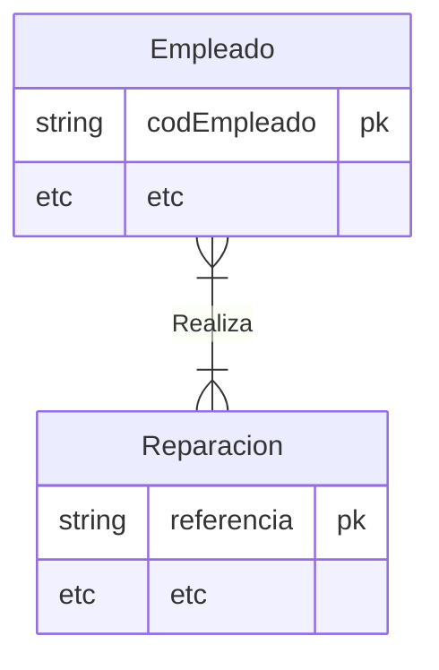

# Corrección de Laura

<!-- toc -->

* [Apartado 1](#apartado-1)
* [Apartado 2](#apartado-2)
* [Apartado 3](#apartado-3)

<!-- tocstop -->

Hola Laura.

Cuando uses una notación intenta ceñirte a la misma. Si eliges la notación de Chen usa la notación de Chen y si usas Crow's Foot pues usa Crow's Foot. Pero no me mezcles las dos. Te corrijo esta tarea así pero en el examen no lo hagas.

## Apartado 1

* En el enunciado se nos indica que una reparación puede ser realizada por múltiples **Empleados**. En tu diagrama no se ve claro. No puedes poner la _pata de pollo_ en el lado del rombo/relación, no tiene sentido. La relación debería ser de **n a m**.

## Apartado 2

Todo correcto.

## Apartado 3

No aparece.

Si tienes cualquier duda sobre la corrección no dudes en decírmelo, ponemos un día y lo vemos en detalle.
