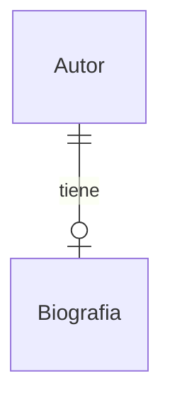

# Guía para los vídeos del Modelo Entidad-Relación

## Vídeo 1: Introducción al Modelo Entidad-Relación y Entidades

### Objetivo del modelo entidad-relación

El modelo entidad-relación es un modelo conceptual propuesto por Peter Chen en el año 1976. 

El objetivo del modelo entidad-relación es obtener una representación gráfica de los datos de un dominio de conocimiento. Esto es, de un conjunto de entidades y de las relaciones que existen entre ellas dentro de un contexto determinado. Lo que llamamos diagrama entidad-relación.

El objetivo final de aplicar secuencialmente el modelo entidad-relación, el modelo relacional y un lenguaje de definición de datos (DDL), es obtener una base de datos que permita almacenar, recuperar y manipular la información de manera eficiente tanto en espacio como en tiempo.

No existe un único diagrama para representar el modelo entidad-relación, sino que existen diferentes notaciones y convenciones. Además no es raro que se utilicen diferentes notaciones en un mismo diagrama.

### Importancia de las relaciones

Las relaciones son importantes en tanto que nos dan indicios de los tipos de consultas que se harán en la base de datos. Si tenemos una relación entre autor y libro, ésta nos interesa porque es muy probable que en la base de datos deseemos consultar los libros de un autor. Lo mismo para los alumnos de un ciclo, módulo, tutor, etc.

## Vídeo 2: Entidades

### Entidades

Entidad es una *cosa* o *concepto* que es capaz de una **existencia independiente**, que puede ser **identificada de forma única** y **con información asociada** a si misma.

#### Ejemplos de entidades

* **Existencia independiente:** Dependiendo del contexto. Empleado en el contexto de una empresa, socio y libro en el contexto de una biblioteca, paciente en el contexto de un hospital, etc. Nombre, fecha de nacimiento, dirección de correo electrónico, etc. no son entidades pues han de estar ligadas a una entidad para *tener sentido* o *ser útiles*.
* **Identificación única:** Cada entidad ha de tener una forma de identificación única. Por ejemplo, un número de empleado, un número de socio, un número de libro, un número de paciente, etc. *(Idea de instancia de entidad)*.
* **Información asociada:** Cada entidad tiene asociada una serie de propiedades o atributos que la describen. Por ejemplo, un empleado tiene un nombre, un apellido, una fecha de nacimiento, un número de teléfono, etc. *(Idea de categoría de entidad)*.

#### Entidad como categoría e instancia

Nos interesan las entidades como categorías, es decir, como un conjunto de instancias que comparten las mismas propiedades. Que se identifican y distinguen entre sí por sus valores.

La entidad / categoría `Libro` incluye a todos los libros de una librería, cada libro es una instancia de la entidad `Libro`.

## Vídeo 2: Atributos y Tipos de Atributos

### Atributos

Una atributo es una propiedad o característica de una entidad que describe un aspecto de la entidad. En algunos casos las relaciones también pueden tener atributos, por ejemplo la fecha de inicio de una relación entre dos entidades.

### Tipos de atributos

* **Clave primaria**: Atributo o conjunto de atributos que identifican de forma única a una entidad. No puede tener valores nulos y no puede repetirse.
* **Clave candidata**: Atributo o conjunto de atributos que podrían ser claves primarias. No puede tener valores nulos y no puede repetirse.
* **Atributo calculado**: Atributo cuyo valor se puede calcular a partir de otros atributos.

## Vídeo 3: Relaciones

Una relación describe una asociación entre dos o más entidades, cómo interactúan entre sí. Aunque una relación pueden involucrar a más de dos entidades a lo largo del proceso de diseño se intenta simplificar a relaciones binarias.

## Vídeo 4: Cardinalidades

La cardinalidad de una relación indica el número de instancias de una entidad que pueden estar relacionadas con una instancia de otra entidad. Esto se analiza mirado desde cada extremo de la relación: ¿Cuantos libros puede retirar un socio? ¿Por cuántos socios puede ser retirado un libro? Lo que nos interesará será el número mínimo y máximo de instancias de una entidad que pueden estar relacionadas con una instancia de otra entidad.

Así, podemos decir que un ciclo de FP puede tener asociados de 0 a N módulos, mientras que un módulo puede estar asociado a un único ciclo de FP. Y una alumno puede estar matriculado en un único ciclo de FP pero un ciclo de FP puede tener asociados de 0 a N alumnos o 1 a N si existiese alguna **restricción** que indicase que no se permite la existencia de ciclos sin alumnos, etc.

### Cardinalidad 1:N (Uno a muchos)

Esta cardinalidad indica que una instancia de una entidad puede estar relacionada con N instancias de otra entidad. Por ejemplo, un departamento puede tener asignados de 1 a N empleados, mientras que un empleado puede estar asignado a un único departamento.

### Cardinalidad M:N (Muchos a muchos)

Esta cardinalidad indica que una instancia de una entidad puede estar relacionada con N instancias de otra entidad y viceversa. Por ejemplo, un libro puede estar escrito por uno o más autores y un autor puede serlo de uno o más libros.

### Cardinalidad 1:1 (Uno a uno)

Este es un caso raro en el que una instancia de una entidad está relacionada con una única instancia de otra entidad. Por ejemplo, un empleado puede tener asignado un único despacho y un despacho puede estar asignado a un único empleado.

### Cardinalidad 0 ó ...

Cuando decimos que una cardinalidad es 0 a *algo* lo que estamos indicando es que es posible que no exista una relación entre algunas instancias. Por ejemplo si sabemos que todo profesor ha de estar asignado a un departamento, diremos que la relación entre profesor y departamento es N a 1 (un profesor puede estar asignado a un único departamento pero un departamento puede tener asignados de N profesores). Si sabemos que habrá profesores sin asignar a un departamento, diremos que la relación es N a 0 ó 1 (un profesor puede estar asignado a un único departamento pero un departamento puede tener asignados de 1 a N profesores). Finalmente, si un departamento puede existir sin profesores diremos que la cardinalidad sería 0 ó N a 0 ó 1.
