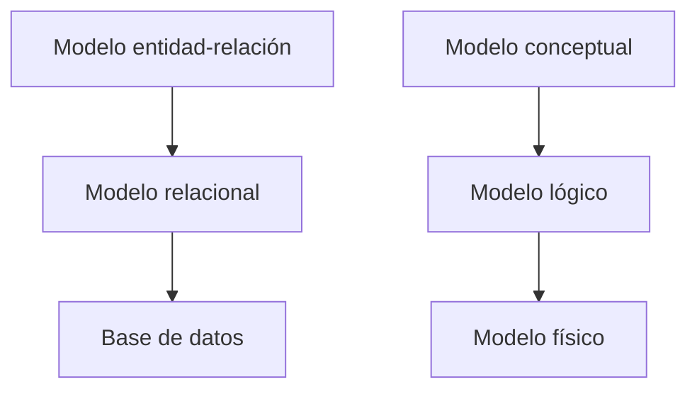

# Introducción

En esta unidad aprenderemos a modelar una base de datos mediante el modelo entidad-relación. Este modelo es una representación gráfica de la estructura de una base de datos que describe las entidades que la componen, los atributos de las entidades y las relaciones entre ellas. Es una herramienta muy útil para diseñar bases de datos y es el paso previo a la creación de la base de datos en un sistema de gestión de bases de datos.

Las fases de modelado de datos que culminan en la creación física de la base de datos son las siguientes:

- **Modelo conceptual**: En esta fase se crea un modelo conceptual de la base de datos. Este modelo es **independiente del sistema de gestión de bases de datos** y se centra en la estructura de la base de datos y en las relaciones entre las entidades. El **modelo entidad-relación** es un ejemplo de modelo conceptual.
- **Modelo lógico**: En esta fase se traduce el modelo conceptual a un modelo lógico. El modelo lógico es una representación de la base de datos en un sistema de gestión de bases de datos concreto. En esta fase se definen las tablas, los campos, las claves primarias y foráneas, etc. El modelo relacional es un ejemplo de modelo lógico.
- **Modelo físico**: En esta fase se crea la base de datos en un sistema de gestión de bases de datos concreto. Se crean las **tablas, los índices, las claves primarias y foráneas, etc.** En esta fase se utiliza un lenguaje de definición de datos (DDL) para crear la base de datos. El **lenguaje SQL** incluye un conjunto de instrucciones DDL para crear y modificar bases de datos.



```

```
