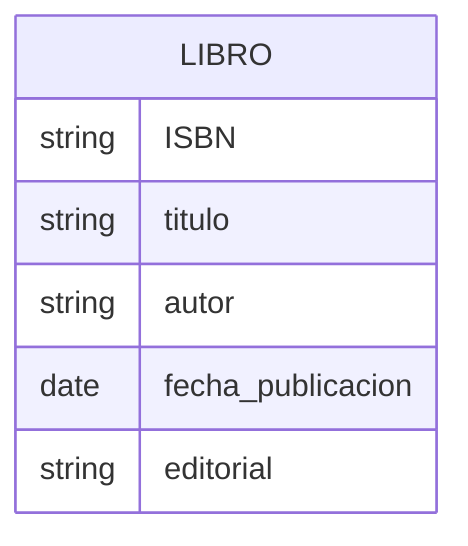
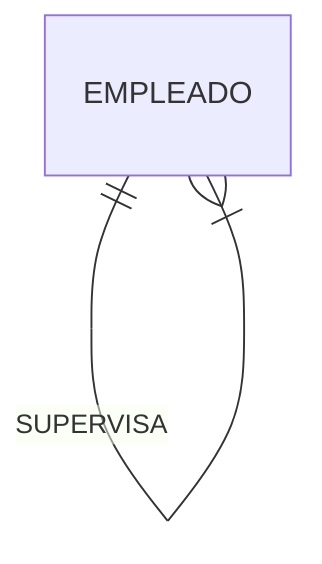
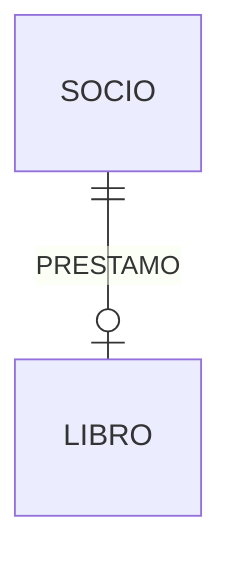
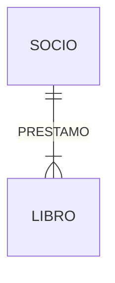
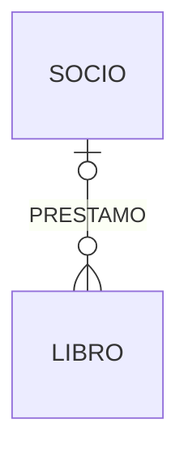

# Modelo entidad relación

[TOC]

El modelo entidad-relación fue propuesto por Peter Chen en 1976 y es una herramienta muy útil para diseñar bases de datos. Es un modelo conceptual de la base de datos que describe las **entidades** que la componen, los **atributos** de las entidades y las **relaciones** entre ellas de una forma gráfica y sencilla. Esto es, permite obtener un diagrama entidad-relación que es una representación gráfica de la estructura conceptual de una base de datos.

Este modelo describe **elementos de interés interrelacionados** dentro de un **dominio específico de conocimiento**. ¿Qué quiere decir esto? Un _dominio de conocimiento_ podría ser lo que sabemos del funcionamiento de una biblioteca, y los _elementos de interés_ serían los fondos: libros, revistas, películas, etc.; los socios, los préstamos, etc.

El modelo entidad-relación básico está compuesto de entidades (que clasifican las cosas de interés) y especifica relaciones que pueden existir entre entidades (instancias de esos tipos de entidades).

En las siguientes secciones iremos viendo todos los elementos que componen el modelo entidad-relación, analizando cada uno de ellos en detalle y viendo cómo se representan gráficamente.

**Nota:** No existe una única representación gráfica del modelo entidad relación. En estes apuntes utilizaremos la notación de pata de gallo (crow's foot) pero existen otras notaciones como la notación de Chen, la notación de Bachman o la notación de Martin.

## Elementos básicos

En esta sección veremos los elementos básicos del modelo: entidades, atributos y relaciones. Comenzaremos con una definición de cada uno de ellos y pondremos ejemplos para que se entienda mejor.

### Entidades

Una entidad se define como una cosa que es capaz de una **existencia independiente**, que puede ser **identificada de forma única** y que es **capaz de almacenar datos**. Una entidad es una abstracción de las complejidades de un dominio. Cuando hablamos de una entidad, normalmente hablamos de algún aspecto del mundo real que se puede distinguir de otros aspectos del mundo real.

Una librería, por ejemplo vende libros. Cada libro se puede considerar una entidad. Cada uno tiene una existencia independiente, puede ser identificado de forma única (por ejemplo por su ISBN [^1]) y puede almacenar datos (autor, fecha de publicación, editorial, etc.).

_Cuando decimos que una entidad "puede almacenar datos" nos referimos a que hay información asociada a la entidad, que la describe; no a que la entidad funcione como un almacén de datos._

[^1]: Un ISBN (International Standard Book Number) es un número que identifica de forma única un libro. Es un atributo de la entidad libro.

Una entidad puede ser un objeto físico o un concepto. Por ejemplo, un coche, una persona, una ciudad, una cuenta bancaria, una factura, etc.

Las entidades suelen corresponderse con sustantivos. Por ejemplo, un empleado, un ordenador, una ciudad, una nómina, etc.

#### Representación gráfica

La entidades se representan mediante un rectángulo con el nombre de la entidad en su interior. Por ejemplo, la entidad `libro` se representaría de la siguiente forma:

### Atributos

Un atributo es una propiedad o característica de una entidad (o relación). Los atributos describen las entidades y son la información que se almacena de las mismas. Por ejemplo, si tenemos una entidad `libro`, los atributos podrían ser `título`, `autor`, `fecha de publicación`, `editorial`, etc. Los atributos son los que permiten distinguir una entidad de otra.

Para toda entidad habrá uno o más atributos que la identifiquen de forma única. A estos atributos se les llama **clave primaria**. Por ejemplo, en una entidad `libro`, el atributo `ISBN` podría ser la clave primaria. El atributo `autor` no sería una clave primaria, ya que puede haber varios libros con el mismo autor.

Hay casos en los que las relaciones también pueden tener atributos. Por ejemplo, si tenemos una relación `prestamo` entre las entidades `socio` y `libro`, el atributo `fecha` sería un atributo de la relación `prestamo`.

La representación gráfica sería:

Usando el un diagrama ER de Chen:

### Relaciones

Una relación representa cómo las entidades interactúan entre sí. Las relaciones se pueden pensar como verbos, que enlazan dos o más sustantivos. Algunos ejemplos de relaciones son: `posee` entre una empresa y un ordenador, `pertenece` entre un profesor y un departamento, `interpreta` entre un artista y una canción, `demuestra` entre un matemático y una conjetura. Volviendo al ejemplo de la biblioteca, podríamos tener una relación `prestamo` entre las entidades `socio` y `libro`.

La representación gráfica de una relación es la siguiente:

Una relación también puede darse entre una única entidad. Por ejemplo, si tenemos una entidad `empleado` y una relación `supervisa` entre empleados, la representación gráfica sería la siguiente:

Como se puede observar, la relación tendrá un nombre que indica la naturaleza de la relación. En el ejemplo anterior, la relación `supervisa` indica que un empleado supervisa a otro empleado.

#### Roles

Es práctica común expresar el _rol_ que representa cada entidad en una relación mediante una expresión como "el empleado es supervisor de otros empleados" o "el socio toma prestado un libro". En el ejemplo anterior, el rol de la entidad `empleado` es `supervisor` y el rol de la entidad `empleado` es `supervisado`, del mismo modo el rol de la entidad `socio` es `prestatario` y el rol de la entidad `libro` es `prest ado`.

## Cardinalidad

La cardinalidad de una relación indica cuántas instancias de una entidad pueden estar relacionadas con una instancia de otra entidad. La cardinalidad se representa mediante un número o un rango de números. Por ejemplo, en la relación `prestamo` entre las entidades `socio` y `libro`, la cardinalidad podría ser `1` (uno) a `n` (ene), lo que indica que un socio puede tomar prestado varios libros (n libros), pero un libro solo puede ser tomado prestado por un socio. Obviamente esto viene determinado por las reglas del dominio de conocimiento que estamos modelando (por las reglas del negocio).

### Tipos de cardinalidad

#### Cardinalidad 1 a 1

Esta cardinalidad se expresa como "La entidad A está relacionada con una y solo una entidad B". Por ejemplo, si tenemos una relación `libro` con la entidad `socio`, la cardinalidad 1 a 1, indicaría que **todo socio** tiene uno y sólo un libro en préstamo y que **todo libro** tiene que estar prestado a un socio.

_Obviamente esta situación es absurda ya que habrá socios que no tengan libros en préstamo y libros que no estén prestados a socios, por lo que esta cardinalidad no tiene mucho sentido en este caso._

Se representa gráficamente de la siguiente forma:

##### Notación de pata de gallo (crow's foot)

##### Notación de Chen

#### Cardinalidad 1 a 0 ó 1

En este caso lo que decimos es que "La entidad A está relacionada con una y solo una entidad B o con ninguna". Por ejemplo, si tenemos una relación 1 a 0 ó 1 de `socio` con la entidad `libro`, estaría diciendo que un socio puede tener un libro en préstamo o ninguno. Por otro lado, un libro (en el caso que estamos representando) tendrá que estar prestado a un socio.

_De nuevo estamos ante una relación sin sentido en el mundo real, puesto que no todos los libros estarán en préstamo todo el tiempo._

La representación gráfica sería la siguiente:

#### Cardinalidad 1 a n

Con esta cardinalidad decimos que "La entidad A está relacionada con una o más entidades B". Por ejemplo, si tenemos una relación 1 a n de `socio` con la entidad `libro`, estaríamos diciendo que un socio puede tener varios libros en préstamo, pero como mínimo tendrá siempre 1. Por otro lado, seguimos diciendo que un libro tendrá que estar prestado a un socio.

_Esta relación tiene algo más de sentido en el mundo real, ya que un socio puede tener varios libros en préstamo._

Su representación gráfica será la siguiente:

#### Cardinalidad 1 a 0 ó n

Esta vez estamos indicando que "La entidad A está relacionada con cero o más entidades B". Por ejemplo, si tenemos una relación 1 a 0 ó n de `socio` con la entidad `libro`, estaríamos diciendo que un socio puede tener varios libros en préstamo o ninguno. Por otro lado, un libro tendrá que estar prestado a un socio.

_Esta relación tiene sentido en el mundo real, al menos para el socio, ya que un socio puede tener varios libros en préstamo o ninguno._

Se representaría de la siguiente forma:

#### Cardinalidad 0 ó 1 a 0 o n

En este caso decimos que "La entidad A está relacionada con cero o una entidad B y la entidad B está relacionada con cero o más entidades A". Por ejemplo, si tenemos una relación 0 ó 1 a 0 o n de `socio` con la entidad `libro`, estaríamos diciendo que un socio puede tener varios libros en préstamo o ninguno. Por otro lado, un libro puede estar prestado a un socio o a varios.

_Esta relación tiene sentido en el mundo real, ya que un libro puede estar prestado a un sólo socio, o no estar prestado, y un socio puede tener varios libros en préstamo, o ninguno._

Gráficamente sería:

