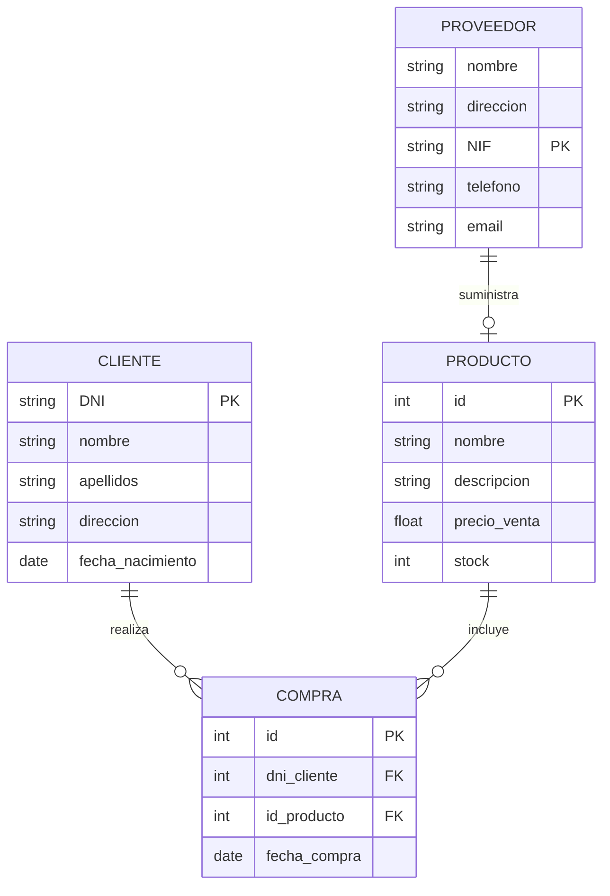

# Tarea 2 - Modelo entidad-relación - Empresa genérica

Obtén el diagrama entidad-relación a partir de la siguiente descripción:

Una empresa vende productos a varios clientes. De cada cliente se necesita conocer su nombre y apellidos, dirección y fecha de nacimiento. De cada producto se desea guardar su nombre, descripción, precio de venta y stock. Cada cliente puede comprar varios productos y un mismo producto puede ser comprado por varios clientes.

A su vez los productos son suministrados por diferentes proveedores. Un producto sólo se puede suministrar por un único proveedor, pero un proveedor puede suministrar varios productos. De cada proveedor se desea guardar su nombre, dirección, NIF, teléfono y email.

**Empieza identificando las entidades y atributos, y después las relaciones. Finalmente las cardinalidades.**

