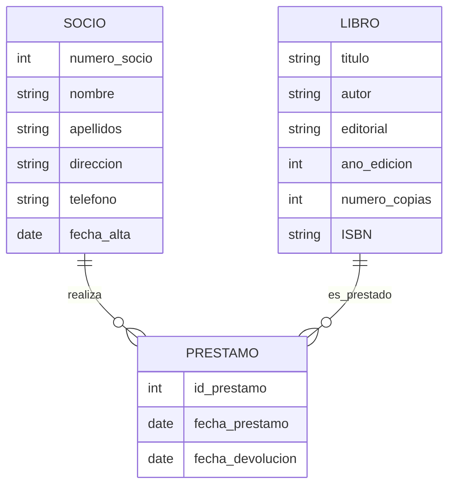

## Tarea 3 - Modelo entidad-relación: Biblioteca

Representa utilizando el diagrama de entidad-relación (notación Crow's Foot) el siguiente caso:

Una biblioteca desea gestionar la información de sus libros y socios. De cada libro se desea guardar su título, autor, editorial, año de edición, número de copias y ISBN. De cada socio se desea guardar su nombre, apellidos, dirección, teléfono y fecha de alta en la biblioteca. También se le asignará un número de socio. Cada socio podrá pedir prestados varios libros, y de cada préstamo se desea guardar la fecha de préstamo y la fecha de devolución.

