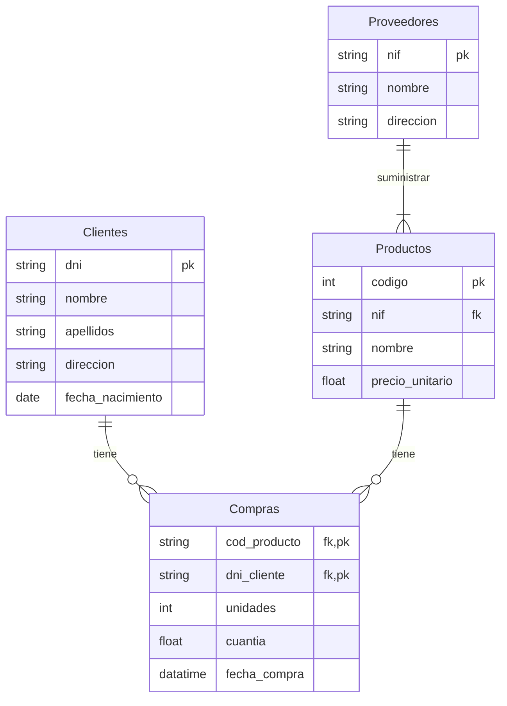

# Ejercicio 1

<!-- toc -->

- [Enunciado](#enunciado)
- [Entidades](#entidades)
- [Relaciones](#relaciones)
- [Diagrama ER](#diagrama-er)
- [Modelo Relacional / tablas](#modelo-relacional--tablas)

<!-- tocstop -->

## Enunciado

_Una empresa vende **productos** a varios **clientes**. Se necesita conocer los datos personales de los clientes (nombre, apellidos, dni, dirección y fecha de nacimiento). Cada producto tiene un nombre y un código, así como un precio unitario. Un cliente puede comprar varios productos a la empresa, y un mismo producto puede ser comprado por varios clientes. Los productos son suministrados por diferentes **proveedores**. Se debe tener en cuenta que un producto sólo puede ser suministrado por un proveedor, y que un proveedor puede suministrar diferentes productos. De cada proveedor se desea conocer eI NIF, nombre y dirección._

## Entidades

- **Productos**: nombre, código y precio unitario.
- **Clientes**: nombre, apellidos, dni, dirección, y fecha de nacimiento.
- **Proveedores**: NIF, nombre, dirección.

## Relaciones

- **Comprar**: entre clientes y productos. Un producto puede ser comprado por varios clientes. Un cliente puede comprar varios productos.
- **Suministrar**: Los proveedores pueden suministrar varios productos, pero un producto sólo puede ser suministrado por un proveedor.

## Diagrama ER

## Modelo Relacional / tablas

Relaciones / tablas

- Productos:
  - `codigo`: clave primaria.
  - `nif`: clave foránea.
  - `nombre`.
  - `precio_unitario`.
- Clientes:
  - `dni`: clave primaria.
  - `nombre`.
  - `apellidos`.
  - `direccion`.
  - `fecha_nacimiento`.
- Compras:
  - `cod_producto`: clave primaria y foránea.
  - `dni_cliente`: clave primaria y foránea.
  - `unidades`.
  - `cuantia`.
  - `fecha_compra`.
- Proveedores:
  - `nif`: clave primaria.
  - `nombre`.
  - `direccion`.
