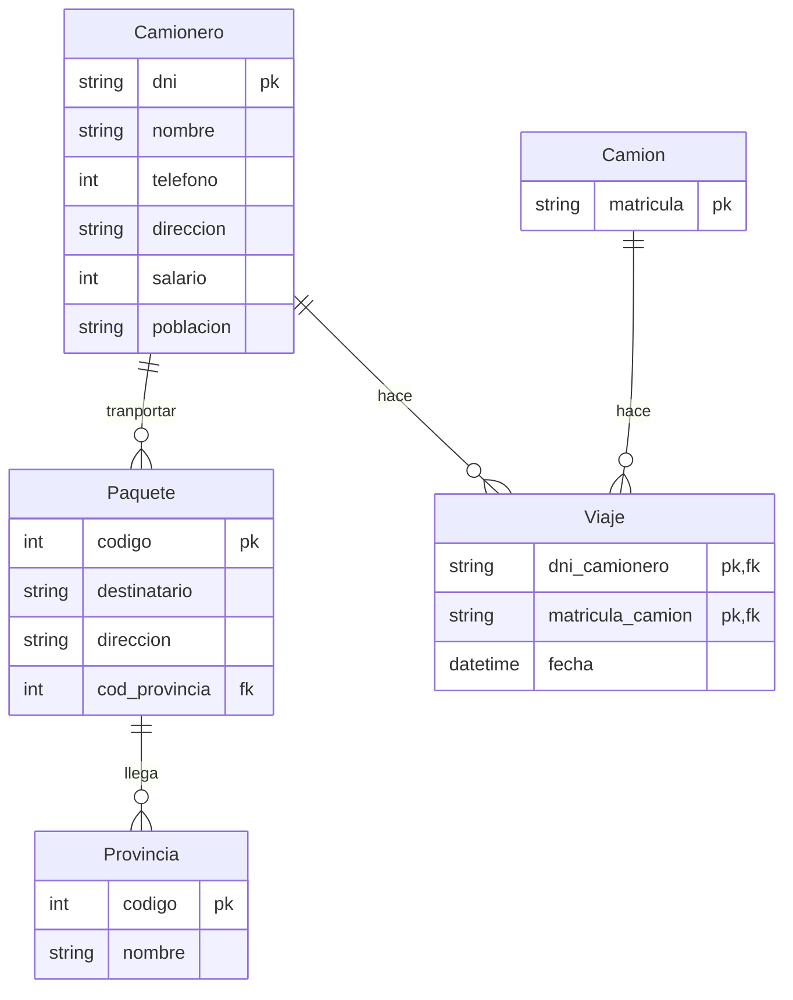

# Ejercicio 2

<!-- toc -->

* [Enunciado](#enunciado)
* [Entidades](#entidades)
* [Relaciones](#relaciones)
* [Diagrama ER](#diagrama-er)
* [Modelo Relacional / tablas](#modelo-relacional--tablas)

<!-- tocstop -->

## Enunciado

_Se desea informatizar la gestión de una empresa de transportes que reparte **paquetes** por toda España. Los encargados de llevar los paquetes son los **camioneros** de los que se quiere guardar el dni, nombre, teléfono, dirección, salario y población en la que vive. De los **paquetes** transportados interesa conocer el código de paquete, descripción, destinatario y dirección del destinatario. Un camionero distribuye muchos paquetes, y un paquete sólo puede ser distribuido por un camionero. De las **provincias** a las que llegan los paquetes interesa guardar el código de provincia y el nombre. Un paquete sólo se puede llevar a una provincia. Sin embargo, a una provincia pueden llegar varios paquetes. De los **camiones** que llevan los camioneros, interesa conocer la matrícula, modelo, tipo y potencia. Un camionero puede conducir diferentes camiones en fechas diferentes, y un camión puede ser conducido por varios camioneros._

## Entidades

* Camionero: dni, nombre, teléfono, dirección, salario, población.
* Camión: matrícula, modelo, tipo, potencia.
* Paquete: código, descripción, destinatario, dirección.
* Provincia: código, nombre.

Podría ser interesante añadir una entidad **destinatario** en caso de que se repita muchas veces. Lo mismo con la entidad que envía los paquetes (que podría ser **Cliente**).
Destinatario: dirección.

## Relaciones

* Llevar: Un camionero lleva paquetes. Un paquete está asignado a un camionero y cada camionero transporta varios paquetes.
* Conducir: Un camionero conduce varios camiones (distintas fechas) y un camión será conducido por varios camioneros.

_Para la relación del camionero que conduce varios camiones, en distintas fechas, y un camión es conducido a lo largo del tiempo por distintos camioneros (relación M:N) crearé la tabla **viaje** que los relacionará a ambos._

## Diagrama ER

La _entidad_ `Viaje` que sirve de enlace entre `Camionero` y `Camion` ha de tener como **clave primaria** la combinación de: `dni_camionero`, `matricula_camion` y `fecha`, ya que un mismo par `Camionero`, `Camión` podrá darse múltiples veces en diferentes fechas.

Otra opción, para evitar tener una clave primaria compuesta por tres campos, sería darle su propio atributo clave primaria `id` a `Viaje`.

Debido a la forma en que funcionan las claves en el tipo de tablas que crea MySQL ([InnoDB](https://es.wikipedia.org/wiki/InnoDB)) el hecho de que la clave primaria sea compuesta no debería suponer un problema de rendimiento. Por otro lado, si esta clave primaria compuesta se utiliza como clave foránea en otras tablas deberá de ser incluida en estas tablas como tal pudiendo causar problemas dependiendo del tamaño de la calve. En el caso que nos ocupa no debería de ser un problema.

## Modelo Relacional / tablas

Tablas, claves primarias y foráneas:

* Camionero:
  * `dni`: clave primaria.
  * `nombre`.
  * `telefono`.
  * `direccion`.
  * `salario`.
  * `poblacion`.
* Camion:
  * `matricula`: clave primaria.
* Paquete:
  * `codigo`: clave primaria.
  * `destinatario`.
  * `direccion`.
  * `cod_poblacion`: clave foránea.
* Provincia:
  * `codigo`: clave primaria.
  * `nombre`.
* Poblacion:
  * `codigo`: clave primaria.
  * `cod_provincia`: clave foránea.
  * `nombre`.
* Viaje:
  * `dni_camionero`: clave primaria y foránea.
  * `matricula_camion`: clave primaria y foránea.
  * `fecha`.
