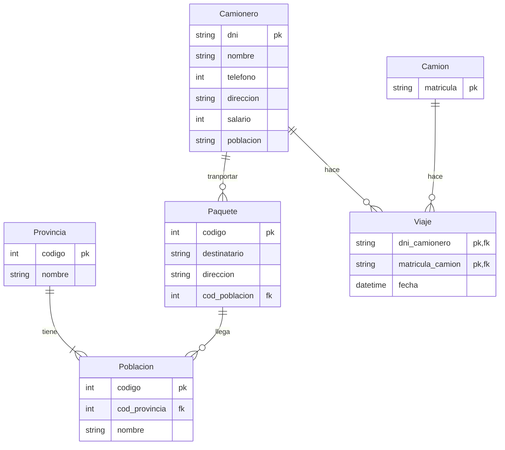

# Ejercicio 2

## Enunciado

_Se desea informatizar la gestión de una empresa de transportes que reparte **paquetes** por toda España. Los encargados de llevar los paquetes son los **camioneros** de los que se quiere guardar el dni, nombre, teléfono, dirección, salario y población en la que vive. De los **paquetes** transportados interesa conocer el código de paquete, descripción, destinatario y dirección del destinatario. Un camionero distribuye muchos paquetes, y un paquete sólo puede ser distribuido por un camionero. De las **provincias** a las que llegan los paquetes interesa guardar el código de provincia y el nombre. Un paquete sólo se puede llevar a una provincia. Sin embargo, a una provincia pueden llegar varios paquetes. De los **camiones** que llevan los camioneros, interesa conocer la matrícula, modelo, tipo y potencia. Un camionero puede conducir diferentes camiones en fechas diferentes, y un camión puede ser conducido por varios camioneros._

## Entidades

* Camionero: dni, nombre, teléfono, dirección, salario, población.
* Camión: matrícula, modelo, tipo, potencia.
* Paquete: código, descripción, destinatario, dirección.
* Província: código, nombre.

Podría ser interesante añadir una entidad **destinatario** en caso de que se repita muchas veces. Lo mismo con la entidad que envía los paquetes (que podría ser **Cliente**).
Destinatario: dirección.

## Relaciones

* Llevar: Un camionero lleva paquetes. Un paquete está asignado a un camionero y cada camionero transporta varios paquetes.
* Conducir: Un camionero conduce varios camiones (distintas fechas) y un camión será conducido por varios camioneros.

_Para la relación del camionero que conduce varios camiones, en distintas fechas, y un camión es conducido a lo largo del tiempo por distintos camioneros (relación M:N) crearé la tabla **viaje** que los relacionará a ambos._

## Diagrama ER

## Modelo Relacional / tablas

Tablas, claves primarias y foráneas:

* Camionero:
  * `dni`: clave primaria.
  * `nombre`.
  * `telefono`.
  * `direccion`.
  * `salario`.
  * `poblacion`.
* Camion:
  * `matricula`: clave primaria.
* Paquete:
  * `codigo`: clave primaria.
  * `destinatario`.
  * `direccion`.
  * `cod_poblacion`: clave foránea.
* Provincia:
  * `codigo`: clave primaria.
  * `nombre`.
* Poblacion:
  * `codigo`: clave primaria.
  * `cod_provincia`: clave foránea.
  * `nombre`.
* Viaje:
  * `dni_camionero`: clave primaria y foránea.
  * `matricula_camion`: clave primaria y foránea.
  * `fecha`.
