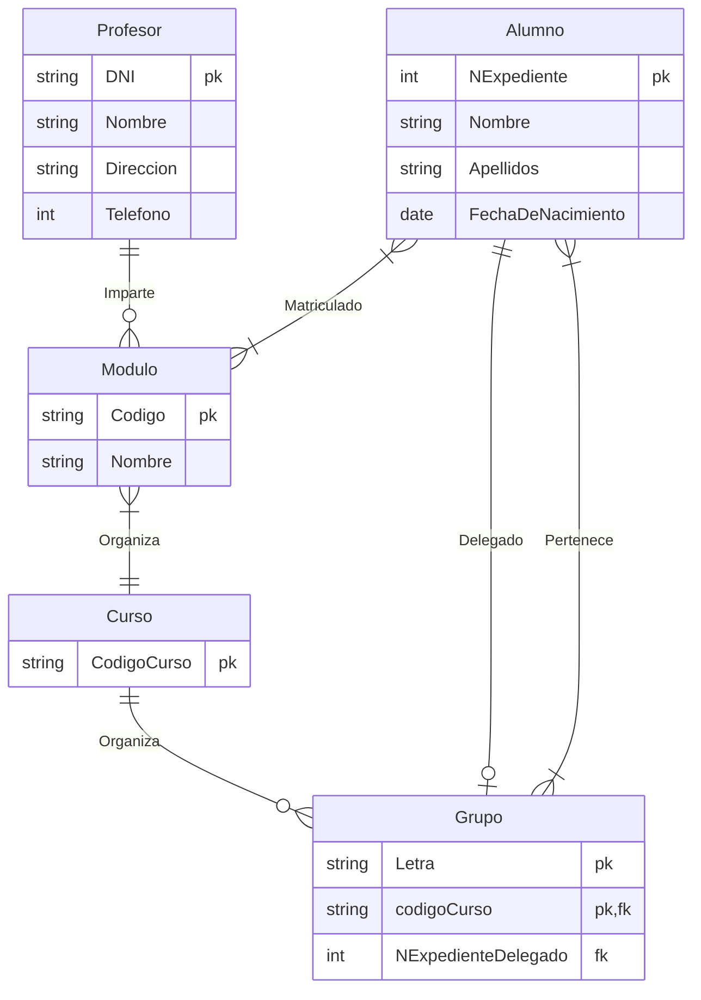
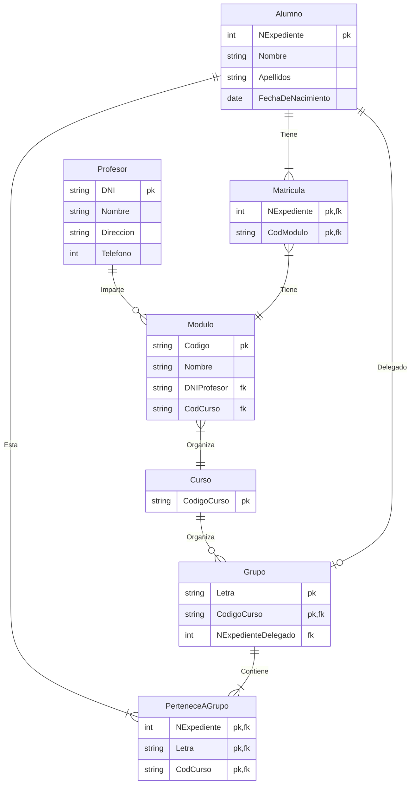

# Ejercicio 3

<!-- toc -->

- [Enunciado](#enunciado)
- [Entidades y atributos](#entidades-y-atributos)
- [Diagrama entidad-relación](#diagrama-entidad-relacion)

<!-- tocstop -->

## Enunciado

Se desea diseñar la base de datos de un Instituto. En la base de datos se desea guardar los datos de los **profesores** del Instituto (<ins>DNI, nombre, dirección y teléfono</ins>). Los **profesores** _imparten_ **módulos**, y cada **módulo** tiene un <ins>código y un nombre</ins>. Cada **alumno** está _matriculado_ en uno o varios **módulos**. De cada **alumno** se desea guardar el <ins>nº de expediente, nombre, apellidos y fecha de nacimiento</ins>. Los **profesores** pueden _impartir_ varios **módulos**, pero un **módulo** sólo puede ser _impartido_ por un **profesor**. Un curso tiene varios módulos y cada curso (código de curso) se _organiza_ en uno o más grupo de alumnos, uno de los cuales es el delegado del grupo.

## Entidades y atributos

Lista de entidades y sus atributos:

* **Profesor**
  * DNI
  * Nombre
  * Dirección
  * teléfono
* **Módulo**
  * Código
  * Nombre
* **Alumno**
  * Nº de expediente
  * Nombre
  * Apellidos
  * Fecha de nacimiento
* **Curso**
  * Código de curso
* **Grupo**
  * Letra

## Diagrama entidad-relación

## Modelo relacional / tablas

Lista de tablas (relaciones) y sus atributos (claves primarias subrayadas y foráneas en cursiva):

* **Profesor** con atributos DNI (clave primaria), Nombre, Dirección, Teléfono
* **Modulo** Código (clave primaria), Nombre, DNI Profesor (clave foránea), Código de curso (clave foránea).

* **Profesor** (<ins>DNI</ins>, Nombre, Dirección, Teléfono)
* **Modulo** (<ins>Código</ins>, Nombre, _DNI Profesor_, _Código de curso_)
* **Alumno** (<ins>Nº de expediente</ins>, Nombre, Apellidos, Fecha de nacimiento)
* **Curso** (<ins>Código de curso</ins>)
* **Grupo** (<ins>Letra</ins>, <ins>_Código de curso_</ins>, _Nº de expediente delegado_)

* **Matricula** (<ins>_Nº de expediente_</ins>, <ins>_Código_</ins>)
* **Pertenece a grupo** (<ins>_Nº de expediente_</ins>, <ins>_Letra_</ins><ins>, _Código de curso_</ins>)

