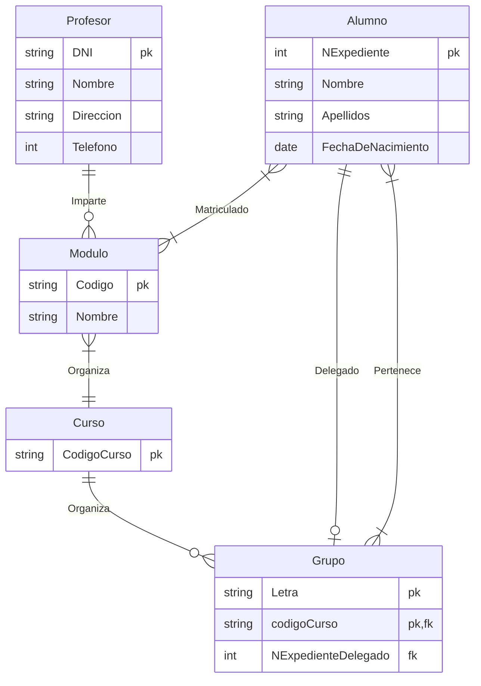
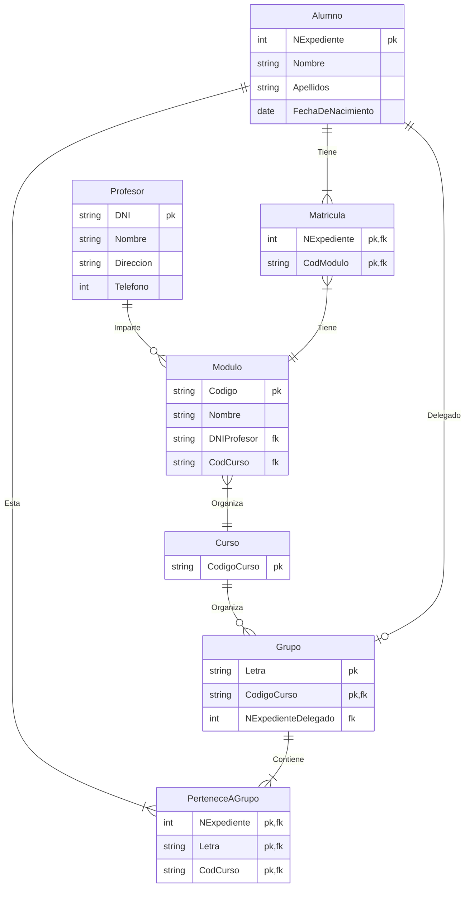
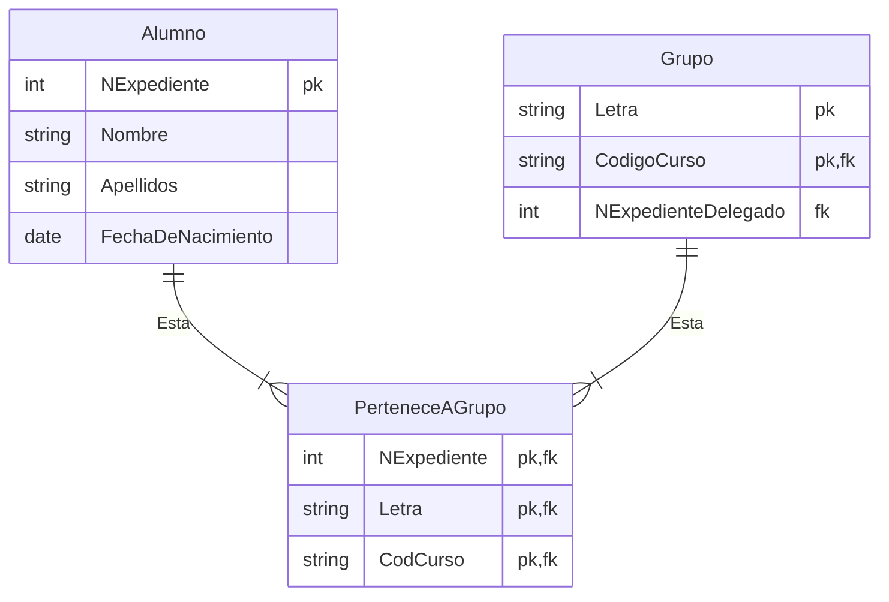
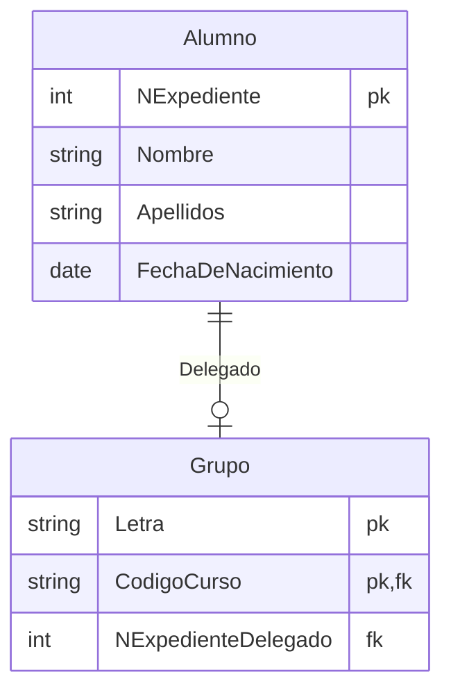

# Ejercicio 3

<!-- toc -->

* [Enunciado](#enunciado)
* [Entidades y atributos](#entidades-y-atributos)
* [Diagrama entidad-relación](#diagrama-entidad-relación)
* [Modelo relacional / tablas](#modelo-relacional--tablas)
  * [Explicación relación de pertenencia entre `Alumno` y `Grupo`](#explicación-relación-de-pertenencia-entre-alumno-y-grupo)
  * [Explicación relación `delegado`](#explicación-relación-delegado)

<!-- tocstop -->

## Enunciado

Se desea diseñar la base de datos de un Instituto. En la base de datos se desea guardar los datos de los **profesores** del Instituto (<ins>DNI, nombre, dirección y teléfono</ins>). Los **profesores** _imparten_ **módulos**, y cada **módulo** tiene un <ins>código y un nombre</ins>. Cada **alumno** está _matriculado_ en uno o varios **módulos**. De cada **alumno** se desea guardar el <ins>nº de expediente, nombre, apellidos y fecha de nacimiento</ins>. Los **profesores** pueden _impartir_ varios **módulos**, pero un **módulo** sólo puede ser _impartido_ por un **profesor**. Un **curso** tiene varios **módulos** y cada curso (código de curso) se _organiza_ en uno o más **grupo de alumnos**, uno de los cuales es el _delegado_ del grupo.

## Entidades y atributos

Lista de entidades y sus atributos:

* **Profesor**
  * DNI
  * Nombre
  * Dirección
  * teléfono
* **Módulo**
  * Código
  * Nombre
* **Alumno**
  * Nº de expediente
  * Nombre
  * Apellidos
  * Fecha de nacimiento
* **Curso**
  * Código de curso
* **Grupo**
  * Letra

## Diagrama entidad-relación

## Modelo relacional / tablas

Lista de tablas (relaciones) y sus atributos (claves primarias subrayadas y foráneas en cursiva):

* **Profesor** con atributos DNI (clave primaria), Nombre, Dirección, Teléfono
* **Modulo** Código (clave primaria), Nombre, DNI Profesor (clave foránea), Código de curso (clave foránea).

* **Profesor** (<ins>DNI</ins>, Nombre, Dirección, Teléfono)
* **Modulo** (<ins>Código</ins>, Nombre, _DNI Profesor_, _Código de curso_)
* **Alumno** (<ins>Nº de expediente</ins>, Nombre, Apellidos, Fecha de nacimiento)
* **Curso** (<ins>Código de curso</ins>)
* **Grupo** (<ins>Letra</ins>, <ins>_Código de curso_</ins>, _Nº de expediente delegado_)

* **Matricula** (<ins>_Nº de expediente_</ins>, <ins>_Código_</ins>)
* **Pertenece a grupo** (<ins>_Nº de expediente_</ins>, <ins>_Letra_</ins><ins>, _Código de curso_</ins>)

### Explicación relación de pertenencia entre `Alumno` y `Grupo`

En el diagrama se muestra que hay una relación entre `Alumno` y `Grupo` de varios a varios (respecto a su pertenencia). Esto se leería como _"un grupo contiene uno o más alumnos y una alumno puede pertenecer a uno o más grupos"_. Esto se deduce **si aceptamos que un alumno puede estar matriculado en módulos de diferentes cursos** como es el caso de FP modular (si no hay conflicto un alumno podría matricularse de hasta dos ciclos).

Para representar esta relación se ha creado una tabla intermedia `PerteneceAGrupo` que contiene las claves foráneas de `Alumno` y `Grupo` y la clave primaria de la tabla.

Cuando se pasa al modelo relacional se crea una tabla `PerteneceAGrupo` que contiene las claves foráneas de `Alumno` y `Grupo` y la clave primaria de la tabla.

### Explicación relación `delegado`

Un alumno puede ser delegado de un grupo, pero no es obligatorio que lo sea. Por otro lado todo grupo tendrá un único delegado.
Con el texto del enunciado en la mano tenemos que un alumno podría estar matriculado en más de un grupo (caso de que un alumno de FP modular se matricule en módulos de dos ciclos/cursos diferentes) por lo que esto implicaría que tendría que estar en dos grupos distintos.

Si se cumpliese que un alumno está matriculado en dos módulos de dos _cursos_ y, por lo tanto, en dos grupos; nada se dice en el enunciado que no pueda ser elegido delegado de ambos grupos. Por lo tanto la relación `delegado` entre alumno y grupo se podría poner como:

