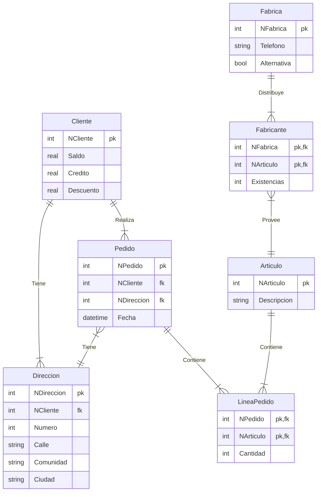

# Ejercicio 4 - Modelo Relacional

<!-- toc -->

* [Enunciado](#enunciado)
* [Entidades y Atributos](#entidades-y-atributos)
* [Relaciones y Cardinalidades](#relaciones-y-cardinalidades)
* [Diagrama ER](#diagrama-er)
* [Tablas (Relaciones del Modelo Relacional)](#tablas-relaciones-del-modelo-relacional)
  * [Restricciones](#restricciones)

<!-- tocstop -->

## Enunciado

Una base de datos para una pequeña empresa debe contener información acerca de **clientes**, **artículos** y **pedidos**. Hasta el momento se registran los siguientes datos en documentos varios:

* Para cada **cliente**: _Número de cliente (único)_, _Direcciones de envío (varias por cliente)_, Saldo, Límite de crédito (depende del cliente, pero en ningún caso debe superar los 3.000.000 pts), Descuento.
* Para cada **artículo**: Número de artículo (único), Fábricas que lo distribuyen, Existencias de ese artículo en cada fábrica, Descripción del artículo.
* Para cada **pedido**: Cada pedido tiene una **cabecera** y el **cuerpo** del pedido. La cabecera está formada por el número de cliente, dirección de envío y fecha del pedido. El cuerpo del pedido son varias líneas, en cada línea se especifican el número del artículo pedido y la cantidad.

Además, se ha determinado que se debe almacenar la información de las **fábricas**. Sin embargo, dado el uso de distribuidores, se usará: Número de la fábrica (único) y Teléfono de contacto. _Y se desean ver cuántos artículos (en total) provee la fábrica_. También, por información estratégica, se podría incluir información de fábricas alternativas respecto de las que ya fabrican artículos para esta empresa. Nota: Una **dirección** se entenderá como _Nº, Calle, Comunidad y Ciudad_. Una fecha incluye hora. Se pide hacer el diagrama ER para la base de datos que represente esta información.

## Entidades y Atributos

Entidades y sus atributos:

* **Cliente**: _Número de cliente_, _Direcciones_ (varias por cliente), _Saldo_, _Límite de crédito_, _Descuento_.
* **Artículo**: _Número de artículo_, _**Fábricas** que lo distribuyen_, _Existencias_, _Descripción_.
* **Pedido** compuesta de dos entidades:
  * **Cabecera del Pedido**: _Número de cliente_, _Dirección de envío_, _Fecha del pedido_. Lo llamaremos **Pedido**.
  * **Cuerpo del Pedido**: _Número del artículo_, _Cantidad_. La llamaremos **Línea de Pedido**.
* **Fábrica**: _Número de fábrica_, _Teléfono de contacto_.
* **Dirección**: _Número_, _Calle_, _Comunidad_, _Ciudad_.

## Relaciones y Cardinalidades

Relaciones y sus cardinalidades:

* **Cliente** (_Número de cliente_) &rarr; **Pedido** (_Número de cliente_): 1:N (Un cliente puede hacer varios pedidos).
* **Artículo** (_Número de artículo_) &rarr; **Línea de Pedido** (_Número del artículo_): 1:N (Un artículo puede estar en varias líneas de pedido).
* **Fábrica** (_Número de fábrica_) &rarr; **Artículo** (_**Fábricas** que lo distribuyen_): 1:N (Una fábrica puede distribuir varios artículos).
* **Artículo** (Nº de artículo) &rarr; **Fábrica (Nº de fábrica)**: N:M (Un artículo puede ser distribuido por varias fábricas y una fábrica puede distribuir varios artículos).
* **Pedido** (_Número de pedido_) &rarr; **Línea de Pedido** (_Número de pedido, Número de artículo_): 1:N (Un pedido puede tener varias líneas de pedido).
* **Dirección** (_Número de cliente_) &rarr; **Cliente** (_Direcciones_): 1:N (Un cliente puede tener varias direcciones).

## Diagrama ER

## Tablas (Relaciones del Modelo Relacional)

Relación de tablas, atributos (columnas) y sus tipos:

* **Cliente**:
  * _NCliente_: Clave primaria (int)
  * _Saldo_ (real)
  * _Credito_ (real)
  E* _Descuento_ (real)
* **Direccion**:
  * _NDireccion_: Clave primaria (int)
  * _NCliente_: Clave foránea (int)
  * _Numero_ (int)A
  * _Calle_ (string)
  * _Comunidad_ (string)
  * _Ciudad_ (string)
* **Pedido**:
  * _NPedido_: Clave primaria (int)
  * _NCliente_: Clave foránea (int)
  * _NDireccion_: Clave foránea (int)
  * _Fecha_ (datetime)
* **LineaPedido**:
  * _NPedido_: Clave primaria y foránea (int) &rarr; **Pedido**
  * _NArticulo_: Clave primaria y foránea (int) &rarr; **Articulo**
  * _Cantidad_ (int)
* **Articulo**:
  * _NArticulo_: Clave primaria (int)
  * _Descripcion_ (string)
* **Fabrica**:
  * _NFabrica_: Clave primaria (int)
  * _Telefono_ (string)
  * _Alternativa_ (bool)
* **Fabricante**:
  * _NFabrica_: Clave primaria y foránea (int) &rarr; **Fabrica**
  * _NArticulo_: Clave primaria y foránea (int) &rarr; **Articulo**
  * _Existencias_ (int)

### Restricciones

* La dirección de envío de un pedido debe ser una de las direcciones del cliente.
* El límite de crédito no debe superar los 3.000.000 pts.
