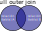

# Modelo Relacional

<!-- toc -->

- [Conceptos básicos](#conceptos-básicos)
  - [Relaciones](#relaciones)
    - [Cabecera](#cabecera)
    - [Cuerpo](#cuerpo)
  - [Restricciones o "constrains"](#restricciones-o-constrains)
  - [Claves](#claves)
    - [Claves foráneas](#claves-foráneas)
  - [Operaciones relacionales](#operaciones-relacionales)
    - [_Join_](#join)
      - [_inner join_](#inner-join)
      - [_left outer join_](#left-outer-join)
      - [_right outer join_](#right-outer-join)
      - [_full outer join_](#full-outer-join)

<!-- tocstop -->

El modelo relacional es un modelo teórico que fue desarrollado por Edgar F. Codd como un modelo general de los datos. Este nombre volverá a aparecer cuando hablemos de normalización con la _forma normal Boyce-Codd_.

¿Qué coño está pasando aquí?

## Conceptos básicos

A continuación veremos de una forma no exaustiva los elementos básicos del modelo relacional. Aunque es interesante conocer estos conceptos y cómo se traducen a las bases de datos relaciones reales, considero que verlos en profundidad requiere un esfuerzo superior al beneficio que puedan aportar.

### Relaciones

En el modelo relacional los datos se almacenan en estructuras denominadas **relaciones** (no confundir con el concepto de _relación_ utilizado en el modelo entidad-relación). **Toda la información** que contiene una base de datos estará almacenada en un conjunto de una o más **relaciones**.

_**Nota:** Las **relaciones** serán lo que en las bases de datos pasaremos a llamar **tablas**._

Las relaciones constan de dos elementos o partes: cabecera y cuerpo.

#### Cabecera

Toda relación consta de una **cabecera** (_heading_) y un **cuerpo**. La cabecera define los **atributos** de la relación. Cada atributo constará de un **nombre** y un **tipo de dato**. El _tipo de dato_ determinará qué valores puede tomar un atributo. Así, por ejemplo, si un atributo es de tipo _entero_ podrá almacenar valores como 1, 2, -5, 100, pero no $1.5$; si es de tipo _cadena_ (_string_) podrá contener valores alfanuméricos como "Manuel"; si es de tipo _fecha_ u _hora_ (_date_, _time_, _date-time_) contendrá valores que representen una fecha, etc.

<https://github.com/fannheyward/coc-markdownlint>

_**Nota:** aquí el concepto de atributo coincide con el del modelo ER solo que añadimos al mismo la restricción de **tipo de dato**. En las bases de datos se utiliza el nombre **columna** para referirnos a un atributo._

Cada sistema de gestión de base de datos define sus propios tipos de datos. Por ejemplo, **MySQL** define unos [24 tipos de datos](https://dev.mysql.com/doc/refman/8.4/en/data-types.html) agrupados en tipos _numéricos_ (`NUMERIC`, `INT`, `FLOAT`, etc.), _cadenas de caracteres_ (`CHAR`, `VARCHAR`, `TEXT`, etc.), _fecha y hora_ (`DATE`, `TIME`, `DATETIME`, `TIMESTAMP`), _espaciales_ ([OpenGIS](https://es.wikipedia.org/wiki/Open_Geospatial_Consortium)), etc. Por su parte la base de datos **SQLite** tiene [5 tipos de datos](https://www.sqlite.org/datatype3.html): `NULL`, `INTEGER`, `REAL`, `TEXT` y `BLOB`.

#### Cuerpo

El **cuerpo** contiene una serie de _tuplas_. Cada tupla tendrá tantos elementos como **atributos** se hayan definido en la **cabecera**. Cada valor de la tupla se corresponderá con un único atributo. El número de tuplas será la _cardinalidad_ de la relación.

En principio no hay nada que oblige a que todos los atributos tengan valores en todas las tuplas. Es decir, si la cabecera define diez atributos todas las tuplas tendrán diez _campos_ pero alguno de dichos campos podría estar vacío o ser nulo.

_**Nota:** La **tupla** representa lo que en el modelo ER sería una **instancia** de una **entidad**. Cuando almacenamos los datos de un libro en una base de datos, los valores de sus atributos (título, autor, fecha de publicación, etc.) formarán una tupla. En las bases de datos suele utilizarse el término **registro** o **fila** en lugar de tupla._

### Restricciones o "constrains"

En una base de datos se pueden definir una serie de expresiones lógicas (expresiones que se pueden evaluar a **verdadero** o **falso**) que se denominarán **Restricciones**. Cuando todas las restricciones _se cumplan_, es decir, se evalúen a **verdadero**; diremos que la base de datos es **consistente**, si esto no se cumple la base de datos sería **inconsistente**. No se debe permitir que una base de datos se vuelva inconsistente.

Puesto que no se puede permitir que una base de datos sea inconsistente, si intentásemos realizar una operación sobre ella que la volviese inconsistente (que provocase que alguna restricción dejase de cumplirse, pasase a _devolver_ falso) dicha modificación sería **ilegal** y no se debería de permitir.

Un ejemplo de restricción sería exigir que **una clave nunca podrá estar en blanco**. Por lo que si una operación fuese a eliminar el atributo clave de una tupla sería rechazada. Otra restricción sería exigir que las **claves no se pueden repetir en una misma relación**. Por lo que intentar insertar una tupla con una clave que ya existe en la relación (_tabla_) tampoco ser permitiría.

### Claves

Las claves están ligadas a las relaciones. Son una forma de _interconectar_ distintas relaciones.

Una **clave candidata**, o simplemente **clave**, será el subconjunto **mínimo** de atributos que pueda identificar de manera unívoca a cada **tupla** de la relación. Es decir, cata tupla de la relación ha de tener una clave **distinta** del resto de tuplas.

#### Claves foráneas

Una clave foránea es un atributo o conjunto de atributos de la _relación A_ que se corresponde con (es idéntica a) la clave de la _relación B_. Podemos decir que la clave foránea de cada tupla de la _relación A_ **_apuntará_** a **una única tupla** de la _relación B_.

Una clave foránea es la forma de _relacionar_ una o más tuplas de una _relación_ (la que tiene la clave foránea) con una **única** tupla de otra relación (aquella donde la clave foránea es clave).

### Operaciones relacionales

Una operación relacional involucrará la manipulación de una o más relaciones para dar como resultado otra relación. Visto de otra forma, una operación relacional es una función de una o más relaciones que dará como resultado una única relación.

Existen tres tipos de operaciones relacionales:

- **Selección**: implicará obtener un subconjunto de **tuplas** de una relación que satisfagan una **condición**. La relación resultante incluirá **todos** los atributos de las tuplas seleccionadas.
- **Proyección**: implicará _filtrar_ un subconjunto de los atributos de una relación.
- **Combinación o _join_**: el _join_ permitirá realizar las operaciones de selección y proyección **sobre varias relaciones** a la vez. Es una forma de _encadenar_ varias relaciones.

Podemos interpretar la proyección como un _filtrado de atributos_ (para coger sólo los que nos interesen), la selección como un _filtrado de tuplas (o registros)_ para _seleccionar_ los que nos interesen y la combinación como el _entrelazado de relaciones_ **que han de estar _conectadas_ mediante _claves foráneas_** para obtener los datos asociados que nos interesen.

En el _mundo real_ los usuarios de una base de datos solicitarán información de la misma mediante una **consulta** (_query_). En respuesta a la consulta, la base de datos responderá con conjunto de resultados. Esta _consulta_ podrá incluir simultáneamente las tres operaciones: selección, proyección y _join_.

En el lenguaje **SQL** las _consultas_ se realizarán mediante la instrucción `SELECT`. Un ejemplo de sentencia `SELECT` es la siguiente:

```SQL
SELECT (lista de atributos de la proyección) FROM (relación o relaciones a las que afecta) WHERE (condición o condiciones de selección de las tuplas);
```

Supongamos que tenemos una relación de libros. Sus atributos serán: título, autor, nº de páginas, fecha de publicación, id_libro (la clave). Si queremos mostrar el título y el autor (proyección) de los libros de más de 100 páginas (selección) escribiremos la siguiente instrucción `SELECT`:

```SQL
SELECT (título, autor) FROM libros WHERE (num_pag > 100);
```

Un ejemplo de sentencia SQL con _join_ sería:

```sql
SELECT (isbn, título, nombre, año_nacimiento) FROM Libros INNER JOIN Autores ON Libros.id_autor = Autores.id WHERE año_nacimiento >= 2000;
```

_Bueno... más o menos._

#### _Join_

El _join_ será una operación que se realizará entre dos o más relaciones que _compartan_ uno o más _atributos_. Generalmente estos atributos serán la **clave** de una relación y la **clave foránea** de la otra.

Si hablamos de dos relaciones (para simplificar) tendremos una relación con una **clave foránea** que será **clave** de la otra relación. Si se cumple esto podremos hacer un _join_ entre dichas relaciones.

Por ejemplo, si tenemos una tabla de productos (id, nombre, precio) y una tabla de ventas (id_venta, fecha, id_producto, unidades) donde la columna (o atributo) _id_producto_ de la relación de ventas se corresponde con el atributo _id_ (clave) de productos. Podremos _combinarlas_ mediante la siguiente sentencia `SELECT`:

```SQL
SELECT (fecha, nombre, unidades, precio) FROM Ventas INNER JOIN ON  Ventas.id_producto == Productos.id;
```

Existen varios tipos de join: _inner join_, _left join_, _right join_ y _outer join_. Los veremos más adelante cuando veamos las sentencias en lenguaje SQL.

##### _inner join_

Es el _join_ _más común. Cuando se aplica este _join_ la relación resultante incluirá **únicamente** los valores de la relación A y de la relación B cuyos valores de **clave foránea** y **clave** coincidan. Hay que tener en cuenta que en la relación A no hay nada que impida que la **clave foránea** esté en blanco.

Una sentencia de _inner join_ sería la siguiente:

```sql
SELECT *
FROM productos AS A
INNER JOIN precios AS B
ON A.id = B.id_producto;
```

Y una representación gráfica de un _inner join_ es la siguiente:


##### _left outer join_

En este caso, la relación resultante incluirá también las tuplas de la relación A cuya **clave foránea NO COINCIDA con ninguna clave** de la relación B.

La sentencia sería igual a la del _inner join_ pero substituyendo `INNER JOIN` por `LEFT OUTER JOIN` o simplemente `LEFT JOIN`.

La sentencia SQL para el _left outer join_ sería algo similar a:

```sql
SELECT col1, col2, ...
FROM tabla1
LEFT JOIN tabla2
ON tabla1.id = tabla2.t1_id;
```

Un representación gráfica de este _join_ sería:


##### _right outer join_

Análogo al anterior pero ahora saldrían **todas las tuplas de la relación B**, aunque su clave no coincida con ninguna tupla de la relación A pero sólo las tuplas de A que tengan _match_ con las claves de B.

La sentencia SQL que describe el _right outer join_ es análoga a la anterior:

```sql
SELECT usuarios.nombre, ventas.valor
FROM usuarios as U
RIGHT OUTER JOIN ventas AS V
ON U.id = V.user_id;
```

Y su representación gráfica:


##### _full outer join_

Finalmente, en este _join_ saldrán **TODAS LAS TUPLAS DE A Y DE B**, haya o no _match_ entre los atributos **clave foránea** y **clave**. Obviamente, cuando haya coincidencia (_match_) se mostrarán los datos combinados pero cuando no la haya se mostrarán los atributos de A o los de B dejando el resto en blanco.

La sentencia SQL que genera este _join_ sería:

```sql
SELECT columnas
FROM tabla_a
LEFT OUTER JOIN tabla_b
ON tabla_a.atributo = tabla_b.atributo;
```

Una imagen que ilustre este _join_ sería:



