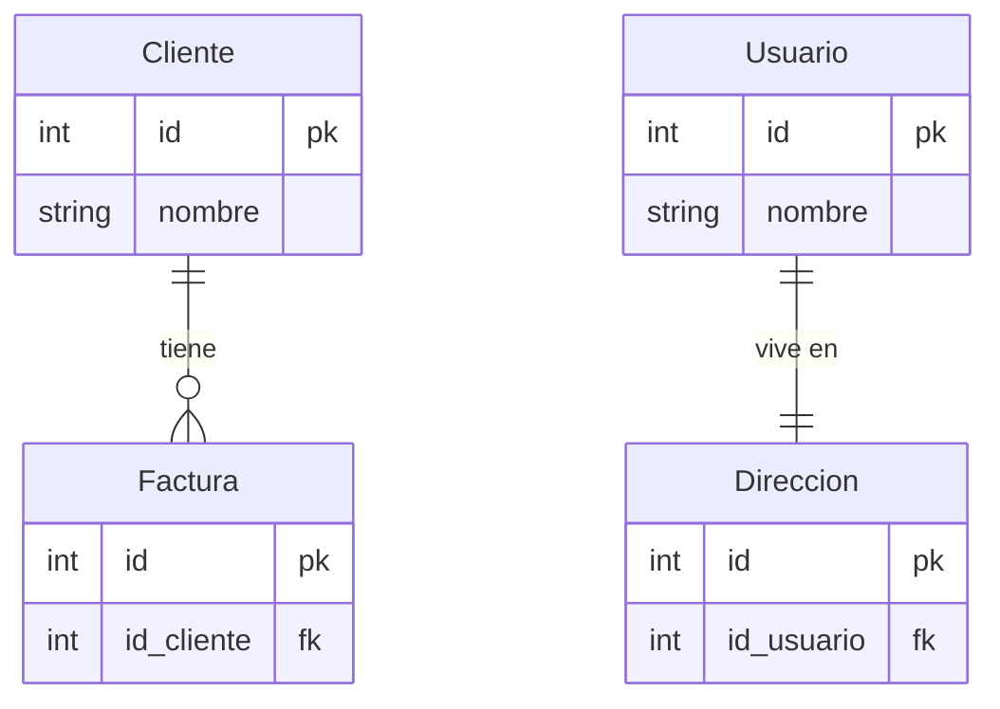
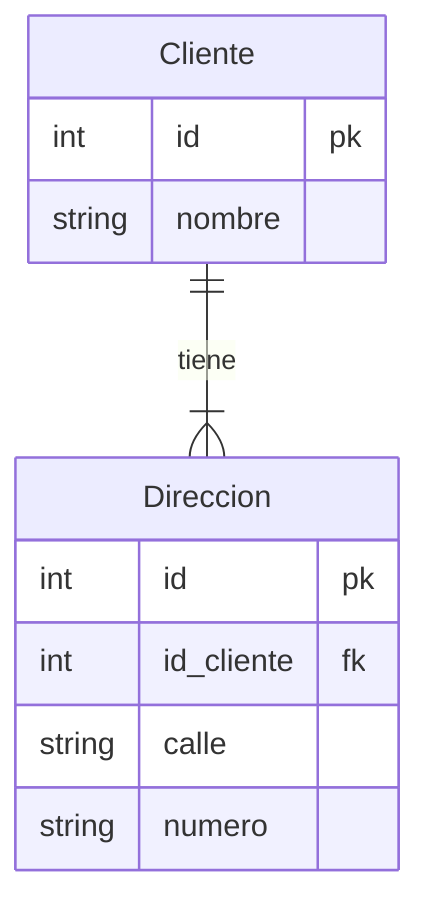
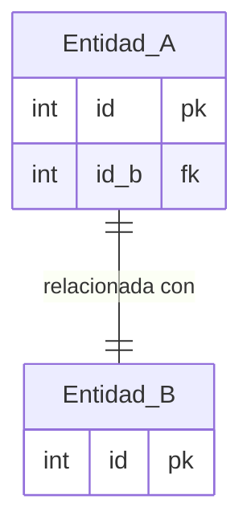

# Transformación de un modelo entidad-relación a un modelo relacional

<!-- toc -->

* [Introducción](#introducción)
* [Entidades](#entidades)
* [Atributos](#atributos)
  * [Atributos multivaluados](#atributos-multivaluados)
* [Relaciones](#relaciones)
  * [Relación binaria con cardinalidad 1:1](#relación-binaria-con-cardinalidad-11)
    * [1 : 1 en ambas direcciones](#1--1-en-ambas-direcciones)
    * [1 : 1 en una dirección y 0 : 1 en la otra](#1--1-en-una-dirección-y-0--1-en-la-otra)
    * [0 : 1 en ambas direcciones](#0--1-en-ambas-direcciones)
  * [Relación binaria con cardinalidad uno a muchos](#relación-binaria-con-cardinalidad-uno-a-muchos)

<!-- tocstop -->

## Introducción

La conversión del modelo entidad-relación (MER) a un modelo relacional (MR) es una fase fundamental en el diseño de una base de datos. Mientras que el MER nos da una representación conceptual de los datos (plasmado en forma de diagrama ER), el MR nos dará una representación física de los mismos (en forma de descripción de _relaciones_ o tablas) que podremos implementar en un sistema de gestión de bases de datos relacionales (SGBDR) real. Para poder llevar a cabo esta transformación, es necesario seguir una serie de pasos que se describen a continuación.

## Entidades

El primer paso consistirá en transformar las entidades del MER en tablas del MR. Cada entidad se transformará en una tabla y cada atributo de la entidad se transformará en un campo (o columna) de la tabla. La clave primaria de la tabla será la clave primaria de la entidad.

_**Nota:** En el modelo relacional **lo único que existirá son tablas y atributos**. Las relaciones entre las entidades se representarán mediante la inclusión de claves foráneas en las tablas correspondientes o mediante la creación de tablas que representen la relación (dependiendo de las cardinalidad de la relación)._

Cuando tenemos una entidad **débil** (una entidad cuya existencia depende de otra entidad) la transformación es sencilla. La **clave primaria de la entidad fuerte** pasará a ser una **clave foránea en la entidad débil**. Cuando tenemos una relación entre una entidad débil y un fuerte siempre tendremos una relación del 1:1 o 1:N, nunca una relación N:M.

## Atributos

Los atributos pasarán a ser campos o columnas de las tablas creadas. Habrá que tener en cuenta los posibles valores de los atributos para asignarles los tipos de datos que correspondan. Habrá que tener también en cuenta cuando un atributo es opcional u obligatorio para definir si el campo correspondiente puede ser `NULL` o no (mediante una restricción).

### Atributos multivaluados

Cuando una entidad tenga atributos multivaluados, estos se transformarán o no en una tabla nueva (como cualquier otra entidad) dependiendo de las siguientes consideraciones.

Si el número de valores que puede tener el atributo multivaluado es fijo, se puede representar como un conjunto de campos en la tabla de la entidad a la que pertenece. Por ejemplo, si tenemos una entidad `Persona` con un atributo `teléfonos` que puede tener hasta 3 valores, se puede representar como `telefono1`, `telefono2` y `telefono3` (o `t_fijo`, `t_movil`, etc.) en la tabla `Persona`.

Si el número de valores que puede tener el atributo multivaluado es variable, se creará una tabla nueva para representar este atributo que pasará a comportarse como una entidad.

En esta tabla se incluirán los atributos multivaluados junto con la clave primaria de la entidad a la que pertenecen.

Supongamos que decimos que un cliente puede tener multiples direcciones:

## Relaciones

Lo que determinará la forma de representar las relaciones (en el MR no se contemplan) dependerá de la cardinalidad de las mismas. A continuación se describen los casos más comunes.

### Relación binaria con cardinalidad 1:1

El paso as seguir dependerá de la cardinalidad mínima.

#### 1 : 1 en ambas direcciones

Se elegirá **arbitrariamente** una de las dos tablas para que contenga la clave foránea de la otra tabla. En este caso, la tabla `Entidad_A` tendrá un campo `id_b` que será clave foránea de la tabla `Entidad_B`.

#### 1 : 1 en una dirección y 0 : 1 en la otra

En este caso, para _preservar la relación_ bastará con incluir como **clave foránea** de la tabla que tiene la cardinalidad 1 : 1 la clave primaria de la otra tabla. En este caso, la tabla `Entidad_A` tendrá un campo `id_b` que será clave foránea de la tabla `Entidad_B`. De esta forma evitamos tener campos con valores nulos.

_Si pasamos la clave primara de la `Entidad_A` a la tabla `Entidad_B`, y **no todas las instancias de `Entidad_B` se corresponden con una instancia de `Entidad_A`** tendríamos que tener campos con valores nulos de la clave foránea `id_a` en la tabla `Entidad_B`._

#### 0 : 1 en ambas direcciones

En este caso, además de crear una tabla para cada entidad, habrá que crear una tabla para la relación. En esta tabla se incluirán las claves primarias de las **instancias** de las entidades que participen de la relación.

### Relación binaria con cardinalidad uno a muchos

En este caso vuelve a ser relevante si la es 1:N en ambas direcciones o en una sola. En el caso de que sea 1:N en una sola dirección, la clave foránea se incluirá en la tabla de la entidad que tiene la cardinalidad 1 (ó 0:1).

En el caso de que fuese 1:N en ambas direcciones, habría que crear una tabla para la relación.

