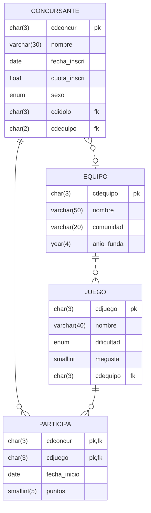

# Enunciado tareas unidad didáctica 4 - Consultas

La Asociación Andaluza de Vídeo Juegos y E-Sports gestiona diferentes campeonatos de juegos online mediante una base de datos denominada `campeonatos` que almacena información sobre los `concursante`, sus `equipo` y los diferentes `juego` en los que `participa`n los `concursante`s.

A partir de la base de datos CAMPEONATO formada por las tablas CONCURSANTE, JUEGO, EQUIPO  y PARTICIPA, relacionadas tal y como muestra el esquema relacional de la imagen, debes realizar las siguientes consultas indicadas más abajo.

## Esquema relacional

El esquema relacional de la base de datos `campeonatos` es el siguiente:

* CONCURSANTE: almacena información de los concursantes que participan en juegos.
* EQUIPO: almacena información sobre los equipos de los concursantes y que además organizan juegos.
* JUEGO: almacena información sobre diferentes juegos online y su nivel de dificultad: alta, media, baja.
* PARTICIPA: almacena información sobre los puntos obtenidos por los concursantes en los juegos en los que participan y la fecha de inicio del juego.

## restricciones

* Los concursantes pueden catalogar a uno de ellos como su _ídolo_, pero no es obligatorio. Un mismo concursante puede ser ídolo de varios concursantes.
* Los concursantes pueden pertenecer a un único equipo, aunque hay concursantes sin equipo que van por libre.
* En el campeonato, cada equipo puede organizar varios juegos o ninguno, y cada juego estará organizado por un único equipo.
* Los concursantes pueden participar en varios juegos, que pueden ser los organizados por su equipo o por otros equipos.
* En un mismo juego pueden participar concursantes de varios equipos.

## Consultas

Realiza las siguientes consultas y responde indicando el código SQL que genera cada una.

### Consulta 1

Devuelve el **código**, **nombre**, **fecha de inscripción** y **cuota** de los **concursantes** **masculinos** cuya cuota de inscrición se encuentre entre 50 y 100 € (ambos inclusive), su año de inscripción seal 2019 y el mes entre marzo y septiembre (ambos inclusive). Los resultados deben de estar **ordenados por cuota** de mayor a menor (`desc`).

El encabezado de la tabla debe ser `Código, Jugador, Fecha, Cuota`.

Han de realizarse **dos versiones**. La primera sin utilizar el operador `BETWEEN` y la segunda con él.

#### Pistas consulta 1

* Utilizar las funciones `year()` y `month()` para filtrar por el año y el mes.

### Consulta 2

Devuelve código, nombre, comunidad y año de fundación de los equipos de concursantes que son de Andalucía, Murcia o Galicia y su año de fundación es el 2019. Ordena por comunidad alfabéticamente.
Redacta dos versiones:
a)Usando IN() donde sea posible b) Sin usar IN().
