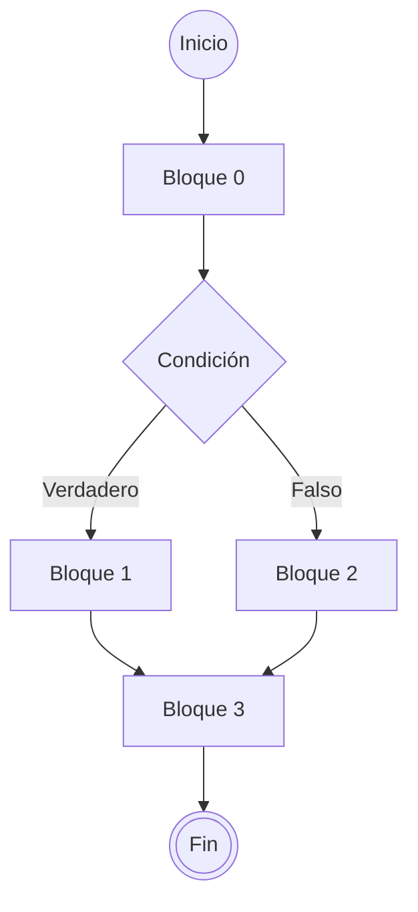

# Introducción a la programación en bases de datos

<!-- toc -->

- [Variables del sistema](#variables-del-sistema)
    * [Variables de usuario](#variables-de-usuario)
    * [Variables locales](#variables-locales)
- [Sentencias compuestas / bloques de código](#sentencias-compuestas--bloques-de-codigo)
    * [Estructuras condicionales](#estructuras-condicionales)
        + [Sentencia `IF`](#sentencia-if)
        + [Sentencia `CASE`](#sentencia-case)
    * [Estructuras repetitivas - bucles](#estructuras-repetitivas---bucles)
        + [Bucle `LOOP`](#bucle-loop)
            - [Sobre etiquetas](#sobre-etiquetas)
        + [`WHILE` y `REPEAT`](#while-y-repeat)
- [Rutinas almacenadas: procedimientos, funciones, eventos y triggers](#rutinas-almacenadas-procedimientos-funciones-eventos-y-triggers)
    * [Procedimiento](#procedimiento)
        + [Parámetros de entrada y salida](#parametros-de-entrada-y-salida)
        + [Seguridad en la ejecución: `DEFINER` y `SQL SECURITY`](#seguridad-en-la-ejecucion-definer-y-sql-security)
    * [Funciones](#funciones)
        + [`DETERMINISTIC` y `NON DETERMINISTIC`](#deterministic-y-non-deterministic)
    * [Triggers](#triggers)
        + [`NEW` y `OLD`](#new-y-old)
- [Cursores](#cursores)
    * [¿Qué es un cursor?](#%C2%BFque-es-un-cursor)
        + [Propiedades de un cursor](#propiedades-de-un-cursor)
        + [Sintaxis de un cursor](#sintaxis-de-un-cursor)
        + [Señal `NOT FOUND`, _handlers_ y cursores](#senal-not-found-_handlers_-y-cursores)
    * [¿Qué es un handler?](#%C2%BFque-es-un-handler)
        + [Relación entre _handler_, `SIGNAL` y `SQLSTATE`](#relacion-entre-_handler_-signal-y-sqlstate)
        + [Sintaxis de un handler](#sintaxis-de-un-handler)
        + [Ejemplo de handler](#ejemplo-de-handler)
- [Uso de `SIGNAL`](#uso-de-signal)
    * [_Condiciones_ definidas por el usuario](#_condiciones_-definidas-por-el-usuario)

<!-- tocstop -->

Cuando trabajamos con una base de datos podemos necesitar que se ejecute la misma secuencia de sentencias de manera repetida. Por ejemplo, si tenemos que realizar una serie de consultas SQL para obtener un resultado específico, podríamos crear un script SQL que contenga todas estas sentencias y ejecutarlo cada vez que necesitemos obtener el mismo resultado. Sin embargo, esto puede resultar poco eficiente y poco práctico si tenemos que ejecutar el mismo script varias veces. Para evitar esto podemos **almacenar esta sentencias** en el servidor y después podríamos ejecutarlas aunque no tengamos acceso a los scripts. Antes de entrar directamente en la escritura de rutinas almacenadas debemos entender algunos conceptos básicos de programación. En este apartado vamos a ver algunos de estos conceptos que nos ayudarán a entender mejor la programación en bases de datos. ## Variables Una variable es un mecanismo que permite almacenar un valor temporalmente. Para acceder a este valor se utilizará un nombre, el nombre de la variable, un ejemplo de uso de una variable en MySQL sería el siguiente: ```sql set @mi_variable = 10;``` (En MySQL hemos de preceder el nombre de la variable con el símbolo `@` para indicar que es una variable de usuario). En este caso hemos creado una variable llamada `mi_variable` y le hemos asignado el valor `10`. A partir de este momento podremos utilizar la variable `mi_variable` en cualquier parte de la consulta SQL. Por ejemplo:

```sql
select @mi_variable as "mi variable";
+-------------+
| mi variable |
+-------------+
|          10 |
+-------------+
1 row in set (0.0014 sec)
```

En MySQL, existen dos tipos de variables: **variables del sistema** y **variables de usuario**.

**NOTA: Cuando escribamos rutinas almacenadas las variables han de ser lo primero que declaremos.**

El orden de declaración de _cosas_ dentro de una rutina almacenada es el siguiente:

- Variables locales (las veremos en un momento).
- Cursores (los veremos un poco más tarde).
- Condiciones (relacionadas con `SIGNAL` y _handlers_, las veremos _al final_).
- _Handlers_ (los veremos junto con los elementos del punto anterior).

## Variables del sistema

Las variables del sistema son variables que se utilizan para almacenar información sobre el estado y modo de funcionamiento del gestor de la base de datos y su configuración. Estas variables son definidas por el sistema y pueden ser utilizadas para obtener información sobre la configuración del servidor, el número máximo de conexiones, etc. Se pueden consultar utilizando la sentencia `SHOW VARIABLES` o `SELECT @@nombre_variable`. Por ejemplo:

```sql

SHOW VARIABLE LIKE 'max_connections';
+-----------------+-------+
| Variable_name   | Value |
+-----------------+-------+
| max_connections | 151   |
+-----------------+-------+
1 row in set (0.0022 sec)
```

```sql
SELECT @@max_connections;
+-------------------+
| @@max_connections |
+-------------------+
|               151 |
+-------------------+
1 row in set (0.0011 sec)
```

Estas variables pueden tener un **scope global o de sesión** . Las variables de **scope global** son aquellas que afectan a todo el servidor y se pueden consultar utilizando la sentencia `SHOW GLOBAL VARIABLES` y su valor se mantiene hasta que se reinicia el servidor. Las variables de **scope de sesión** son aquellas que afectan a la sesión actual y se pueden consultar utilizando la sentencia `SHOW SESSION VARIABLES`. Estas estas últimas se eliminan al cerrar la sesión.

_El **scope** de una variable se refiere a los lugares desde los cuales se puede acceder a la misma._

_Así, si decimos que el **scope** de una variable es global, significa que se puede acceder a ella desde cualquier lado (desde cualquier conexión) y su valor se mantiene entre sesiones. Por el contrario, si decimos que el **scope** de una variable es **de sesión**, significa que se puede acceder a ella desde cualquier parte de la sesión actual pero no se asegura que su valor será el mismo en otra sesión._

_Finalmente, si decimos que el **scope** de una variable es **local**, significa que sólo se puede acceder a ella desde dentro de la rutina donde se ha **declarado** y dejará de existir al finalizar la rutina._

### Variables de usuario

Las variables de usuario son variables que se pueden utilizar para guardar datos temporales (como el resultado de una consulta) y pasarlos entre diferentes sentencias SQL. Se definen con el símbolo `@` seguido del nombre de la variable. El nombre ha de estar compuesto de caracteres alfanuméricos y los símbolos `.`, `_` y `$`, con una longitud máxima de 64 caracteres. Si necesitamos que incluyan algún otro carácter hemos de indicar el texto entre comillas `""` o `''`.

Para definir una variable de usuario hemos de utilizar la sentencia `SET` o `SELECT`.

```sql
SET @nombre_variable = valor;
```

```sql
SELECT @nombre_variable := valor;
```

Para consultar el valor de una variable de usuario hemos de utilizar la sentencia `SELECT`:

```sql
SELECT @nombre_variable;
```

Las variables se pueden utilizar en la mayoría de los contextos donde se permiten expresiones. Por ejemplo, se pueden utilizar en la cláusula `WHERE` de una consulta SQL, en la cláusula `SET` de una sentencia `UPDATE`, o en la cláusula `VALUES` de una sentencia `INSERT`:

```sql
SET @year = 2006;

SELECT film_id, title FROM film WHERE release_year = @year;
+---------+-----------------------------+
| film_id | title                       |
+---------+-----------------------------+
|       1 | ACADEMY DINOSAUR            |
|       2 | ACE GOLDFINGER              |
|       3 | ADAPTATION HOLES            |
|       4 | AFFAIR PREJUDICE            |
|       5 | AFRICAN EGG                 |
...
```

Sin embargo, **no se pueden utilizar** los contextos **donde debería ir una constante o valor literal**. Por ejemplo, no se pueden utilizar en la cláusula `LIMIT` de una consulta SQL.

```sql
SET @limit = 10;

SELECT actor_id, first_name, last_name FROM actor ORDER BY last_name LIMIT @limit;
ERROR: 1064: You have an error in your SQL syntax; check the manual that corresponds to your MySQL server version for the right syntax to use near '@limit' at line 1

SET @col_1 = 'release_year';
SET @col_2 = 'rental_rate';

SELECT film_id, title, rental_rate, release_year FROM film ORDER BY @col_2 LIMIT 5;
+---------+------------------+-------------+--------------+
| film_id | title            | rental_rate | release_year |
+---------+------------------+-------------+--------------+
|       1 | ACADEMY DINOSAUR |        0.99 |         2006 |
|       2 | ACE GOLDFINGER   |        4.99 |         2006 |
|       3 | ADAPTATION HOLES |        2.99 |         2006 |
|       4 | AFFAIR PREJUDICE |        2.99 |         2006 |
|       5 | AFRICAN EGG      |        2.99 |         2006 |
+---------+------------------+-------------+--------------+

SELECT film_id, title, @col_2, @col_1 FROM film LIMIT 5;
+---------+------------------+-------------+--------------+
| film_id | title            | @col_2      | @col_1       |
+---------+------------------+-------------+--------------+
|       1 | ACADEMY DINOSAUR | rental_rate | release_year |
|       2 | ACE GOLDFINGER   | rental_rate | release_year |
|       3 | ADAPTATION HOLES | rental_rate | release_year |
|       4 | AFFAIR PREJUDICE | rental_rate | release_year |
|       5 | AFRICAN EGG      | rental_rate | release_year |
+---------+------------------+-------------+--------------+
```

Como podemos ver en las dos últimas sentencias **no se muestra ningún error** aunque el resultado **no es el esperado**.

### Variables locales

Las variables locales son variables que se utilizan dentro de un bloque de código de una _rutina almacenada_ (como un procedimiento o una función) y sólo son accesibles dentro de ese bloque. Se definen utilizando la sentencia `DECLARE`.+

La sintaxis para declarar una variable es la siguiente:

```txt
DECLARE nombre_variable tipo_dato [DEFAULT valor];
```

Por ejemplo:

```sql
BEGIN
  DECLARE nombre_variable INT DEFAULT 0;
END
```

En sentencia anterior hemos declarado una variable de nombre `nombre_variable` de tipo entero `INT` y le asignamos un valor inicial de `0`. Esta variable sólo será accesible dentro del bloque `BEGIN ... END` en el que se ha declarado. Si no se asigna un valor inicial, la variable tendrá un valor nulo `NULL` por defecto.

**IMPORTANTE: Cuando declaramos variables en una rutina almacenada hemos de hacerlo antes de cualquier otra sentencia SQL. En caso contrario nos dará un error de sintaxis. Las variables han de declararse también antes de _conditions_, _handlers_ o _cursores_ (elementos que veremos más adelante).**

Para ver una lista de los tipos de datos que se pueden utilizar para declarar variables locales, podemos consultar la documentación oficial de MySQL en el siguiente enlace: [MySQL Data Types](https://dev.mysql.com/doc/refman/8.4/en/data-types.html).

## Sentencias compuestas / bloques de código

Cuando creamos alguna de estas rutinas almacenadas (funciones, procedimientos, eventos o triggers) podemos utilizar _sentencias compuestas_ ([_compound statements_](https://dev.mysql.com/doc/refman/8.4/en/sql-compound-statements.html)). Una sentencia compuesta consiste en un conjunto ordenado de instrucciones o sentencia que se han de escribir dentro de un bloque delimitado por `BEGIN` y `END`.

```txt
[etiqueta_del_begin:] BEGIN
    [statement_list]
END [end_label]
```

Cuando una rutina almacenada necesita solo una sentencia **no es necesario crear un bloque de código**. Por ejemplo, si queremos crear un procedimiento que devuelva el número de filas de una tabla, podríamos escribirlo de la siguiente forma:

```sql
CREATE FUNCTION sakila.get_num_actors()
RETURNS INT
READS SQL DATA
    RETURN (SELECT COUNT(*) FROM actor);
```

Para definir la lógica de ejecución, es decir, qué sentencias se ejecutarán y en qué orden, utilizaremos estructuras de control. Estas estructuras son similares a las que se utilizan en otros lenguajes de programación y nos permiten controlar el flujo de ejecución del código.

Las sentencias de control disponibles en MySQL son:

- Condicionales: `IF`, `CASE`.
- Bucles: `LOOP`, `WHILE`, `REPEAT`.
- Sentencia de salida: `LEAVE` (disponible dentro de bloques de código y bucles).
- Sentencia de repetición de bucle: `ITERATE` (disponible dentro de bucles).
- Sentencia de retorno de resultado: `RETURN` (disponible dentro de las funciones).

Estas sentencias de control de flujo se pueden consultar en detalle en la [documentación de MySQL](https://dev.mysql.com/doc/refman/8.4/en/flow-control-statements.html).

### Estructuras condicionales

Una estructura condicional nos permite ejecutar diferentes bloques de código según se cumplan o no ciertas condiciones. En MySQL disponemos de las sentencias `IF` y `CASE` para implementar estructuras condicionales.

Gráficamente una estructura condicional se puede representar de la siguiente forma:



Comenzamos la ejecución del bloque de código en inicio (`BEGIN`), comenzarán las sentencias de nuestra rutina (Bloque 0) llegando a la condición. Si la condición se cumple, diremos que verdadera se ejecutará el bloque 1 y después el bloque 3. Si la condición es falsa se ejecutará el bloque 2 y después el bloque 3. Finalmente llegaremos al final de la rutina (Fin).

#### Sentencia `IF`

La sintaxis de una sentencia `IF` tiene la siguiente forma:

```txt
IF search_condition THEN
    statement_list
[ELSEIF search_condition THEN statement_list] ...
[ELSE statement_list]
END IF
```

Donde _`search_condigion`_ será una expresión booleana (es decir, una expresión que puede ser verdadera o falsa). Si la condición es verdadera se ejecutará el bloque de código que sigue a `THEN` y si es falsa se ejecutará el bloque de código que sigue a `ELSE`.

`ELSE` es opcional y si no aparece se ejecutará el bloque del `THEN` si la condición es verdadera y no se ejecutará nada si la condición es falsa.

Para verlo con un ejemplo:

```sql
IF resultados > limit THEN
    SELECT CONCAT('Hay más de ', limit, ' resultados');
ELSE
    SELECT CONCAT('Hay menos de ', limit, ' resultados');
END IF;
```

Se pueden _encadenar_ instrucciones `IF`:

```sql
IF x < 0 THEN
    SELECT 'x es negativo';
ELSE 
    IF x = 0 THEN
        SELECT 'x es cero';
    END IF;
ELSE 
    SELECT 'x es positivo.';
END IF;
```

Como se puede ver este código es difícil de leer y no es recomendable. En su lugar, podemos utilizar la sentencia `ELSEIF` para evaluar múltiples condiciones. El código anterior, utilizando la sentencia `ELSEIF` quedaría de la siguiente forma:

```sql
IF x < 0 THEN
    SELECT 'x es negativo';
eLSEIF x = 0 THEN
    SELECT 'x es cero';
ELSE 
    SELECT 'x es positivo.';
END IF;
```

Utilizando la cláusula `ELSEIF` para evaluar múltiples condiciones. La sentencia `ELSE` se ejecuta si ninguna de las condiciones anteriores se cumple.

Un ejemplo más completo utilizando esta sentencia en un procedimiento almacenado sería el siguiente:

```sql
DELIMITER $$

USE sakila$$

CREATE PROCEDURE test(IN input_value INT,  OUT output_value INT)
READS SQL DATA
BEGIN

    SELECT COUNT(*) FROM actor INTO output_value;

    IF output_value > input_value THEN
        SELECT CONCAT('The number of actors (', output_value, ') is greater than the limit (', input_value, ').') AS message;
    ELSE
        SELECT 'The number of actors is within the limit.' AS message;
    END IF;

END$$

DELIMITER ;
```

Más adelante veremos en detalle la creación de procedimientos por lo que no explicaremos el significado de cada una de las partes de la sentencia.

#### Sentencia `CASE`

La sentencia `CASE` es otra forma de implementar estructuras condicionales en MySQL. Esta sentencia no aporta nada nuevo respecto a la sentencia `IF`, pero puede resultar más legible en algunos casos.

La sentencia `CASE` tiene dos sintaxis alternativas:

La primera es como sigue:

```txt
CASE case_value
    WHEN when_value THEN statement_list
    [WHEN when_value THEN statement_list] ...
    [ELSE statement_list]
END CASE
```

Donde _`case_value`_ es una expresión que se evalúa y se compara con los valores de las cláusulas `WHEN`. Si la expresión coincide con uno de los valores de `WHEN`, se ejecuta el bloque de código correspondiente y saldremos del `CASE`. Si su valor no coincide con ningún `WHEN`, se ejecuta el bloque de código del `ELSE` (si existe).

La segunda sintaxis es la siguiente:

```txt
CASE
    WHEN search_condition THEN statement_list
    [WHEN search_condition THEN statement_list] ...
    [ELSE statement_list]
END CASE
```

En este caso _`search_condition`_ será una expresión booleana (es decir, una expresión que puede ser verdadera o falsa). Si la condición es verdadera se ejecutará el bloque de código que sigue a `THEN` y se termina. Si es falsa se comprobará la condición del siguiente `WHEN` y así sucesivamente. Si ninguna de las condiciones es verdadera se ejecutará el bloque de código que sigue a `ELSE` (si existe).

**Importante:** Si se _entra_ en algún `WHEN` **se dará por finalizado el `CASE`**. No se comparan los siguientes `WHEN` ni se ejecuta el bloque de código del `ELSE`. Por lo tanto, si se entra en un `WHEN` se ejecutará el bloque de código correspondiente y se saldrá del `CASE`.

Un ejemplo de la sentencia `CASE` sería el siguiente:

```sql
SELECT Quantity FROM OrderDetails WHERE OrderID = 10248;

CASE
    WHEN Quantity > 30 THEN
        SELECT "The quantity is greater than 30";
    WHEN Quantity = 30 THEN
        SELECT "The quantity is 30";
    ELSE 
        SELECT "The quantity is under 30";
END CASE;
```

La otra forma de escribir la sentencia `CASE` es la siguiente:

```txt
CASE
    WHEN search_condition THEN statement_list
    [WHEN search_condition THEN statement_list] ...
    [ELSE statement_list]
END CASE
```

Un ejemplo más completo utilizando esta sentencia en un procedimiento sería el siguiente:

```sql
DELIMITER $$

USE sakila$$

CREATE PROCEDURE test_case(IN input INT)
READS SQL DATA
BEGIN

    CASE
        WHEN input < 0 THEN
            SELECT 'Negative number';
        WHEN input = 0 THEN
            SELECT 'Zero';
        WHEN input > 0 AND input < 10 THEN
            SELECT 'Single digit positive number';
        WHEN input >= 10 AND input < 100 THEN
            SELECT 'Double digit positive number';
        ELSE
            SELECT 'Large positive number';
    END CASE;

    CASE input
        WHEN 1 THEN
            SELECT 'Case 1';
        WHEN 2 THEN
            SELECT 'Case 2';
        ELSE
            SELECT 'Default case';
    END CASE;

END$$

DELIMITER ;
```

### Estructuras repetitivas - bucles

Una estructura repetitiva se utiliza para ejecutar un mismo conjunto de instrucciones cierto número de veces. Este es el motivo por el que se denominan "estructuras repetitivas", repiten un bloque de código. En otras palabras, una estructura repetitiva nos permite repetir un bloque de código varias veces hasta que se cumpla una condición (_condición de terminación_) que usaremos para determinar cuándo salir del bucle. Otro nombre por el que se las conoce es el de _bucles_ o _loops_.

En MySQL dispondremos de los siguientes tipos de bucles:

- `LOOP`
- `WHILE`
- `REPEAT`

Aunque todos ellos son distintos, al igual que sucede con `CASE` e `IF` podríamos replicar el funcionamiento de uno de ellos con cualquiera de los otros dos.

El bucle `LOOP` es el más básico (y el más complicado) y nos permite hacer lo mismo que hacen los otros dos. Podríamos decir que los bucles `WHILE` y `REPEAT` vienen siendo un bucle `LOOP` simplificado.

Empezaremos explicando el bucle `LOOP` y después veremos los bucles `WHILE` y `REPEAT`, que resultarán más sencillos.

#### Bucle `LOOP`

Este bucle es, en principio, un bucle infinito pues no tiene una condición de terminación. Para salir del hemos de invocar una sentencia `LEAVE` seguida de la _etiqueta_ del bucle o, si estamos dentro de una función, se puede utilizar `RETURN` (cuando aparece una sentencia `RETURN` dentro de una función, esta terminará y devolverá el valor indicado).

Su sintaxis es la siguiente:

```txt
[begin_label:] LOOP
    statement_list
END LOOP [end_label]
```

##### Sobre etiquetas

Las etiquetas son _nombre_ que se pueden asignar a un bloque de código. Su utilidad consiste en que nos permiten usar dentro de ese bloque una sentencia `LEAVE` o `RETURN` para salir de él. La etiqueta se define justo antes de la palabra `LOOP` y se utiliza para identificar el bucle al que pertenece la instrucción `LEAVE etiqueta_del_bloque` para ir al final del bloque de código.

Volviendo al bucle `LOOP`, este tipo de bucle se utiliza cuando no se conoce el número de iteraciones de antemano como, por ejemplo, cuando queremos _iterar_ sobre (recorrer los valores de) un cursor.

Un ejemplo más completo utilizando esta sentencia en un procedimiento almacenado sería el siguiente:

```sql
DELIMITER $$

CREATE PROCEDURE sakila.test_loop(IN input INT)
BEGIN
    -- Declaramos una variable de tipo entero con el valor inicial 0.
    DECLARE iteration INT DEFAULT 0;

    mi_primer_loop: LOOP

        -- Comprobamos si la variable iteration es menor que el valor de input (condición de salida del bucle).
        IF iteration < input THEN
            LEAVE etiqueta;
        END IF;

        SELECT iteration AS 'Repetición número';

    END LOOP mi_primer_loop;

END$$

DELIMITER ;
```

#### `WHILE` y `REPEAT`

Las sentencias `WHILE` y `REPEAT` son similares. En ambas se define una **condición de terminación** para el bucle. Es decir, el bucle se repetirá mientras se cumpla o no una condición. La única diferencia entre ambas es que la sentencia `WHILE` evalúa la condición **antes de ejecutar** el bloque de código, mientras que la sentencia `REPEAT` evalúa la condición **después de ejecutar** el bloque de código.

La sintaxis de una sentencia `WHILE` es la siguiente:

```txt
[begin_label:] WHILE search_condition DO
    statement_list
END WHILE [end_label]
```

La sintaxis de una sentencia `REPEAT` es la siguiente:

```txt
[begin_label:] REPEAT
    statement_list
UNTIL search_condition
END REPEAT [end_label]```

Un ejemplo más completo utilizando estas sentencias en un procedimiento almacenado sería el siguiente:

```sql
DELIMITER $$

USE sakila$$

CREATE PROCEDURE test_while_repeat(IN input INT)
READS SQL DATA
BEGIN

    DECLARE iteration INT DEFAULT 0;

    SELECT 'Bucle while:';
    WHILE iteration < input DO
        SELECT 'Iteration: ', iteration;
        SET iteration = iteration + 1;
    END WHILE;

    SET iteration = 0;
    SELECT 'Bucle repeat:';
    REPEAT
        SELECT 'Iteration: ', iteration;
        SET iteration = iteration + 1;
    UNTIL iteration >= input
    END REPEAT;

END$$

DELIMITER ;
```

Compor se puede intuir por la estructura del código escrito, el bucle `WHILE` se ejecuta mientras (_while_) la condición `iteration < input` sea verdadera. En cambio, el bucle `REPEAT` se ejecuta al menos una vez y luego evalúa la condición `iteration >= input` y se seguirá ejecutando hasta (_until_) que la condición sea verdadera. Podríamos decir que si queremos transformar un bucle _while_ en un bucle _repeat_ deberíamos _invertir_ la condición de terminación.

## Rutinas almacenadas: procedimientos, funciones, eventos y triggers

Estas estructuras permiten encapsular lógica y automatizar tareas dentro de la base de datos:

- **Procedimientos**: Bloques de código que se almacenan en la base de datos y se ejecutan mediante un nombre específico utilizando `CALL`.
- **Funciones**: Similares a los procedimientos, pero devuelven un valor y se pueden usar en consultas SQL. Se invocan con la sentencia `SELECT` o dentro de otras funciones o procedimientos.
- **Eventos**: Tareas programadas que se ejecutan automáticamente en un momento específico o de forma recurrente.
- **Triggers**: Bloques de código que se ejecutan automáticamente en respuesta a eventos como `INSERT`, `UPDATE` o `DELETE` en una tabla.

### Procedimiento

Para declarar un procedimiento almacenado utilizamos la sentencia `CREATE PROCEDURE`. La sintaxis es la siguiente:

```txt
CREATE
    [DEFINER = user]
    PROCEDURE [IF NOT EXISTS] sp_name ([proc_parameter[,...]])
    [characteristic ...] routine_body
```

A continuación iremos viendo cada una de las partes de la sentencia:

- `DEFINER`: Indica a quién _pertenece_ el procedimiento. Este parámetro es opcional y si no se especifica se utilizará el usuario que lo ha creado.
- `proc_parameter`: Aquí especificamos los parámetros de entrada y salida del procedimiento.
- `characteristic`: Aquí especificamos las características del procedimiento como `CONTAINS SQL`, `NO SQL`, `READS SQL DATA`, `MODIFIES SQL DATA`, etc. Las características más importantes serán las que indican si el procedimiento lee o modifica datos de la base de datos.

#### Parámetros de entrada y salida

```sql
CREATE PROCEDURE mi_procedimiento (IN parametro1 INT, OUT parametro2 VARCHAR(50), INOUT parametro3 INT)
```

Des esta forma estaremos indicando que el procedimiento `mi_procedimiento` tiene un parámetro de entrada `parametro1` de tipo entero y un parámetro de salida `parametro2` de tipo cadena de caracteres con una longitud máxima de 50 caracteres y un parámetro de entrada y salida `parametro3` de tipo entero. Los parámetros de entrada se utilizan para pasar valores al procedimiento, mientras que los parámetros de salida se utilizan para devolver valores al llamador del procedimiento y los parámetros de entrada y salida se utilizan para pasar y devolver valores al mismo tiempo.

Un ejemplo de como usar estos parámetros sería el siguiente:

```sql
DELIMITER $$

CREATE PROCEDURE sakila.test_parametros(IN parametro1 INT, OUT parametro2 VARCHAR(50), INOUT parametro3 INT)
BEGIN
    SELECT CONCAT('El valor de parametro1 es: ', parametro1) AS mensaje1;
    SET parametro2 = "Hola mundo";
    SELECT CONCAT('El valor de parametro3 es: ', parametro3, ' y lo hemos cambiado a ', parametro1) AS mensaje2;
END$$

DELIMITER ;
```

Para probarlo podríamos utilizarlo en la siguiente sentencia:

```sql
SET @parametron_inout = 10;

CALL test_parametros(5, @parametro_out, @parametro_inout);

SELECT @parametro_out AS "Parametro de salida", @parametro_inout AS "Parametro de entrada y salida";
```

Y obtendríamos el siguiente resultado:

```txt
CALL test_parametros(1, @parametro_out, @parametro_inout);
+------------------------------+
| mensaje1                     |
+------------------------------+
| El valor de parametro1 es: 1 |
+------------------------------+
1 row in set (0.0034 sec)

+-------------------------------------------------------+
| mensaje2                                              |
+-------------------------------------------------------+
| El valor de parametro3 es: 10 y lo hemos cambiado a 1 |
+-------------------------------------------------------+

SELECT @parametro_out AS "Parametro de salida", @parametro_inout AS "Parametro de entrada y salida";
1 row in set (0.0034 sec)
+---------------------+-------------------------------+
| Parametro de salida | Parametro de entrada y salida |
+---------------------+-------------------------------+
| Hola mundo          |                            10 |
+---------------------+-------------------------------+
```

#### Seguridad en la ejecución: `DEFINER` y `SQL SECURITY`

Este parámetro funciona en combinación con la cláusula `SQL SECURITY` y se utiliza para definir el contexto de seguridad del procedimiento. `SQL SECURITY` puede tomar dos valores:

- `DEFINER`: El procedimiento se ejecuta con los privilegios del usuario que lo creó (el usuario definido en `DEFINER = ...`).
- `INVOKER`: El procedimiento se ejecuta con los privilegios del usuario que lo invoca (el usuario que llama al procedimiento).

Si omitimos el parámetro `DEFINER` se utilizará el usuario que ha creado el procedimiento.

Por ejemplo, si creamos un procedimiento con el usuario "admin" y deseamos que se ejecute con los privilegios de "admin", utilizaremos la siguiente sentencia:

```sql
CREATE DEFINER = 'admin'@'%' PROCECURE mi_procedimiento()
SQL SECURITY DEFINER
```

_En la práctica no haría falta especificar `DEFINER` si estamos creando el procedimiento como admin. Tampoco haría falta indicar `SQL SECURITY DEFINER` ya que este es el valor por defecto._

Si por el contrario creamos un procedimiento como `admin` pero no queremos que se ejecute con sus privilegios, sino con los del usuario que lo invoca, utilizaremos la siguiente sentencia:

```sql
CREATE PROCEDURE mi_procedimiento()
SQL SECURITY INVOKER
```

Obviamente, si el usuario que invoca (ejecuta la instrucción `CALL mi_procedimiento()`) no tiene privilegios para ejecutar el procedimiento, o no tiene privilegios para acceder a los objetos de la base de datos que se utilizan dentro del procedimiento, se producirá un error.

### Funciones

Las funciones se parecen mucho a los procedimientos en que ambos se pueden ejecutar directamente por parte de un usuario. Los procedimientos se ejecutan con la instrucción `CALL` y las funciones se ejecutan con la instrucción `SELECT`. La diferencia principal entre ambos es que las funciones devuelven un valor y los procedimientos no. Cuando decimos que una función devuelve una valor queremos decir que podríamos substituir la llamada a la función por el valor que devuelve. Esto no es lo que sucede con los procedimientos que _no devuelven un valor_ si no que pueden modificar los parámetros `OUT` e `INOUT`.

Al igual que los procedimientos, las funciones también tienen la cláusula `SQL SECURITY` que indica el contexto de seguridad en el que se ejecuta la función y funciona de manera similar a los procedimientos.

La sintaxis para crear una función es la siguiente:

```txt
CREATE 
    [DEFINER = user] 
    FUNCTION [IF NOT EXISTS] func_name ([func_parameter[,...]])
    RETURNS data_type
    [characteristic ...] routine_body
```

El significa de `DEFINER` y la cláusula `SQL SECURITY` (dentro del bloque `characteristic`) es el mismo que en los procedimientos. La diferencia principal es que las funciones tienen la cláusula `RETURNS` que indica el tipo de dato que devuelve la función. Esta cláusula es obligatoria y no se puede omitir. Dentro de la función habrá siempre una sentencia `RETURN` que devolverá el valor de la función.

Otra diferencia lógica entre procedimientos y funciones es que en los parámetros de una función no se pueden utilizar los modificadores `IN`, `OUT` o `INOUT`. Todos los parámetros de una función son de entrada y no se pueden modificar. En este sentido, las funciones son más restrictivas que los procedimientos.

Veamos un ejemplo de como crear una función:

```sql
DELIMITER $$

USE sakila$$

CREATE FUNCTION test_funcion(parametro1 INT, parametro2 INT)
RETURNS INT
DETERMINISTIC

BEGIN
    DECLARE resultado INT;
    SET resultado = parametro1 + parametro2;
    RETURN resultado;
END$$

DELIMITER ;
```

Como mencionamos antes, para invocar una función hemos de utilizarla dentro de una sentencia `SELECT`:

```sql
SELECT test_funcion(5, 10);
+---------------------+
| test_funcion(5, 10) |
+---------------------+
|                  15 |
+---------------------+
1 row in set (0.0027 sec)
```

#### `DETERMINISTIC` y `NON DETERMINISTIC`

Una de las características que podemos ignorar en la creación de procedimientos pero no en las funciones es `DETERMINISTIC` y `NON DETERMINISTIC`. Esta característica indica si la función devuelve siempre el mismo resultado para los mismos parámetros de entrada. Si la función es `DETERMINISTIC` significa que siempre devolverá el mismo resultado para los mismos parámetros de entrada. Si la función es `NON DETERMINISTIC` significa que puede devolver resultados diferentes para los mismos parámetros de entrada. Esto ha de indicarse pues el SGBD lo utilizará para optimizar la ejecución de la función. Si no se indica, el SGBD asumirá que la función es `NON DETERMINISTIC` y no podrá optimizar su ejecución.

Además de usar explícitamente `DETERMINISTIC` o `NON DETERMINISTIC`, también podemos utilizar:

- `CONTAINS SQL`: Indica que una rutina no tiene sentencias que **lean o escriban datos**. Este es el caso de nuestro ejemplo anterior.
- `NO SQL`: Indica que la rutina no contiene sentencias SQL.
- `READS SQL DATA`: Indica que la rutina tiene sentencias de lectura de datos, como SELECT, pero no de escritura.
- `MODIFIES SQL DATA`: Indica que la rutina contiene sentecias de escritura de datos como por ejemplo, `INSERT` or `DELETE`).

Si indicamos que nuestra sentencia es `NO SQL` o que `READS SQL DATA` no sería necesario indicar `[NOT] DETERMINISTIC`.

Un ejemplo de función que lee datos sería el siguiente:

```sql
DELIMITER $$

CREATE FUNCTION sakila.cuenta_nombres(nombre VARCHAR(50))
READS SQL DATA
RETURNS INT
BEGIN
    DECLARE cuenta INT DEFAULT 0;
    SELECT COUNT(*) FROM actor WHERE first_name = nombre INTO cuenta;
    RETURN cuenta;
END$$

DELIMITER ;
```

Si la invocamos de la siguiente manera:

```sql
SELECT cuenta_nombres("WOODY");
+-------------------------+
| cuenta_nombres("WOODY") |
+-------------------------+
|                       2 |
+-------------------------+
```

### Triggers

Los _triggers_ o _disparadores_ son un tipo de rutina almacenada que estará asociada a dos elementos:

- Una tabla de la base de datos.
- Una acción que modifique los datos de dicha tabla (`INSERT`, `UPDATE` o `DELETE`).

Además de estos elementos también podremos indicar si queremos que nuestro _trigger_ salte antes o después de la acción que lo dispara. Por ejemplo, si tenemos un _trigger_ asociado a una tabla y a la acción `INSERT`, podremos indicar si queremos que el _trigger_ se ejecute antes o después de que se inserten los datos en la tabla.

Durante la ejecución del código del trigger tendremos acceso a los valores nuevos y antiguos (cuando proceda) de los datos que se están modificando. Estos valores se pueden utilizar para realizar operaciones adicionales o para validar los datos antes de que se inserten o actualicen en la tabla.

La sintaxis para crear un _trigger_ es la siguiente:

```txt
CREATE
    [DEFINER = user]
    TRIGGER [IF NOT EXISTS] trigger_name
    trigger_time trigger_event
    ON tbl_name FOR EACH ROW
    [trigger_order]
    trigger_body
```

Donde:

- `trigger_time`: Indica si el _trigger_ se ejecuta antes (`BEFORE`) o después (`AFTER`) de la acción que lo dispara. Este parámetro es obligatorio.
- trigger_event: Indica la acción que dispara el _trigger_ (`INSERT`, `UPDATE` o `DELETE`). Este parámetro es obligatorio.

- `trigger_order`: Indica el orden de ejecución del _trigger_ si hay varios _triggers_ asociados a la misma tabla y acción. Puede ser `FOLLOWS` o `PRECEDES`. Este parámetro es opcional.
  - `FOLLOWS nombre_del_trigger_anterior`: Si queremos que el _trigger_ se ejecute después de otro _trigger_.
  - `PRECEDES nombre_del_trigger_siguiente`: Si queremos que el _trigger_ se ejecute antes de otro _trigger_.

Veamos un ejemplo de _trigger_:

```sql
DELIMITER $$

CREATE TRIGGER sakila.test_trigger
BEFORE INSERT ON actor
fOR EACH ROW
BEGIN
    SET NEW.first_name = UPPER(NEW.first_name);
    SET NEW.last_name = UPPER(NEW.last_name);
END$$

DELIMITER ;
```

Este trigger, por ejemplo, se ejecutará antes de que se realice una operación de inserción en la tabla `actor` y convertirá los valores de las columnas `first_name` y `last_name` a mayúsculas. Para ello utilizamos la variable `NEW` que contiene los valores que se están insertando en la tabla.

#### `NEW` y `OLD`

Los objetos `NEW` y `OLD` son variables especiales que se utilizan dentro de los _triggers_ para acceder a los valores de las filas afectadas por la acción que dispara el _trigger_. Estas variables son útiles para realizar operaciones adicionales o para validar los datos antes de que se inserten o actualicen en la tabla.

Mediante `NEW` (y `OLD`) tendremos acceso a los valores de las columnas que se están modificando de la siguiente manera:

- `NEW.nombre_columna`: Hace referencia al valor de la columna después de la modificación (en caso de un `INSERT` o `UPDATE`) y hace referencia al dato que está siendo insertado (en caso de un `INSERT`). No se puede utilizar en un `DELETE` ya que no hay un valor nuevo.
- `OLD.nombre_columna`: Hace referencia al valor de la columna antes del cambio (en caso de un `UPDATE` o `DELETE`) y hace referencia al dato que está siendo eliminado (en caso de un `DELETE`). Igualmente, no se puede utilizar en un `INSERT` ya que no hay un valor antiguo.

Si el trigger se establece con `BEFORE` se puede modificar el valor de `NEW` antes de que se inserte o actualice el registro. Si el trigger se establece con `AFTER` no se puede modificar el valor de `NEW` ya que ya se ha realizado la operación.

Dentro de un trigger se pueden invocar procedimientos **siempre que estos no devuelvan valores a cliente** (es decir, que saldrían por pantalla en el cliente o en pestañas de MySQL Workbench) pero **sí pueden devolver valores** mediante parámetros `OUT` o `INOUT`. Esto es importante tenerlo en cuenta ya que si el procedimiento devuelve valores al cliente se producirá un error. Por ejemplo, no se puede utilizar un `SELECT` dentro de un trigger que devuelva valores al cliente pero sí que guarda valores en una variable local.

Dentro de un trigger tampoco se pueden iniciar o terminar transacciones. Esto es, no se pueden utilizar las sentencias `START TRANSACTION`, `COMMIT` o `ROLLBACK`.

## Cursores

Antes de continuar explicando como crear rutinas almacenadas es conveniente explicar el concepto de _cursor_. Es bastante común que en una rutina almacenada necesitemos recorrer una a una el conjunto de filas devueltas por una consulta SQL. Para ello utilizamos un _cursor_.

### ¿Qué es un cursor?

Un cursor es un mecanismo que permite _encapsular_ una consulta SQL y recorrer *_una a una_ el conjunto de filas devueltas por esta consulta. Un _cursor_ se puede utilizar para realizar operaciones sobre cada fila del conjunto de resultados, como actualizar otra tabla a partir de sus valores, eliminar filas, etc.

Los cursores **sólo pueden utilizarse dentro de rutinas almacenadas**.

Para utilizar un cursor éste ha de:

1. Declararse (sentencia `DECLARE CURSOR`).
2. Abrirse (`OPEN`).
3. Recorrerse (`FETCH`).
4. Y finalmente cerrarse (`CLOSE`).

La declaración de un cursor ha de realizarse **después de la declaración de las variables y antes de la declaración de los _handlers_**. El orden es importante o se producirá un error.

#### Propiedades de un cursor

Los cursores tienen tres propiedades que son importantes a la hora de utilizarlos:

1. Los cursores son _asensitive_: El servidor podrá hacer o no una copia en memoria de sus resultados:
    - Si el servidor hace una copia de los resultados, el cursor será _insensible_ a los cambios realizados en la tabla.
    - Si no hace una copia de los resultados, el cursor será _sensible_ a los cambios realizados en la tabla.
2. Los cursores son _read only_: Esto significa que sólo se pueden leer y **no se pueden modificar**.
3. Los cursores son _nonscrollable_: Es decir, los cursores **sólo se pueden recorrer en una dirección y no se pueden saltar filas**.

**Sobre el primer punto**: La documentación de MySQL es algo confusa con respecto a este tema. En teoría, decir que un cursor es _asensitive_ parece que quiere decir que no podemos saber si el cursor es _sensible_ (_sensitive_) o _insensible_ (_insensitive_) a los cambios en los datos subyacentes a la consulta.

- Si el cursor _apunta_ a los datos _reales_ que hay tras la consulta y estos cambian esto se vería reflejado en el cursor. De ahí la denominación de _sensitive_. **Se dice que los cursores de este tipo son más rápidos** aunque no he encontrado una explicación técnica del motivo.
- La otra posibilidad es que el servidor haga una copia de los datos y el cursor apunte a esta copia. En este caso, si los datos cambian mientras recorremos el cursor veríamos la _instantánea_ y no veríamos los cambios; por lo tanto sería _insensible_ a los cambios.

`¯\_(ツ)_/¯`.

#### Sintaxis de un cursor

La sintaxis para declarar un _cursor_ es la siguiente:

```txt
DECLARE cursor_name CURSOR FOR select_statement;
```

Donde `select_statement` es una sentencia `SELECT` válida.

Antes de ver ejemplos de uso de cursores debemos ver dos elementos que se usan en los mismos: _handlers_ y señales. Si los siguientes conceptos son difíciles de entender no te preocupes, su funcionamiento será más evidente cuando veamos ejemplos de uso de cursores.

#### Señal `NOT FOUND`, _handlers_ y cursores

Una señal es un mecanismo que permite indicar que se ha producido una condición o un estado específico durante la ejecución de un bloque de código. En el contexto de los cursores, las señales se utilizan para manejar situaciones como el final del conjunto de resultados o errores específicos.

Un _handler_ es un bloque de código que se ejecuta en respuesta a una señal específica. Es decir, cuando declaramos un _handler_ hemos de indicar a qué señal (o tipo de señal) estará _atento_ y que acciones ha de realizar como respuesta a la misma.

En el caso de los cursores se utilizará un _handler_ para detectar que hemos llegado al final de los datos. Cuando esto sucede se dispara na señal llamada `NOT FOUND`, esta que indica que no hay más filas que leer en el cursor y el _handler_ que la _maneja_ ejecutará el bloque de código que modificará una variable que indicará el final del proceso del cursor (esto se verá más claro en los ejemplos de uso de cursores).

Cuando recorremos un cursor dentro de un bucle necesitamos una forma de determinar cuándo hemos llegado al final del conjunto de resultados. Para ello utilizamos la señal `NOT FOUND` que se activa cuando no hay más filas que leer en el cursor. Esta señal se puede capturar mediante un _handler_ y nos permite salir del bucle.

Por lo tanto, la forma de recorrer un cursor es la siguiente:

1. Declaramos una variable que indicará si hemos alcanzado el final del cursor.
2. Declaramos el cursor.
3. Declaramos el _handler_ que capturará la señal `NOT FOUND` y modificará la variable que indica el final del cursor.
4. Abrimos el cursor.
5. Escribimos el bucle que recorrerá el cursor.
    5.1. Dentro del bucle, utilizamos la sentencia `FETCH` para leer la siguiente fila del cursor.
6. Al crear el bucle establecemos como condición de salida la variable que indica el final del cursor.
7. Cerramos el cursor.

Veamos un ejemplo de como recorrer un cursor en un procedimiento:

```sql
DELIMITER $$

CREATE PROCEDURE sakila.test_cursor()
BEGIN
    -- fin_cursor: Variable que indica si hemos llegado al final del cursor.
    DECLARE fin_cursor BIT DEFAULT False;
    -- Declaramos ahora el cursor. El orden de las declaraciones es importante.
    DECLARE mi_cursor CURSOR FOR SELECT first_name, last_name FROM actor;
    -- Finalmente declaramos el handler que capturará la señal NOT FOUND.
    -- Este handler ejecutará la sentencia "SET fin_cursor = True;" cuando detecte la señal "NOT FOUND".
    DECLARE CONTINUE HANDLER FOR NOT FOUND SET fin_cursor = True;

    -- Abrimos el cursor.
    OPEN mi_cursor;

    -- Escribimos el bucle que recorrerá el cursor.
    WHILE NOT fin_cursor DO
        -- Declaramos las variables que contendrán los valores del cursor.
        DECLARE nombre VARCHAR(50);
        DECLARE apellido VARCHAR(50);

        -- Leemos la siguiente fila del cursor.
        FETCH mi_cursor INTO nombre, apellido;

        -- Mostramos los valores leídos por el cursor.
        SELECT CONCAT('Nombre: ', nombre, ' Apellido: ', apellido) AS 'Datos del cursor';
    END WHILE;
    
    -- Como ya hemos terminado de recorrer el cursor, lo cerramos.
    CLOSE mi_cursor;

END$$
DELIMITER ;
```

En la mayoría de los ejemplos que se pueden encontrar se utilizan bucles `LOOP` para recorrer los cursores. En este caso hemos utilizado un bucle `WHILE` que es más sencillo de entender.

### ¿Qué es un handler?

Como acabamos de ver el el ejemplo de recorrido de un cursor, un _handler_ es un mecanismo que nos permite definir un bloque de código para que se ejecute cuando se produzca una condición específica (una _señal_, como veremos más adelantes). A continuación veremos una explicación más detallada de los _handlers_ y su relación con las señales y el valor `SQLSTATE`.

Un _handler_ o manejador es un elemento que puede _capturar excepciones_ y ejecutar un bloque de código en respuesta a una condición específica. En otras palabras, un _handler_ es un mecanismo que permite manejar errores o condiciones especiales que pueden ocurrir durante la ejecución de un bloque de código.

Con relación a los cursores, un _handler_ se utiliza para manejar situaciones en las que no hay más filas que leer en el cursor. Por ejemplo, si estamos recorriendo un cursor y llegamos al final del conjunto de resultados, se producirá una condición (excepción) `NOT FOUND`. En este caso, podemos utilizar un _handler_ para capturar esta condición y ejecutar un bloque de código específico (como cerrar el cursor o modificar una variable que indique la terminación del bucle).

#### Relación entre _handler_, `SIGNAL` y `SQLSTATE`

Como hemos dicho en el apartado anterior un _handler_ puede _capturar excepciones o errores_. Estos se pueden producir durante el _normal_ funcionamiento de nuestros scripts SQL. Por ejemplo, cuando llegamos al final de un cursor se producirá un error `NOT FOUND` que puede ser manejado por un _handler_.

Existe también un mecanismo que nos permite lanzar excepciones (no errores) de forma manual. Esto se hará por medio de la sentencia `SIGNAL` y se utiliza para lanzar excepciones personalizadas. `SIGNAL` nos permitirá lanzar excepciones codificadas mediante un valor `SQLSTATE`. Este valor es un código de error que indica el tipo de excepción que se ha producido.

Hay literalmente cientos de valores `SQLSTATE` que organizan en cuatro clases. La clase de un valor `SQLSTATE` viene definida por los dos primeros caracteres del código:

- `SQLSTATE` que empieza por 00: Clase "S", indica "Success" (clase 00), no se puede utilizar en `SIGNAL`.
- `SQLSTATE` que empieza por 01: Clase "W", indica "Warning".
- `SQLSTATE` que empieza por 02: Clase "N", indica "No data".
- `SQLSTATE` que empieza por cualquier otro valor: Clase "X" que indica "Exception".

En los ejemplos es común ver los valores `02000` para indicar que _no hay datos_ y `42000` que sería un _error de sintaxis o acceso_ ó `45000` que sería una _excepción definida por el usuario_.

`SQLSTATE` forma parte del estándar SQL. Aquí tenéis un enlace a su entrada en la [Wikipedia](https://en.wikipedia.org/wiki/SQLSTATE) (tomado de la documentación oficial del estándar SQL).

Veremos ejemplos de como interactúan los _handlers_ y `SIGNAL` en el apartado de [Uso de SIGNAL](#uso-de-signal).

#### Sintaxis de un handler

La sintaxis para declarar un _handler_ es la siguiente:

```txt
DECLARE handler_action HANDLER FOR condition_value statement;
```

`handler_action` indicará qué acción deseamos que se realice cuando suceda `condition_value` y puede ser una de las siguientes:

- `CONTINUE`: Indica que se continuará la ejecución del código después de que se produzca la condición especificada.
- `EXIT`: Indica que se saldrá del bloque de código después de que se produzca la condición especificada.
- `UNDO`: Indica que se deshará la última acción realizada después de que se produzca la condición especificada.

`condition_value` hace referencia a la condición que hará que se active el _handler_. Esta condición puede ser:

- Un [número de error específico](https://dev.mysql.com/doc/mysql-errors/8.0/en/server-error-reference.html).
- Un valor específico de `SQLSTATE` (como vimos antes).
- Un _alias_ para algunas de las clases de `SQLSTATE` como:
  - `SQLWARNING`: Para la clase "W" (_warning_) que empieza por 01.
  - `NOT FOUND`: Que _pillaría_ todos los valores `SQLSTATE` de la clase "N" (_No data_) que empiezan por 02.
  - `SQLEXCEPTION`: Que _saltaría_ para los valores que no empiezan por 00, 01 o 02, es decir la clase "X" (_exception_).

A nosotros nos interesarán principalmente los valores `SQLWARNING`, `NOT FOUND` y `SQLEXCEPTION`:

Finalmente, `statement` será una instrucción o un bloque de código que se ejecutará cuando se produzca la condición especificada. Esta instrucción puede ser cualquier sentencia SQL válida o un bloque de código que contenga sentencias SQL.

_(Cuando se trata de una sola instrucción no es necesario rodearla de `BEGIN` y `END`)._

No entraremos aquí en la definición de condiciones ni explicaremos los distintos tipos de [códigos de error de MySQL](https://dev.mysql.com/doc/mysql-errors/8.0/en/server-error-reference.html) ni los posibles [valores de SQL](https://www.ibm.com/docs/en/i/7.4.0?topic=codes-listing-sqlstate-values) ya que excede lo necesario para esta sección.

#### Ejemplo de handler

Un ejemplo más concreto dentro de como declarar y recorrer un cursor en un procedimiento almacenado sería el siguiente:

```sql
DELIMITER $$

CREATE PROCEDURE sakila.test_cursor()
BEGIN

    -- Declaramos unas variables para almacenar los valores de ciertas columnas.
    DECLARE done INT DEFAULT FALSE;
    DECLARE actor_id INT;
    DECLARE actor_name VARCHAR(255);

    -- Declaramos el cursor.
    DECLARE actor_cursor CURSOR FOR SELECT actor_id, first_name FROM actor;

    -- Declaramos el manejador para cerrar el cursor.
    -- Este manejador detectará si se produce un "NOT FOUND" (no hay más filas
    -- que leer en el cursor) y, como respuesta, ejecutará la sentencia:
    -- "SET done = TRUE"
    -- que establece el valor de la variable "done" a "TRUE" que a su vez se
    -- utilizará para decidir si salimos o no del bucle ("LEAVE read_loop;").
    DECLARE CONTINUE HANDLER FOR NOT FOUND SET done = TRUE;

    -- Abrir el cursor
    OPEN actor_cursor;

    -- Bucle para recorrer el cursor.
    -- Utilizamos un bucle LOOP para recorrer el cursor.
    read_loop: LOOP
        -- Obtener la siguiente fila del cursor:
        FETCH actor_cursor INTO actor_id, actor_name;

        -- Si en la sentencia anterior no se ha podido obtener una fila habrá 
        -- saltado el error `NOT FOUND`, y el manejador habrá establecido la
        -- variable `done` a `TRUE`.
        IF done THEN
            -- Utilizamos una sentencia `LEAVE` para salir del bucle.
            LEAVE read_loop;
        END IF;
        SELECT CONCAT('Actor ID: ', actor_id, ', Actor Name: ', actor_name);
    END LOOP;

    -- Cerrar el cursor
    CLOSE actor_cursor;

END$$
```

## Uso de `SIGNAL`

`SIGNAL` es el mecanismo que nos permite _lanzar_ excepciones. Mediante este mecanismo podremos enviar información de la excepción a un _handler_ o al cliente. Además también nos da control sobre otras características del como el código de error, valor del `SQLSTATE` y un mensaje de error.

La sintaxis es la siguiente:

```txt
SIGNAL condition_value
    [SET signal_information_item
    [, signal_information_item] ...]
```

`condition_value` puede ser dos cosas:

- `SQLSTATE` seguido de un valor SQLSTATE válido. Dará error, por ejemplo, si indicamos el número '00000'.
- El nombre de una _condición_ definida por el usuario. Esta condición debe ser una condición válida que se haya definido previamente en el bloque de código.

**`SIGNAL` no se puede utilizar para _lanzar_ códigos de error. Sólo se podrá utilizar con valores de `SQLSTATE`.**

Los valores de `SQLSTATE` que hemos visto en el apartado dedicado a los _handlers_ son los mismos que podemos utilizar aquí. Por lo tanto, si queremos devolver un error de tipo `NOT FOUND` podríamos utilizar el valor `02000` de `SQLSTATE`, para indicar una excepción definida por el usuario `450000`, etc. Pasemos a ve cómo se definen condiciones de error y cómo se utilizan.

`signal_information_item` es un elemento opcional que nos permite enviar información adicional sobre la excepción. Esta información puede ser un mensaje de error `MESSAGE_TEXT`, un código de error `MYSQL_ERRNO` y otros datos relacionados con el error que se ha producido y su origen

### _Condiciones_ definidas por el usuario

Puesto que es difícil recordar para qué era cada valor de `SQLSTATE` o qué indica cada código de error, MySQL permite crear un elemento que encapsule estos valores llamado `condition`. Este elemento se puede utilizar con `SIGNAL` para lanzar excepciones personalizadas y en los _Handlers_ para capturar excepciones específicas en un bloque de código.

**NOTA: Como acabamos de decir, `SIGNAL` no se puede utilizar para lanzar códigos de error, por lo que si declaramos una `condition` como un código de error, no podremos utilizarla con `SIGNAL`.**

Definir una condición de error es, para variar, muy sencillo. Sus sintaxis es la siguiente:

```txt
DECLARE condition_name CONDITION FOR condition_value
```

Donde:

- `condition_name` será el nombre de la condición. El que usaremos cuando queramos lanzar la _condición_ con `SIGNAL`.
- `condition_value` podrá ser:
  - `SQLSTATE` seguido de un valor válido (como vimos antes).
  - Un _código de error_ de MySQL ([Lista de los códigos de error](https://dev.mysql.com/doc/mysql-errors/8.4/en/server-error-reference.html)).

Veamos un ejemplo de cómo utilizar _handlear_, `SIGNAL` y `condition` en un procedimiento almacenado:

```sql
DELIMITER $$

DROP PROCEDURE IF EXISTS sakila.test_condition$$

CREATE PROCEDURE sakila.test_condition(IN s INT)
BEGIN

    -- Primero declararemos la condición para el error 1046:
    DECLARE error_1046 CONDITION FOR 1046;
    -- También podríamos hacerlo de la siguiente manera:
    DECLARE sqlstate_3D00 CONDITION FOR SQLSTATE '3D000';

    -- Después de las condiciones, declaramos los handlers:
    -- Hander para un error específico de MySQL:
    -- En este ejemplo será 1046 / SQLSTATE '3D000': Base de datos no especificada.
    DECLARE EXIT HANDLER FOR error_1046
        SELECT "Error 1046 capturado." AS "Mensaje de error";
    DECLARE EXIT HANDLER FOR SQLSTATE '3D000'
        SELECT "SQLSTATE '3D000' capturado." AS "Mensaje";
    -- Handler para NO DATA:
    DECLARE EXIT HANDLER FOR NOT FOUND
        SELECT "¡No hay más datos que leer!" AS "Mensaje de NO DATA";
    -- Handler para un error definido por el usuario:
    DECLARE EXIT HANDLER FOR SQLSTATE '45000'
        SELECT "Error definido por el usuario." AS "Mensaje de error definido por el usuario";


    -- Hagamos un CASE para elegir que señal lanzar:
    CASE s
    WHEN 1 THEN
        -- Lanzamos el error SQLSTATE '3D000':
        SIGNAL sqlstate_3D00;
    WHEN 2 THEN
        -- Lanzamos un error de tipo NOT FOUND:
        SIGNAL SQLSTATE '02000' SET MESSAGE_TEXT = 'No hay nada más que leer.';
    WHEN 3 THEN
        -- Lanzamos un error definido por el usuario:
        SIGNAL SQLSTATE '45000' SET MESSAGE_TEXT = 'Error definido por el usuario.';
    ELSE
        SELECT "No se ha lanzado ningún error." AS "Mensaje de funcionamiento normal";
    END CASE;

END$$

DELIMITER ;
```

Veamos qué sucede según vallamos invocando el procedimiento con los distintos valores de `s` 1, 2, 3 y 4:

```sql
CALL sakila.test_condition(1);
```

Lanzamos una excepción con el valor `3D000`.

```txt
+-----------------------------+
| Mensaje                     |
+-----------------------------+
| SQLSTATE '3D000' capturado. |
+-----------------------------+
1 row in set (0.0013 sec)
```

Y la capturamos correctamente. Podemos observar que aunque se nos diga que el error `1046` se corresponde con el `SQLSTATE '3D000'` sólo se activa el _handler_ para el `SQLSTATE` y no el definido para el error.

```sql
CALL sakila.test_condition(2);
```

Ahora lanzamos una excepción con el valor `02000` y la capturamos con el _handler_ `NOT FOUND`:

```txt
+-----------------------------+
| Mensaje de NO DATA          |
+-----------------------------+
| ¡No hay más datos que leer! |
+-----------------------------+
1 row in set (0.0014 sec)
```

```sql
CALL sakila.test_condition(3);
```

De nuevo no hay ninguna sorpresa. Lanzamos un valor `45000` y lo capturamos con el _handler_ definido para dicho valor:

```txt
+------------------------------------------+
| Mensaje de error definido por el usuario |
+------------------------------------------+
| Error definido por el usuario.           |
+------------------------------------------+
1 row in set (0.0010 sec)
```

```sql
CALL sakila.test_condition(4);
```

No lanzamos nada y no capturamos nada.

```txt
+----------------------------------+
| Mensaje de funcionamiento normal |
+----------------------------------+
| No se ha lanzado ningún error.   |
+----------------------------------+
1 row in set (0.0020 sec)
```

The End.
