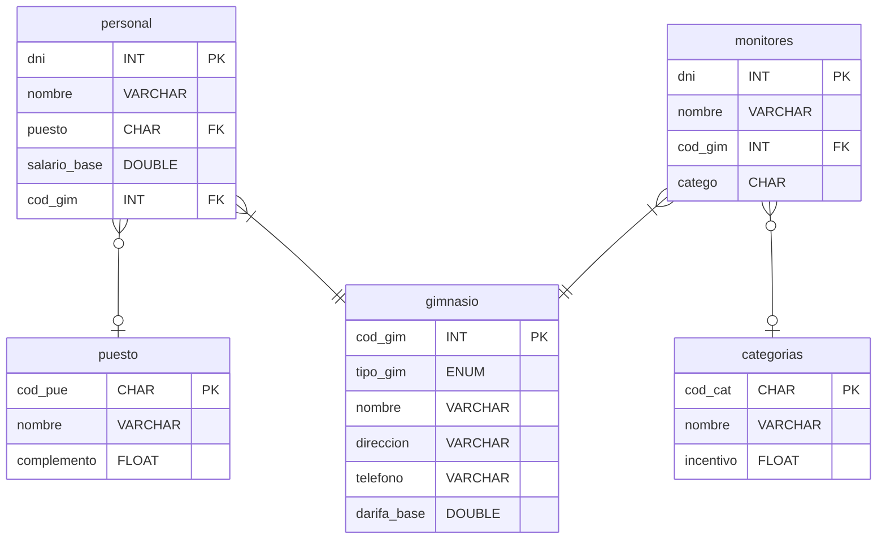

# A ver

```mermaid
erDiagram

gimnasio {
  cod_gim INT PK
  tipo_gim ENUM 
  nombre VARCHAR
  direccion VARCHAR
  telefono VARCHAR
  darifa_base DOUBLE
}
personal {
  dni INT PK
  nombre VARCHAR
  puesto CHAR FK
  salario_base DOUBLE
  cod_gim INT FK
}

puesto {
  cod_pue CHAR PK
  nombre VARCHAR
  complemento FLOAT
}

monitores {
  dni INT PK
  nombre VARCHAR
  cod_gim INT FK
  catego CHAR
}

categorias {
  cod_cat CHAR PK
  nombre VARCHAR
  incentivo FLOAT
}

monitores }|--|| gimnasio: ""
personal }o--o| puesto : ""
personal }|--|| gimnasio : ""
monitores }o--o| categorias: ""
```
